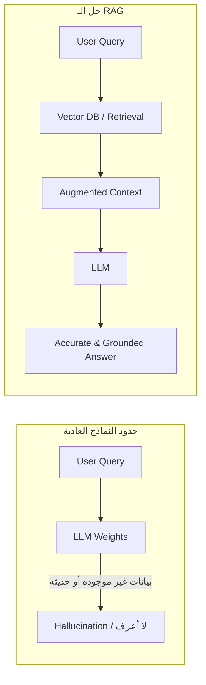
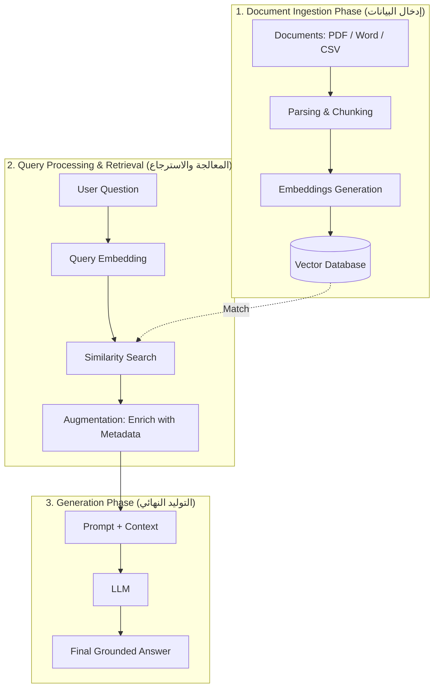

# 01 - ما هو الـ RAG؟ (Introduction to Retrieval-Augmented Generation)

> **ملخص سريع:** أكثر من **80%** من تطبيقات الذكاء الاصطناعي التوليدي (Generative AI) في بيئة الأعمال والشركات تعتمد على معمارية الـ RAG لحل مشكلتي **انقطاع المعرفة (Knowledge Cutoff)** و**غياب البيانات الخاصة بالشركات (Private Enterprise Data)**.

---

## 1. التشبيه الذهني الأبسط (The Exam Analogy)

| النموذج التقليدي (Standard LLM) | النموذج المعزز بالاسترجاع (RAG-Enabled LLM) |
| :--- | :--- |
| **امتحان مغلق الكتاب (Closed-Book Exam)** 📕 | **امتحان مفتوح الكتاب (Open-Book Exam)** 📖 |
| يعتمد فقط على ما حفظه أثناء التدريب المسبق (Weights). | يبحث في مراجع ومستندات محددة وحديثة قبل صياغة الإجابة. |
| عرضة للهلوسة (Hallucination) عند سؤاله عن بيانات غير موجودة في تدريبه. | يقدّم إجابات موثوقة ومبنية على مصادر وسياق محدد (Grounded Context). |

---

## 2. المشكلة الأساسية للـ LLMs (The Core Problem)

1. **انقطاع المعرفة الزمني (Knowledge Cutoff):**
   * إذا كان النموذج مدرّباً حتى تاريخ معين (مثلاً يوليو 2023)، فلن يستطيع الإجابة عن أحداث اليوم أو الأخبار الحالية.
2. **البيانات الخاصة والمغلقة (Private / Internal Data):**
   * بيانات الشركات الداخلية (مثل: سياسات الإجازات لشركة معينة، التقارير المالية الداخلية، العقود) لم ولن يتدرب عليها النموذج العام.

---

## 3. تفكيك مصطلح الـ R-A-G

الـ RAG ليس خطوة واحدة بل هو دمج لثلاث عمليات أساسية:

### ① Retrieval (الاسترجاع - R)
* **المفهوم:** عند وصول استعلام المستخدم (User Query)، يقوم النظام بالبحث داخل قاعدة بيانات متجهة (**Vector Database**) تحوي مستندات الشركة على هيئة متجهات (Vectors).
* **الآلية:** تتم عملية البحث باستخدام مقاييس التشابه الدلالي (**Similarity Search / Metrics**) لاستخراج النصوص والفقرات الأكثر صلة بالسؤال بدقة.

### ② Augmentation (التعزيز والإثراء - A)
* **المفهوم:** لا نكتفي بأخذ النص الخام المسترجع، بل نقوم بعملية **إثراء (Enrichment)** للنص قبل تمريره للنموذج.
* **إضافة البيانات الوصفية (Metadata Enrichment):**
  * إضافة اسم المصدر (Source: e.g., Tesla Q4 Financial Report).
  * إضافة التاريخ (Date).
  * تحديد أرقام الصفحات أو الأقسام.
* **بناء السياق (Context Construction):** دمج السؤال الأصلي مع النصوص المسترجعة والـ Metadata داخل قالب أوامر محكم (Augmented Prompt).

### ③ Generation (التوليد - G)
* **المفهوم:** يستلم الـ LLM السياق المعزز (Augmented Context) مع السؤال.
* **النتيجة:** يقوم النموذج بتلخيص وصياغة إجابة مباشرة ودقيقة معتمدة بالكامل على المستندات المرفقة مع إمكانية توثيق المصدر بدقة (Citation).

---

## 4. المراحل الثلاث الكبرى لمعمارية الـ RAG (High-Level Architecture)

---

## 5. خلاصة تعليمية (Key Takeaway)
* الـ RAG يحوّل الـ LLM من مجرد "مخزن معلومات قديمة" إلى "محرك استنتاج وتوليد ذكي" يعمل فوق بياناتك المحدثة والخاصة.
* جودة مرحلة الاسترجاع (R) وإثراء السياق (A) هي المحدد الأساسي لدقة مرحلة التوليد (G).
