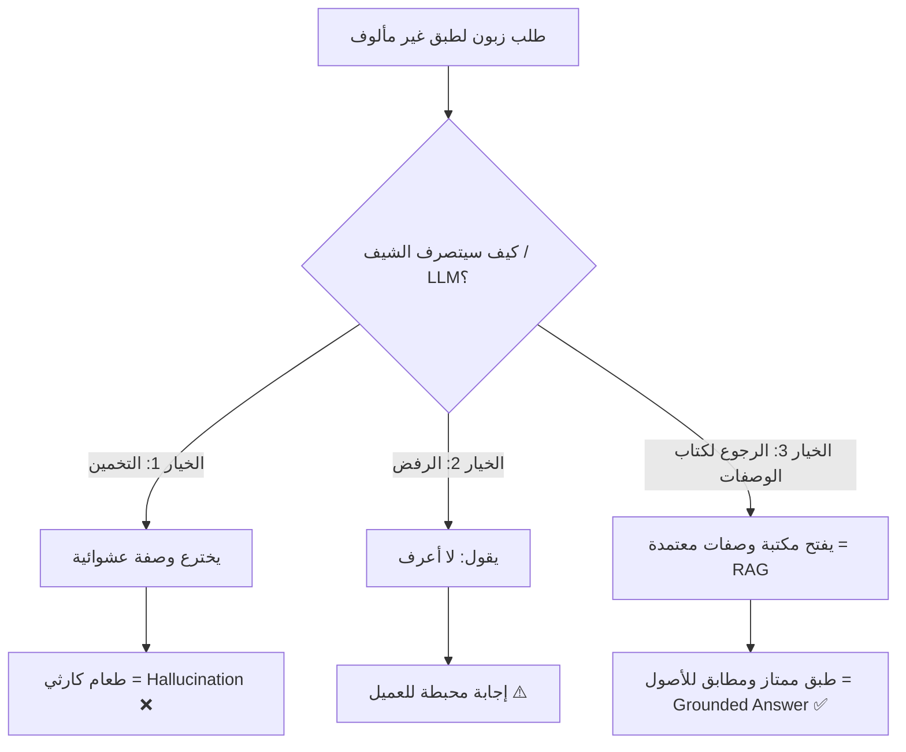
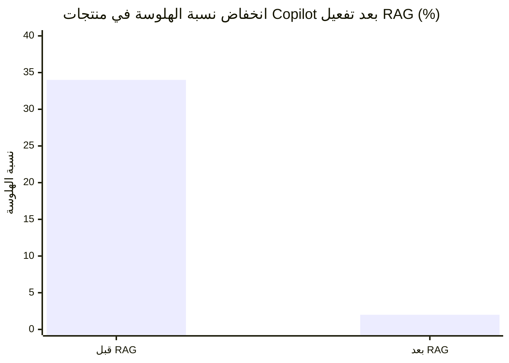
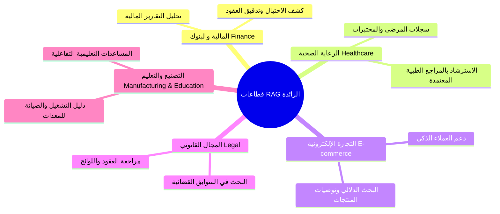

# 02 - مميزات RAG وأثره في بيئة الأعمال (Advantages & Business Impact)

> **ملخص سريع:** لماذا يستثمر عمالقة الصناعة الملايين في الـ RAG؟ يركز هذا الدرس على القيمة الفعلية للـ RAG من خلال تشبيه "الشيف"، ومقارنة واقعية في خدمة العملاء، وإحصائيات دقيقة ومقاييس عائد استثماري حقيقية من كبرى الشركات مثل JP Morgan و Microsoft و Bloomberg.

---

## 1. التشبيه التوضيحي: معضلة الطاهي والوصفة (The Chef Analogy)

تخيل مطعماً يعمل به **طاهٍ محترف (LLM)**، مدرّب على إعداد الأطباق المحلية فقط (مثل الأطباق الهندية أو الشرقية). دخل زبون وطلب طبقاً أوروبياً لم يسبق للطاهي دراسته أو إعداده:

### المقابلة الهندسية:
* **مكتبة الوصفات (Recipe Library):** هي قاعدة البيانات المتجهة (**Vector Database**) التي تحفظ المعرفة والوسائط عبر التضمينات النصية (**Text Embeddings**).
* **قراءة الوصفة:** هي عملية الاسترجاع (**Retrieval**) ومطابقة التشابه (**Similarity Search**).
* **إعداد الطبق بدقة:** هو التوليد (**Generation**) المعزز بالسياق الصحيح.

---

## 2. مثال واقعي: خدمة العملاء (Customer Support Case Study)

سؤال العميل: **"ما هي سياسة الإرجاع للمنتجات المشتراة خلال عروض Black Friday؟"**

### مقارنة بين النموذجين:

| وجه المقارنة | بدون RAG (Pure LLM) ❌ | باستخدام RAG (LLM + Vector DB) ✅ |
| :--- | :--- | :--- |
| **طبيعة الإجابة** | إجابة عامة وسطحية وغير مفيدة: *"عادة تقدم معظم الشركات مهلة 30 يوماً للإرجاع، لكن السياسة قد تختلف..."* | إجابة دقيقة وحاسمة وموثقة: *"وفقاً لوثيقة سياسة الإرجاع الحالية (إصدار 3.2 المحدّث في نوفمبر 2024)، مشتريات Black Friday لها فترة إرجاع ممتدة لـ 60 يوماً حتى 31 يناير."* |
| **المشكلة / الميزة** | لا يملك وثائق الشركة الخاصة، فيلجأ للمعلومات العامة القديمة على الإنترنت. | بحث في قاعدة بيانات وثائق وسياسات الشركة، واسترجع الفقرة الخاصة بالعرض الحالي مع رقم الإصدار والتاريخ. |
| **الأثر على العميل** | تضليل محتمل وإحباط وتشكيك في موثوقية الشركة. | حل فوري وموثوق وبناء ثقة مباشرة. |

---

## 3. أثر الـ RAG في بيئة الأعمال بالأرقام (Business Impact & Case Studies)

تثبت الإحصائيات والأرقام الواقعية أن التحول إلى RAG ليس مجرد رفاهية تقنية، بل قرار استثماري ضخم يوفر الملايين ويقلل المخاطر:

### أ) دراسات حالة كبرى الشركات (Major Case Studies)

| الشركة / المؤسسة | الوضع قبل RAG | النتيجة بعد تفعيل RAG | المكسب المحقق |
| :--- | :--- | :--- | :--- |
| **JP Morgan** 🏦 | إنفاق **$200M سنوياً** على الـ Fine-Tuning لمحللي الأبحاث. | انخفض الإنفاق إلى **$50M سنوياً** فقط بالاعتماد على RAG. | **توفير 150 مليون دولار سنوياً** مع بيانات محدثة أولاً بأول. |
| **Microsoft** 💻 | نسبة هلوسة تبلغ **34%** في المساعدات الذكية. | انخفضت نسبة الهلوسة إلى **2% فقط** في منتجات Copilot. | **انخفاض بنسبة 94%** في معدل الهلوسة والأخطاء. |
| **Bloomberg** 📈 | دورة تدريب النماذج التقليدية تستغرق **6 أشهر**. | تحديثات لحظية ومستمرة لحركة السوق المالية. | استجابة أسرع **بـ 24 ضعفاً (24x Faster)** للبيانات الجديدة. |

---

### ب) الامتثال والحوكمة الرقابية (Regulatory Compliance & Auditability)

في القطاعات الحساسة (كالبنوك والرعاية الصحية والقطاع القانوني)، لا يمكن قبول إجابة من الذكاء الاصطناعي دون تدقيق:
* **نسبة إسناد المصادر (Source Attribution):** تصل إلى **100%** حيث يُلزم النظام بربط كل جملة بمصدرها الرسمي.
* **سجل تدقيق كامل (Complete Audit Trail):** القدرة على مراجعة: أي وثيقة تم استرجاعها؟ وأي فقرة استند إليها النموذج؟
* **صلاحيات الوصول (Approved Access Only):** عزل البيانات بحيث لا يسترجع النظام إلا ما يملك المستخدم صلاحية قراءته داخل المنظمة.

---

### ج) مؤشرات الأداء والجاهزية للإنتاج (ROI & Time to Market)

* **متوسط العائد على الاستثمار (Average ROI):** يقدر بحوالي **312%** للمشاريع المعتمدة على RAG بفضل تقليل تكاليف الحوسبة وزيادة إنتاجية الموظفين.
* **سرعة الإطلاق للإنتاج (Time to Production):** يستغرق بناء ونشر نظام RAG متكامل للإنتاج بين **6 إلى 8 أسابيع** فقط، مقارنة بأشهر طويلة في مشاريع إعادة التدريب.
* **معدل التبني المستقبلي (Adoption Trends):** التقديرات تشير إلى أن أكثر من **85%** من المؤسسات والشركات ستبني تطبيقاتها الأساسية بحلول عام 2026 بالاعتماد على معمارية RAG.

---

### د) أبرز القطاعات المتبنية للـ RAG (Top Industries Adopting RAG)

---

## 4. مراجعة سريعة لأركان الـ RAG الثلاثة

* **R (Retrieval):** العثور على المعلومات ذات الصلة من الـ Vector DB عبر الـ Similarity Search.
* **A (Augmentation):** إثراء هذا المحتوى بالبيانات الوصفية (Metadata: التاريخ، رقم الإصدار، المصدر).
* **G (Generation):** صياغة الإجابة النهائية بالاعتماد الحصري على السياق المرفق.

---

## 5. خلاصة الدرس (Key Takeaway)
> لم يعد الـ RAG مجرد تجربة هندسية، بل أصبح المعيار الصناعي المعتمد عالمياً لأنه يوفر **312% عائد استثماري**، ويُطلق للإنتاج في غضون **6-8 أسابيع**، ويقضي على الهلوسة بنسبة **94%**، مع ضمان الامتثال الرقابي الكامل وإسناد المصادر بنسبة **100%**.
