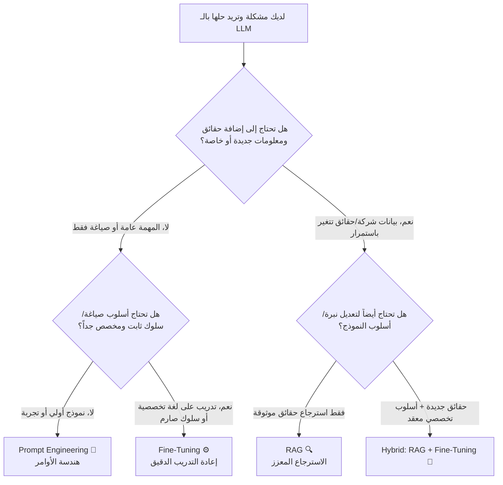

# 03 - المقارنة الثلاثية: Prompt Engineering vs Fine-Tuning vs RAG

> **ملخص سريع:** السؤال الأكثر تكراراً في مشاريع الذكاء الاصطناعي التوليدي: متى نكتفي بهندسة الأوامر؟ متى نلجأ للتدريب الدقيق للنموذج؟ ومتى يكون الـ RAG هو الحل الوحيد الممكن؟ يفكك هذا الدليل الفروق الجوهرية وآليات العمل والمزايا والعيوب ومصفوفة اتخاذ القرار.

---

## 1. شجرة اتخاذ القرار السريعة (Decision Flowchart)

---

## 2. المسار الأول: هندسة الأوامر (Prompt Engineering)

### المفهوم وآلية العمل:
* توجيه نموذج أساسي جاهز (**Base LLM**) مثل GPT-4 أو Llama-3 أو Gemini من خلال تعليمات وسياق منظم ومحدد داخل الـ Prompt (مثال: *"تصرف كخبير طهي وقدّم وصفة..."*).
* **أوزان النموذج (Model Weights):** تظل ثابتة تماماً دون أي تغيير.

### المميزات (Pros):
* ✅ **لا يتطلب خبرة برمجية عميقة:** كتابة أوامر باللغة الطبيعية (Natural Language).
* ✅ **نتائج فورية ولحظية:** اختبار سريع وسهل للنتائج في ثوانٍ.
* ✅ **صفر تكلفة تدريب (Zero Training Cost):** لا يتطلب حجز كروت شاشة (GPUs) أو تدريب.
* ✅ **مرونة العمل:** يعمل مع أي نموذج ذكاء اصطناعي دون قيود معمارية.

### العيوب (Cons):
* ❌ **مقيد بالمعرفة المسبقة للنموذج (Base Knowledge Limits):** لا يمكنه إعطاء إجابات عن بيانات خاصة أو أحداث تلت تاريخ تدريبه.
* ❌ **عدم ثبات النتائج (Inconsistency):** تغيير بسيط في صياغة الأمر قد يغير النتيجة بالكامل.
* ❌ **حدود نافذة السياق (Token Limits):** لا يمكنك إدخال مستندات ضخمة داخل الـ Prompt مباشرة.

### متى تختاره؟ (Best For):
* النماذج الأولية السريعة (**Quick Prototyping**).
* المهام العامة ومساعدة الأفراد (تلخيص نصوص، إعادة صياغة، مهام إبداعية).
* المشاريع الصغيرة محدودة الميزانية التي لا تعتمد على بيانات شركات داخلية.

---

## 3. المسار الثاني: التدريب الدقيق (Fine-Tuning)

### المفهوم وآلية العمل:
* تعليم وتكييف النموذج عبر تدريبه على مجموعة بيانات تخصصية (**Domain-Specific Dataset**).
* **أوزان النموذج (Model Weights):** تتعدل وتتغير بشكل دائم لتكتسب المعرفة أو النمط الجديد (عبر تقنيات مثل LoRA أو QLoRA أو Full Fine-Tuning).
* **الهدف الأساسي:** تعليم النموذج **"كيف يتصرف أو كيف يصيغ" (Style & Form)** أكثر من كونه مجرد حفظ حقائق.

### المميزات (Pros):
* ✅ **سلوك ونبرة متسقة جداً (Consistent Behavior & Tone):** يلتزم تماماً بهوية الشركة وشكل المخرجات المطلوب.
* ✅ **تخصيص عميق للمجال (Deep Domain Specialization):** استيعاب المصطلحات المعقدة (مثل الصياغات القانونية أو الطبية).
* ✅ **الاستغناء عن الأوامر الطويلة:** النموذج مبرمج مسبقاً على السلوك فلا داعي لكتابة أوامر تفصيلية مع كل طلب.

### العيوب (Cons):
* ❌ **تكلفة باهظة (Very Expensive):** يتطلب موارد حوسبة ضخمة وساعات تشغيل كروت شاشة متقدمة (GPUs).
* ❌ **يتطلب خبراء تعلم آلي (Requires ML/AI Expertise):** لتجهيز البيانات وضبط الـ Hyperparameters وتفادي مشكلة النسيان الكارثي (Catastrophic Forgetting).
* ❌ **غير عملي للبيانات المتغيرة:** في حال تحديث سياسة الشركة غداً، ستحتاج لإعادة تدريب النموذج بالكامل (**Frequent Retraining**).

### متى تختاره؟ (Best For):
* إكساب النموذج شخصية أو نبرة صوت محددة جداً (Brand Voice / Custom Style).
* تصنيف النصوص أو إخراج JSON بهيكل صارم ومتكرر بملايين الطلبات.
* المهام التخصصية المغلقة التي لا تتغير بياناتها (مثل معالجة اللهجات أو الترجمة التخصصية).

---

## 4. المسار الثالث: الاسترجاع المعزز بالتوليد (RAG)

### المفهوم وآلية العمل:
* ربط النموذج الأساسي بقاعدة معرفية خارجية ديناميكية (**External Knowledge Base / Vector DB**).
* عند وصول استعلام، يُنفذ النظام بحث تشابه دلالي (**Similarity Search**)، ويسترجع الفقرات ذات الصلة، ويدمجها في الـ Prompt ليقوم النموذج بصياغة إجابة معتمدة عليها.
* **أوزان النموذج (Model Weights):** تظل ثابتة تماماً.

### المميزات (Pros):
* ✅ **بيانات محدثة لحظياً (Dynamic & Real-Time):** تحديث المعرفة لا يتطلب سوى رفع المستند الجديد لقاعدة البيانات دون إعادة تدريب.
* ✅ **صفر تكلفة تدريب (Zero Training Cost):** استهلاك اقتصادي للموارد مقارنة بالـ Fine-Tuning.
* ✅ **حماية البيانات وسريتها (Data Privacy & Compliance):** المستندات محفوظة داخل قواعد بيانات الشركة المعزولة مع إمكانية ضبط الصلاحيات.
* ✅ **توثيق المصادر ومحاربة الهلوسة (Provenance & Anti-Hallucination):** إمكانية إرفاق رابط المصند أو رقم الصفحة لكل جملة يجيب بها النظام.

### العيوب (Cons):
* ❌ **يتطلب بنية تحتية هندسية (Infrastructure Setup):** إعداد Vector Database، وخطوط معالجة وتجزئة (Chunking Pipeline).
* ❌ **الاعتماد التام على جودة الاسترجاع (Retrieval Dependency):** إذا استرجع النظام فقرات غير صحيحة، فستكون إجابة النموذج مضللة (*Garbage In, Garbage Out*).
* ❌ **زمن استجابة إضافي (Latency):** خطوة البحث والاسترجاع تضيف جزءاً من الثانية لزمن الرد مقارنة بالطلب المباشر.

### متى تختاره؟ (Best For):
* بناء روبوتات دعم العملاء والشركات (Enterprise Customer Support).
* البحث في الوثائق والسياسات الداخلية التي تتغير باستمرار.
* التطبيقات التي تتطلب دقة حاسمة وإسناداً للمصادر (بنوك، مستشفيات، شركات طيران).

---

## 5. مصفوفة المقارنة الشاملة (Comparison Matrix)

| معيار المقارنة | Prompt Engineering 🎯 | Fine-Tuning ⚙️ | RAG 🔍 |
| :--- | :--- | :--- | :--- |
| **مصدر المعرفة (Knowledge Source)** | المعرفة المسبقة للنموذج فقط | أوزان النموذج بعد إعادة التدريب | قواعد بيانات ومستندات خارجية |
| **تعديل أوزان النموذج (Weights)** | لا يتم التعديل (Fixed) | يتم التعديل وتحديث الأوزان | لا يتم التعديل (Fixed) |
| **التكلفة المالية (Financial Cost)** | منخفضة جداً (سعر الـ Tokens فقط) | مرتفعة جداً (GPUs + تدريب) | متوسطة (تكلفة Vector DB وسيرفرات) |
| **تحديث المعرفة (Knowledge Update)** | مستحيل دون إدخالها يدوياً في الأمر | يتطلب إعادة تدريب مستمرة | فوري بمجرد إضافة المستند للـ DB |
| **دقة محاربة الهلوسة (Hallucination)** | ضعيفة (معرض للهلوسة) | متوسطة (قد يهلوس بمعلومات واثقة) | ممتازة (مدعومة بأدلة ومصادر موثقة) |
| **إسناد المصادر (Source Citations)** | غير متاح | غير متاح | متاح بنسبة 100% |
| **الخبرة المطلوبة (Skill Level)** | لا تتطلب خلفية تقنية | تتطلب مهندسي تعلم آلي (ML Engineers) | تتطلب مهندسي برمجيات وبيانات (Software/Data) |

---

## 6. خلاصة الدرس (Key Takeaway)
> **القاعدة الذهبية:**
> * استخدم **Prompt Engineering** عندما تريد اختبار فكرة سريعاً.
> * استخدم **Fine-Tuning** إذا أردت تغيير **"كيف يتحدث أو يصيغ النموذج" (Form & Style)**.
> * استخدم **RAG** إذا أردت تزويد النموذج بـ **"ماذا يعرف النموذج من حقائق وبيانات خاصة" (Facts & Knowledge)**.
