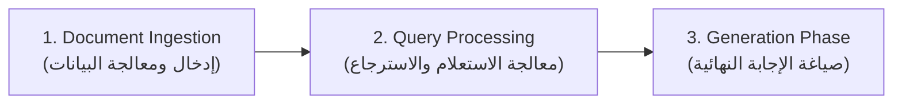
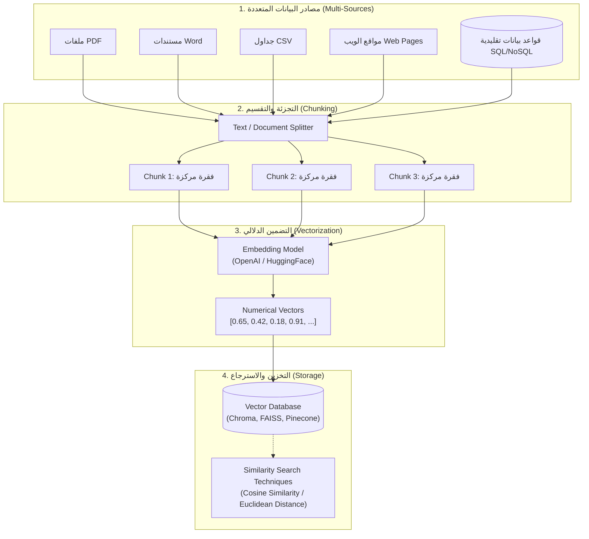

# 04 - المكونات الأساسية للـ RAG ومرحلة إدخال البيانات (Core Components & Ingestion Phase)

> **ملخص سريع:** يتناول هذا الدرس المكونات الهيكلية الثلاثة الكبرى لمعمارية الـ RAG، مع تركيز تفصيلي على **المرحلة الأولى: إدخال ومعالجة البيانات (Document Ingestion & Pre-processing)**؛ من استخراج النصوص وتجزئتها (Chunking)، وتحويلها لمتجهات (Embeddings)، وحتى تخزينها في قواعد البيانات المتجهة (Vector Databases).

---

## 1. المكونات الهيكلية الثلاثة لمنظومة الـ RAG (The 3 Core Phases)

تنقسم أي معمارية RAG متكاملة إلى ثلاث مراحل متتابعة:

1. **Document Ingestion & Pre-processing Phase:** بناء وتجهيز قاعدة المعرفة مسبقاً (Offline / Pre-computation).
2. **Query Processing & Retrieval Phase:** استلام سؤال المستخدم والبحث الدلالي عن أدق سياق مطابق.
3. **Generation Phase:** تمرير السياق المعزز إلى الـ LLM لتوليد وتلخيص الإجابة النهائية.

---

## 2. تفصيل المرحلة الأولى: خط معالجة البيانات (Data Ingestion Pipeline)

---

## 3. تفكيك خطوات مرحلة الـ Ingestion خطوة بخطوة

### الخطوة ①: استخراج البيانات من المصادر (Data Ingestion)
* البيانات في الشركات تكون مشتتة بين ملفات غير مهيكلة (Unstructured) وشبه مهيكلة (Semi-structured) مثل: PDFs، مستندات Word، ملفات CSV، صفحات الويب، وقواعد البيانات.
* يتم استخدام أدوات تحميل الوثائق (**Document Loaders**) لقراءة النصوص واستخراجها بدقة.

---

### الخطوة ②: التجزئة والتقسيم (Text Splitting & Chunking)
* يتم تمرير الوثائق عبر مقسّم نصوص (**Text Splitter / Document Splitter**) لتقسيم المستند الطويل إلى قطع نصية صغيرة تسمى **Chunks**.

#### ❓ لماذا نقوم بتجزئة البيانات إلى Chunks بدلاً من تمرير الملف كاملاً؟
1. **حدود نافذة السياق (Context Window Limits):** النماذج اللغوية (LLMs) تمتلك حداً أقصى من الـ Tokens التي تستوعبها. كتاب بحجم 1000 صفحة يستحيل أو يصعب تمريره دفعة واحدة للنموذج.
2. **جودة التركيز والاستيعاب:** عندما يحصل النموذج على سياق مركّز ومحدد (صفحة أو فقرة بدلاً من كتاب كامل)، تكون إجابته خالية من التشتت والهلوسة.
3. **دقة البحث والاسترجاع (Retrieval Accuracy):** مطابقة سؤال المستخدم مع فقرة محددة تتحدث عن الموضوع مباشرة أسهل وأدق بكثير من مطابقته مع ملف ضخم يتناول مئات الموضوعات.

---

### الخطوة ③: التضمين وتحويل النصوص لمتجهات (Text Embeddings)
* يتم أخذ كل قطعة نصية (Chunk) وتمريرها على نموذج تضمين (**Embedding Model**).
* **وظيفة نموذج التضمين:** تحويل الكلمات والمعاني إلى مصفوفة من الأرقام الرياضية (**Dense Numerical Vectors**) تعبر عن المعنى الدلالي للنص (مثل: `[0.65, -0.12, 0.88, ...]`).
* **أشهر نماذج التضمين:**
  * نماذج مغلقة المصدر وسحابية: مثل نماذج **OpenAI Embeddings**.
  * نماذج مفتوحة المصدر مجانية ومحلية: مثل نماذج منصة **Hugging Face** (مثل `BGE`, `Sentence-Transformers`).

---

### الخطوة ④: الحفظ في قواعد البيانات المتجهة (Vector Databases)
* تُحفظ المتجهات الناتجة مع النصوص الأصلية والبيانات الوصفية (Metadata) داخل قاعدة بيانات متجهة (**Vector DB**).
* **أشهر قواعد البيانات المتجهة المستخدمة في الصناعة:**
  * **FAISS:** مكتبة مفتوحة المصدر وسريعة جداً طورتها Meta للحوسبة المحلية.
  * **ChromaDB:** قاعدة بيانات متجهة خفيفة ومثالية للتطوير والتجارب السريعة.
  * **Pinecone:** قاعدة بيانات متجهة سحابية ومدارة بالكامل للإنتاجية العالية (Managed Cloud).
  * **DataStax / AstraDB:** حلول سحابية متقدمة للمشاريع الضخمة.

---

### الخطوة ⑤: آليات البحث عن التشابه (Similarity Search Techniques)
بمجرد تخزين المتجهات في الـ Vector DB، يصبح النظام جاهزاً للبحث عن الفقرات الأقرب دلالياً لسؤال المستخدم من خلال خوارزميات رياضية، أشهرها:
* **Cosine Similarity (تشابه جيب التمام):** يقيس الزاوية بين متجه السؤال ومتجهات النصوص (يركز على اتجاه المعنى بغض النظر عن طول النص).
* **Euclidean Distance (المسافة الإقليدية):** يقيس المسافة الهندسية المباشرة بين نقطتي المتجهين في الفضاء الشعاعي.

---

## 4. مثال عملي توضيحي (Workflow Example)

* **المستند المصدر:** ملف PDF بعنوان "دليل الذكاء الاصطناعي".
* **التجزئة (Chunking):** قسّم الملف إلى فقرات، إحداها تتحدث عن تعريف الـ LLM.
* **التضمين (Embedding):** حوّلت تلك الفقرة إلى المتجه الشعاعي `V1`.
* **الاستعلام (Query):** سأل المستخدم: *"ما هو الـ LLM؟"*.
* **البحث (Search):** حُوّل السؤال لمتجه، وعبر الـ **Cosine Similarity** وجد النظام أن `V1` هو الأقرب دلالياً بنسبة تشابه 92%، ليتم استخراجه وتجهيزه لمرحلة التوليد.

---

## 5. خلاصة الدرس (Key Takeaway)
> مرحلة **Document Ingestion & Pre-processing** هي حجر الأساس لأي نظام RAG؛ فبدون تجزئة ذكية (**Chunking**) ونماذج تضمين دقيقة (**Embedding Models**) وقاعدة بيانات متجهة سريعة (**Vector DB**)، لن تنجح مرحلة الاسترجاع في تزويد الـ LLM بالمعلومات الصحيحة.
> 
> *الخطوة التالية في الفيديو القادم:* **Query Processing Phase** (كيف يستقبل النظام سؤال المستخدم وكيف يسترجع السياق ويجهزه للتوليد).
