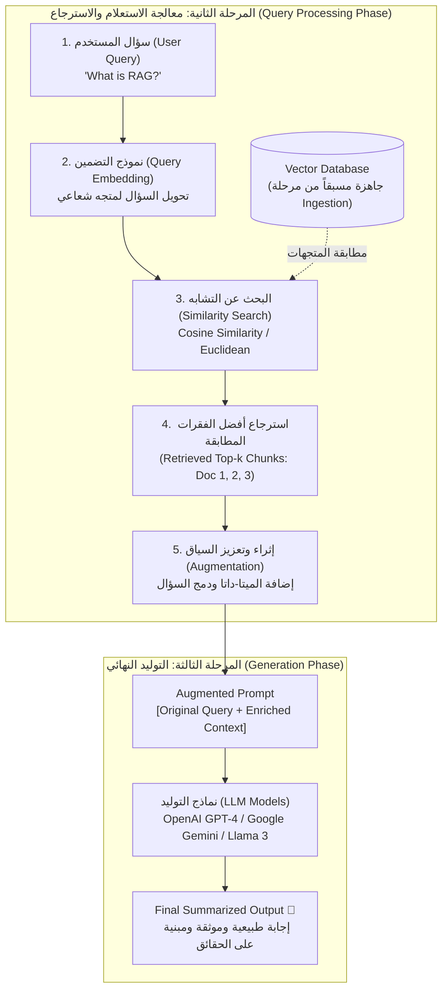

# 05 - معالجة الاستعلام والتوليد (Query Processing & Generation Phases)

> **ملخص سريع:** بعد اكتمال مرحلة إدخال البيانات وتجهيز قاعدة البيانات المتجهة (Vector DB)، يشرح هذا الدرس **المرحلتين المتبقيتين في المعمارية:**
> 1. **مرحلة معالجة الاستعلام (Query Processing Phase):** كيف يتحول سؤال المستخدم إلى بحث دلالي دقيق يُسترجع منه سياق معزز.
> 2. **مرحلة التوليد (Generation Phase):** كيف يصيغ نموذج الـ LLM إجابة بشرية سلسة وموثوقة مبنية بالكامل على السياق المسترجع.

---

## 1. المخطط الشامل لرحلة الاستعلام والتوليد (End-to-End Pipeline)

---

## 2. تفكيك المرحلة الثانية: معالجة الاستعلام (Query Processing Phase)

بمجرد أن يطرح المستخدم سؤاله (مثل: *"ما هو الـ RAG؟"* أو *"ما هي سياسة الإجازات؟"*):

### الخطوة ①: تضمين الاستعلام (Query Embedding)
* لا يمكن مقارنة السؤال كنص عادي مع المتجهات الرياضية في قاعدة البيانات.
* يتم تمرير السؤال إلى **نفس نموذج التضمين (Embedding Model)** الذي استُخدم في مرحلة الـ Ingestion لتحويله إلى متجه عددي ذي أبعاد محددة:
  $$\text{Query Vector} = [0.35, 0.48, -0.62, 0.19, \dots]$$

### الخطوة ②: البحث الدلالي ومطابقة المتجهات (Vector Search)
* يتم إرسال المتجه إلى قاعدة البيانات المتجهة (**Vector Database**).
* تُستخدم خوارزميات قياس التشابه لتحديد الفقرات الأكثر قرباً في المعنى:
  * **Cosine Similarity:** قياس زاوية اتجاه المعنى الدلالي.
  * **Euclidean Distance:** قياس المسافة الفراغية بين النقاط.
* **النتيجة:** استخراج أفضل $K$ قطع نصية متطابقة دلالياً (**Top-k Retrieved Chunks: Doc 1, Doc 2, Doc 3**).

### الخطوة ③: التعزيز والإثراء (Augmentation & Context Construction)
* لا يُمرر النص الخام المسترجع مباشرة، بل يتم إثراؤه:
  * دمج البيانات الوصفية (**Metadata**): اسم المصدر، تاريخ النشر، وأرقام الصفحات.
  * دمج السؤال الأصلي مع السياق المسترجع داخل قالب تعليمات محكم (**Prompt Template**):
  > *"أجب عن السؤال التالي اعتماداً فقط على السياق المرفق، وإذا لم تكن المعلومة متوفرة في السياق فقل لا أعرف ولا تخترع شيئاً:"*

---

## 3. تفكيك المرحلة الثالثة: التوليد والصياغة (Generation Phase)

### الخطوة ④: تمرير السياق للنموذج اللغوي (LLM)
* يستقبل النموذج اللغوي الـ **Augmented Context + Original Query**.
* **الخيارات المتاحة للنماذج في بيئة الإنتاج:**
  * **نماذج سحابية تجارية (Closed-Source):** مثل **OpenAI GPT-4o** أو **Google Gemini 1.5 Pro/Flash**.
  * **نماذج مفتوحة المصدر عالية الأداء (Open-Source):** مثل عائلة **Meta Llama 3** (يمكن استضافتها سحابياً بسرعة استجابة فائقة عبر منصات مثل **Groq** أو محلياً عبر **Ollama**).

### الخطوة ⑤: صياغة المخرج البشري (Summarized Natural Output)
* يقوم الـ LLM بقراءة السياق، واستخلاص الإجابة المحددة، وصياغتها بلغة بشرية طبيعية ومفهومة وسلسة (Human-like conversation).
* النتيجة تكون **مدعمة بالحقائق (Grounded)**، خالية من التخمين، وتوثق المصادر المستند إليها بدقة.

---

## 4. ملخص المعمارية الكاملة لمنظومة RAG (Full Architecture Recap)

| المرحلة | التوقيت (Timing) | المهمة الأساسية | المخرجات الرئيسية |
| :--- | :---: | :--- | :--- |
| **1. Document Ingestion** | أوفلاين (Pre-computed) | قراءة المستندات، التجزئة (Chunking)، والتضمين | قاعدة بيانات متجهة جاهزة (Vector DB) |
| **2. Query Processing** | أونلاين لحظي (Real-time) | تضمين سؤال المستخدم وبحث التشابه واسترجاع السياق | سياق معزز بالبيانات الوصفية (Augmented Context) |
| **3. Generation** | أونلاين لحظي (Real-time) | قيام الـ LLM بصياغة الإجابة اعتماداً على السياق | إجابة نهائية دقيقة وموثقة للعميل |

---

## 5. محطة الانتقال: نهاية الأساس النظري والانتقال للعملي (What's Next?)

> 🎯 **اكتمل الإطار المفاهيمي العام للـ RAG!**
> 
> مع انتهاء هذا الدرس، تصبح كافة المفاهيم الهيكلية واضحة تماماً. المحطة القادمة في المسار ستكون **البدء الفعلي في التطبيق البرمجي العملي (Hands-on Code)** بدءاً من مجلد:
> 
> 📁 **`01-ingestion/`**:
> * قراءة وتحليل مختلف صيغ الملفات (PDFs, Word Docs, Web Scraping, CSV, JSON).
> * تطبيق استراتيجيات التجزئة المتقدمة (Text Splitters & Chunking Strategies).
> * توليد التضمينات وربطها بقواعد البيانات المتجهة برمجياً.
