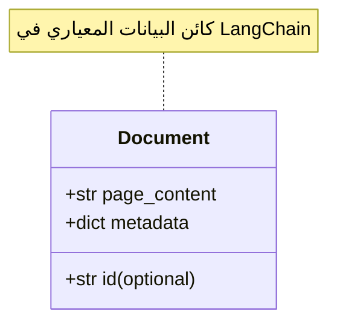
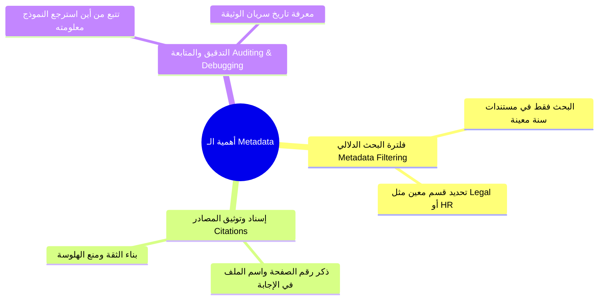

# 02 - بنية كائن الـ Document في LangChain (Document Structure in LangChain)

> **ملخص سريع:** المحاضرة العاشرة من الكورس (المحاضرة الثانية في قسم Ingestion). تشرح البنية الأساسية الموحدة لتمثيل البيانات في منظومة LangChain عبر كائن **`Document`**، ومكونيه الأساسيين: **`page_content`** و **`metadata`**، ودورهما الحاسم في البحث المفلتر وإسناد المصادر.

---

## 1. لماذا يحتاج LangChain إلى بنية كائن Document موحدة؟

عند التعامل مع مصادر بيانات متنوعة (ملفات PDF، جداول Excel، مستندات Word، صفحات ويب):
* تحتاج منظومة الـ RAG إلى **بنية بيانات قياسية موحدة (Standard Data Structure)** تمر عبر كافة مراحل الـ Pipeline (من الـ Loaders إلى الـ Splitters وحتى الـ Vector Stores).
* كافة أدوات تحميل الوثائق (**Document Loaders**) في LangChain تقوم تلقائياً بقراءة البيانات وتحويلها إلى كائنات من نوع **`Document`**.



---

## 2. المكونان الأساسيان لكائن الـ Document

### ① المحتوى النصي (`page_content` : `str`)
* **الوصف:** النص الفعلي المستخرج من المصدر والذي سيتم تجزئته وتمريره لنموذج التضمين (**Embedding Model**) للبحث عنه.
* **الشرط الأساسي:** يجب أن يكون من نوع نص (**String**).

### ② البيانات الوصفية (`metadata` : `dict[str, Any]`)
* **الوصف:** قاموس بايثون (Dictionary) يحمل معلومات إضافية تصف النص وسياقه ومصدره.
* **أمثلة شائعة لمفاتيح الـ Metadata:**
  * `source`: مسار أو رابط الملف (مثل: `company_policies.pdf` أو `https://...`).
  * `page`: رقم الصفحة داخل المستند الأصلي.
  * `author`: اسم كاتب المستند أو القسم التابع له.
  * `date_created` / `timestamp`: تاريخ إنشاء أو تحديث الوثيقة.

---

## 3. لماذا تعتبر الـ Metadata بالغة الأهمية في RAG؟ (Why Metadata Matters)



1. **البحث المفلتر (Metadata Filtering):** تتيح لقواعد البيانات المتجهة حصر البحث في نطاق محدد (مثال: ابحث فقط في الوثائق التي يكون `year >= 2024` و `department == "finance"`).
2. **إسناد المصادر (Source Attribution & Citations):** تمكين الـ LLM من إرفاق اسم الملف ورقم الصفحة الدقيقة للمستخدم في نهاية الإجابة.
3. **التدقيق والمراقبة (Auditing):** إمكانية تتبع أصل كل إجابة ومعرفة الوثيقة الدقيقة التي استند إليها النظام.

---

## 4. الكود العملي لإنشاء والتعامل مع كائن Document

```python
from langchain_core.documents import Document

# 1. إنشاء كائن Document يدوياً
doc = Document(
    page_content="هذا هو النص الأساسي المستخرج من الوثيقة والذي سيتم تحويله لمتجهات والبحث فيه.",
    metadata={
        "source": "hr_policy.txt",
        "page": 1,
        "author": "Ali Ashraf",
        "date_created": "2024-01-15",
        "department": "Human Resources"
    }
)

# 2. الوصول للمحتوى والبيانات الوصفية
print("--- المحتوى النصي ---")
print(doc.page_content)

print("\n--- البيانات الوصفية ---")
print(doc.metadata)
print(f"المصدر: {doc.metadata['source']}")
print(f"الصفحة: {doc.metadata['page']}")
```

---

## 5. نظرة تمهيدية للمحاضرة القادمة (Next Lecture)

في المحاضرة القادمة (**`03-text-loaders`**):
* سنبدأ في استخدام **`TextLoader`** المدمج في LangChain لقراءة الملفات النصية من القرص تلقائياً وتحويلها إلى قائمة من كائنات `Document` مع استخراج الميتا-داتا أوتوماتيكياً.
