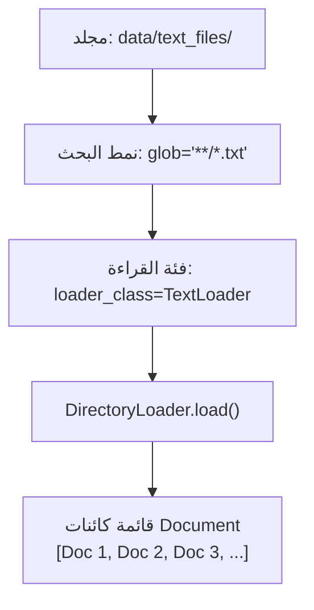

# 03 - قراءة واستيراد الملفات النصية باستخدام Document Loaders (Text Loaders)

> **ملخص سريع:** المحاضرة الحادية عشرة من الكورس (المحاضرة الثالثة في قسم Ingestion). تشرح كيفية قراءة واستخراج البيانات من الملفات النصية الخام (`.txt`) سواءً كان ملفاً منفرداً عبر **`TextLoader`** أو مجلداً كاملاً يحوي ملفات نصية متعددة عبر **`DirectoryLoader`**، مع ضبط الترميز (`UTF-8`) وفهم شكل المخرجات.

---

## 1. لماذا نبدأ بالملفات النصية (`.txt`)؟

تعتبر الملفات النصية أبسط وأوضح نموذج لإدخال البيانات في منظومة RAG:
* لا تحتاج إلى فك تشفير معقد أو OCR (مثل ملفات PDF الممسوحة ضوئياً).
* توضح جوهر عمل أدوات التحميل (**Document Loaders**) في تحويل الملف على القرص إلى قائمة كائنات `Document` تحمل النص والميتا-داتا.

---

## 2. الطريقة الأولى: قراءة ملف نصي منفرد (`TextLoader`)

تُستخدم فئة `TextLoader` عندما تريد قراءة مسار ملف نصي محدد بدقة.

### آلية العمل البرمجية:
```python
from langchain_community.document_loaders import TextLoader

# 1. تهيئة المحمل مع تحديد المسار وترميز النصوص
loader = TextLoader("data/text_files/python_intro.txt", encoding="utf-8")

# 2. تنفيذ التحميل (استرجاع قائمة من كائنات Document)
docs = loader.load()

# 3. فحص النتائج
print(f"عدد الوثائق المحملة: {len(docs)}") # عادة 1 لكل ملف
print(f"المصدر: {docs[0].metadata['source']}")
print(f"أول 100 حرف: {docs[0].page_content[:100]}")
```

> [!IMPORTANT]
> **ترميز النصوص (`encoding="utf-8"`):** يُنصح دائماً بتحديد معامل الترميز `encoding="utf-8"` لتفادي مشاكل الحروف غير الإنجليزية (مثل الحروف العربية والرموز الخاصة) على أنظمة ويندوز.

---

## 3. الطريقة الثانية: قراءة مجلد ملفات دفعة واحدة (`DirectoryLoader`)

عندما تمتلك مجلداً يحوي عشرات أو مئات المستندات النصية، فإن قراءة كل ملف بشكل منفرد تصبح غير عملية. هنا نستخدم **`DirectoryLoader`** مع نمط بحث دلالي (**Glob Pattern**).



### المعاملات الأساسية لـ `DirectoryLoader`:
1. **`path`**: مسار المجلد الذي يحوي الملفات.
2. **`glob`**: نمط المطابقة (Regex / Glob) لتحديد الامتدادات المطلوبة (مثل: `"**/*.txt"` للبحث في المجلد والمجلدات الفرعية).
3. **`loader_cls`**: الفئة المخصصة لقراءة الملفات المطابقة (نمرر `TextLoader`).
4. **`loader_kwargs`**: معاملات إضافية نمررها لمحمل الملف (مثل `{"encoding": "utf-8"}`).
5. **`show_progress`**: إظهار شريط تقدّم مرئي أثناء القراءة (مفيد للمجلدات الضخمة).

### الكود البرمجي:
```python
from langchain_community.document_loaders import DirectoryLoader, TextLoader

dir_loader = DirectoryLoader(
    path="data/text_files",
    glob="**/*.txt",
    loader_cls=TextLoader,
    loader_kwargs={"encoding": "utf-8"},
    show_progress=True
)

documents = dir_loader.load()
print(f"تم تحميل {len(documents)} وثيقة بنجاح.")
```

---

## 4. مقارنة الخصائص والمميزات (Pros & Cons of DirectoryLoader)

| المميزات (Advantages) | القيود والعيوب (Disadvantages) |
| :--- | :--- |
| ✅ تحميل مئات الملفات بأمر واحد دفعة واحدة. | ⚠️ يتطلب عادة أن تكون كافة الملفات من نفس النوع أو تتبع نفس الـ Loader. |
| ✅ دعم البحث المتشعب في المجلدات الفرعية (`Recursive`). | ⚠️ معالجة الأخطاء لكل ملف بمفرده محدودة في حال تلف أحد الملفات. |
| ✅ دعم شريط التقدّم (`show_progress=True`). | ⚠️ قد يستهلك ذاكرة (RAM) كبيرة إذا كان المجلد ضخماً جداً. |

---

## 5. نظرة تمهيدية للمحاضرة القادمة (Next Lecture)

في المحاضرة القادمة (**`04-text-splitting`**):
* سنرى كيف نأخذ هذه النصوص الطويلة ونقوم بتجزئتها بذكاء إلى **Chunks** متناسقة عبر تقنيات مثل `RecursiveCharacterTextSplitter`.
