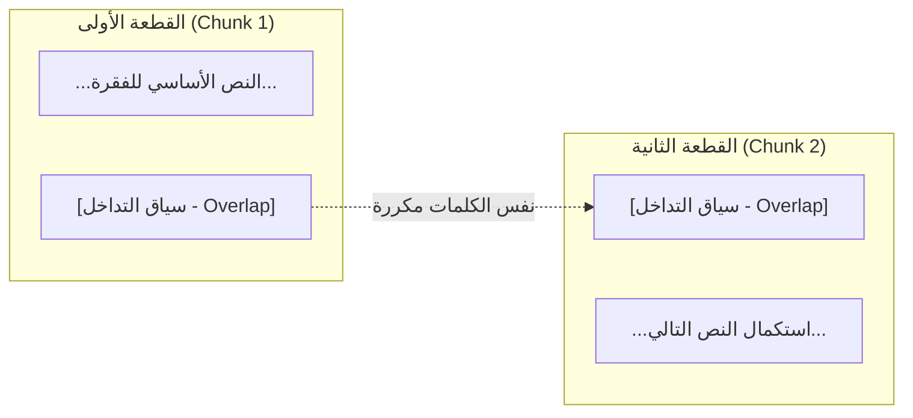
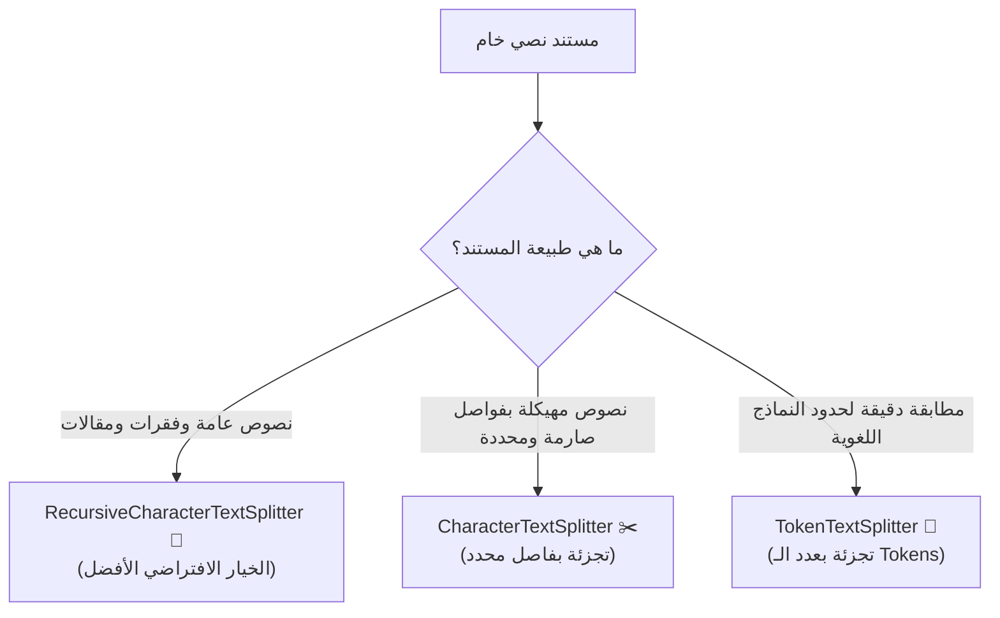

# 04 - استراتيجيات وتقنيات تجزئة النصوص (Text Splitting Techniques)

> **ملخص سريع:** المحاضرة الثانية عشرة من الكورس (المحاضرة الرابعة في قسم Ingestion). تشرح واحدة من أهم مراحل خط المعالجة في أنظمة الـ RAG وهي تجزئة المستندات الطويلة إلى قطع نصية ذكية (**Chunks**) باستخدام استراتيجيات LangChain الثلاث: **`CharacterTextSplitter`**، و **`RecursiveCharacterTextSplitter`** (المعيار الذهبي)، و **`TokenTextSplitter`**، مع فهم دور الـ **`chunk_overlap`** في منع ضياع السياق.

---

## 1. لماذا نقوم بتجزئة النصوص (Chunking)؟ ولماذا الـ Overlap؟

1. **محدودية نافذة السياق (Context Window Limits):** نماذج الـ LLM تمتلك حداً أقصى من الـ Tokens، ولا يمكن تمرير مستند كامل مكون من مئات الصفحات في طلب واحد.
2. **رفع دقة البحث الدلالي (Embedding Precision):** تضمين فقرة مركزة تناقش فكرة واحدة ينتج متجهاً شعاعياً دقيقاً، بينما تضمين كتاب كامل ينتج متجهاً مشتتاً يفقد التفاصيل.
3. **أهمية تداخل القطع النصية (`chunk_overlap`):**
   * عند قطع النص عند حد معين، قد تقع معلومة حاسمة في نهاية القطعة الأولى ويكتمل معناها في بداية القطعة الثانية.
   * الـ **`chunk_overlap`** يضمن تكرار آخر عدد من الحروف/الكلمات من القطعة السابقة في بداية القطعة التالية حتى لا ينقطع المعنى الدلالي.

---

## 2. المقارنة بين استراتيجيات التجزئة الثلاث في LangChain

---

### ① الاستراتيجية الأولى: التجزئة بالحروف (`CharacterTextSplitter`)
* **آلية العمل:** تبحث عن فاصل محدد وثابت (`separator` مثل `\n` أو مسافة).
* **المعاملات:**
  * `separator`: الفاصل المعتمد للتقطيع.
  * `chunk_size`: الحد الأقصى لحجم القطعة النصية بعدد الحروف.
  * `chunk_overlap`: عدد حروف التداخل بين القطع المتتالية.
* **المشكلة:** إذا كانت الفقرة أطول من `chunk_size` ولم يظهر الفاصل، فقد تقطع الجملة في منتصفها بشكل عشوائي.

---

### ② الاستراتيجية الثانية: التجزئة التكرارية الذكية (`RecursiveCharacterTextSplitter`)
* **المعيار الذهبي (Gold Standard):** أكثر استراتيجية موصى بها في 90% من مشاريع RAG.
* **آلية العمل الهرمية (Hierarchy):** تحاول الحفاظ على ترابط المعنى من خلال تجربة قائمة فواصل بالترتيب:
  1. `"\n\n"` : الحفاظ على الفقرات الكاملة معاً أولاً.
  2. `"\n"` : إذا كانت الفقرة أكبر من الحجم، تقسم عند الأسطر.
  3. `" "` : إذا كان السطر طويلاً، تقسم عند المسافات بين الكلمات.
  4. `""` : كحل أخير تماماً، تقسم عند الحروف الفردية.
* **النتيجة:** نصوص ذات معنى مترابط لغوياً دون كسر الجمل أو الكلمات.

---

### ③ الاستراتيجية الثالثة: التجزئة بعدد التوكنز (`TokenTextSplitter`)
* **آلية العمل:** تعتمد على خوارزميات الـ Tokenization (مثل `tiktoken` الخاصة بنماذج OpenAI) بدلاً من عدّ الحروف الأبجدية.
* **الفائدة:** النماذج اللغوية تحسب حدودها بالـ **Tokens** وليس بالحروف؛ كلمة واحدة قد تكون 1 إلى 3 توكنز. تضمن هذه الطريقة عدم تجاوز نافذة السياق بدقة متناهية.

---

## 3. مصفوفة المقارنة الفنية (Comparison Matrix)

| الاستراتيجية | طريقة الحساب | احترام بنية النص | السرعة | متى تستخدمها؟ |
| :--- | :---: | :---: | :---: | :--- |
| **`CharacterTextSplitter`** | عدد الحروف | ضعيف (يعتمد على فاصل واحد) | فائقة | عند وجود فواصل بيانات واضحة وصارمة. |
| **`RecursiveCharacterTextSplitter`** | عدد الحروف | **ممتاز جداً (هرمي)** | سريعة | **الخيار الافتراضي لمعظم أنواع النصوص والكتب.** |
| **`TokenTextSplitter`** | عدد الـ Tokens | جيد | متوسطة | عند الرغبة في ضبط ميزانية وسياق الـ LLM بالتوكن تماماً. |

---

## 4. الفرق بين `split_text()` و `split_documents()`

* **`split_text(text: str) -> list[str]`:**
  * تأخذ نصاً خاماً من نوع String وترجع قائمة نصوص مقطعة.
* **`split_documents(docs: list[Document]) -> list[Document]`:**
  * تأخذ قائمة كائنات `Document` وترجع كائنات `Document` مقطعة **مع الحفاظ التلقائي على الـ Metadata الأصلية** الخاصة بكل وثيقة!

---

## 5. نظرة تمهيدية للمحاضرة القادمة (Next Lecture)

في المحاضرة القادمة (**`05-pdf-parsing`**):
* سننتقل لأشهر وأهم أنواع المستندات في الشركات: **ملفات الـ PDF**، وكيفية قراءتها واستخراج نصوصها وصفحاتها ودمجها مع استراتيجيات الـ Chunking.
