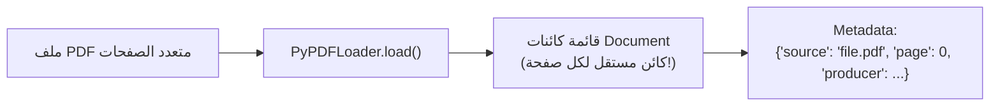

# 05 - قراءة واستخراج مستندات PDF في LangChain (PDF Parsing & Ingestion)

> **ملخص سريع:** المحاضرة الثالثة عشرة من الكورس (المحاضرة الخامسة في قسم Ingestion). تركز على كيفية قراءة واستخراج النصوص والبيانات الوصفية من ملفات الـ **PDF** — المصدر الأكثر شيوعاً في بيئات الأعمال والشركات — باستخدام المحملين الأساسيين: **`PyPDFLoader`** و **`PyMuPDFLoader`**، وفهم الفروق الجوهرية بينهما في السرعة والدقة.

---

## 1. لماذا يعتبر الـ PDF حالة خاصة ومعقدة في RAG؟

ملفات الـ PDF لم تُصمم أصلاً لمعالجة النصوص بواسطة الآلات، بل صُممت للطباعة والعرض البصري الثابت:
* لا تفصل الفقرات أو الأسطر بطريقة دلالية (Semantic).
* تحتوي على عناصر متعددة (نصوص، جداول، صور، هوامش، أرقام صفحات، ترويسات Headers & Footers).
* تختلف جودة وسرعة الاستخراج اختلافاً جذرياً باختلاف أداة التحميل (**PDF Loader**).

---

## 2. المحمل الأول: `PyPDFLoader` (المعيار الافتراضي)

مبني على مكتبة بايثون الشهيرة `pypdf`.



### الخصائص الأساسية:
* **تقسيم بالصفحات:** يُنتج كائن `Document` منفصل لكل صفحة في ملف الـ PDF تلقائياً.
* **الميتا-داتا المستخرجة:** يضيف رقم الصفحة (`page: 0`, `page: 1`...)، ومسار المصدر، وبيانات الملف الوصفية مثل المؤلف وتاريخ الإنشاء.
* **الاعتماديات:** خفيف جداً ومكتوب ببايثون النقية (Pure Python).

### الكود البرمجي:
```python
from langchain_community.document_loaders import PyPDFLoader

loader = PyPDFLoader("data/pdf/sample_paper.pdf")
pages = loader.load()

print(f"إجمالي عدد الصفحات: {len(pages)}")
print(f"محتوى الصفحة الأولى: {pages[0].page_content[:200]}")
print(f"بيانات الصفحة الوصفية: {pages[0].metadata}")
```

---

## 3. المحمل الثاني: `PyMuPDFLoader` (الأسرع والأدق)

مبني على محرك **MuPDF** القوي والمكتوب بلغة **C/C++** (مكتبة `pymupdf` أو `fitz`).

### لماذا يُفضل في المشاريع الإنتاجية؟
* **السرعة الفائقة:** أسرع بعدة أضعاف من المحملات البايثونية التقليدية.
* **دقة استخراج النصوص:** يتعامل بذكاء أكبر مع التنسيقات والأعمدة المزدوجة (Two-column format) الشائعة في الأوراق البحثية.
* **دعم استخراج الصور والتخطيطات المعقدة.**

```bash
# يتطلب تثبيت مكتبة pymupdf
uv pip install pymupdf
```

### الكود البرمجي:
```python
from langchain_community.document_loaders import PyMuPDFLoader

loader = PyMuPDFLoader("data/pdf/sample_paper.pdf")
pages = loader.load()

print(f"تم تحميل {len(pages)} صفحة بسرعة فائقة عبر PyMuPDF.")
```

---

## 4. جدول المقارنة الفنية (PyPDFLoader vs PyMuPDFLoader)

| المعيار | `PyPDFLoader` | `PyMuPDFLoader` ⭐ |
| :--- | :--- | :--- |
| **المحرك الأساسي** | مكتبة `pypdf` (بايثون نقي) | محرك `MuPDF` (مكتوب بـ C/C++) |
| **سرعة المعالجة (Speed)** | متوسطة | **فائقة جداً (أسرع بـ 5 إلى 10 أضعاف)** |
| **دقة النصوص والتنسيق** | جيدة للنصوص البسيطة والقياسية | **ممتازة للنصوص المعقدة ومتعددة الأعمدة** |
| **استخراج الصور** | محدود | يدعم استخراج ومعالجة الصور المرفقة |
| **متى تختاره؟** | للملفات البسيطة وسهولة التثبيت دون مترجمات C | **الخيار الإنتاجي الأفضل لملفات PDF الضخمة والسريعة** |

---

## 5. نظرة تمهيدية للمحاضرة القادمة (Next Lecture)

في المحاضرة القادمة (**`06-pdf-advanced-issues`**):
* سنناقش المشكلات الحقيقية الصعبة في الـ PDF: إزالة الهوامش المكررة (Headers/Footers)، تنظيف النصوص، والتعامل مع الجداول المعقدة والملفات الممسوحة ضوئياً.
