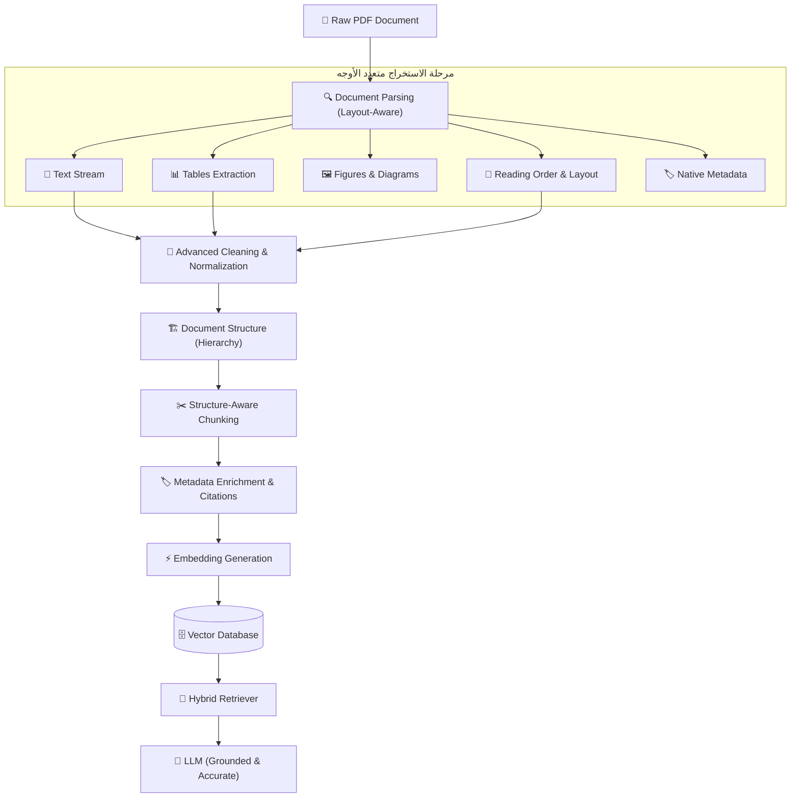
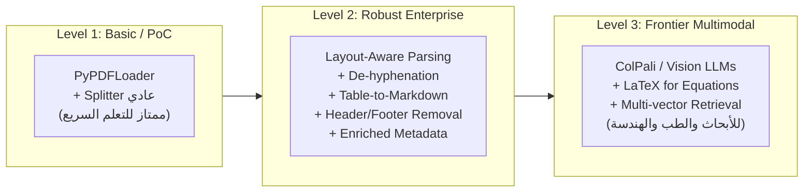

# دليل الإنتاج المعماري: معالجة الـ PDF في أنظمة الـ RAG الحديثة
## (Production-Grade PDF Architecture for Real-World RAG)

> **القاعدة الذهبية:**  
> *"ملف الـ PDF لم يُصمَّم يوماً ليكون بنية بيانات منظمة للذكاء الاصطناعي (Data Structure for AI)، بل صُمّم للعرض والطباعة على الورق والشاشات للعين البشرية (Visual Canvas for Humans)."*

---

## 🧠 1. الصورة الكبيرة: خط أنابيب المعالجة (The Big Picture Pipeline)

نماذج اللغة الكبيرة (LLMs) لا ترى الألوان ولا إحداثيات الصفحة؛ هي تحتاج إلى:
$$\text{Clean Text} + \text{Correct Reading Order} + \text{Preserved Structure} + \text{Rich Metadata}$$

أي خطأ أو تشويه في أول مرحلة (Parsing) سيتضخم عبر التجزئة والـ Embedding وصولاً إلى هلوسة الـ LLM في النهاية:



---

## ⚠️ 2. التحديات الـ 13 لملفات الـ PDF والحلول الإنتاجية (The 13 Real-World Challenges)

---

### 1. الرموز والمسافات المشوهة (Plain Text Artifacts & Ligatures)
* **المشكلة:** دمج الحروف المطبعية مثل (`fi` ➔ `fi`، `fl` ➔ `fl`)، والمسافات والأسطر الزائدة الناتجة عن الـ Justification.
* **الأثر على RAG:** ينقسم الحرف المدمج إلى رمز غريب في الـ Tokenizer مما يدمر الـ Semantic Embedding.
* **الحل الإنتاجي:**
  * استبدال الـ Ligatures الشائعة بقاموس تحويل موحد.
  * توحيد المسافات عبر Regex دون إتلاف أسطر الفقرات المزدوجة `\n\n`.

---

### 2. ترتيب القراءة في الصفحات متعددة الأعمدة (Reading Order & Multi-Column Layout)
* **المشكلة:** عند قراءة صفحة تحتوي عمودين (مثل الأوراق البحثية والتقارير المالية)، يقوم الـ Parser العادي بالقراءة أفقياً (Left-to-Right عبر كامل الصفحة).
* **الأثر على RAG:** اختلاط سطر من العمود الأول مع سطر من العمود الثاني، فيصبح الـ Chunk خليطاً غير مفهوم.
* **الحل الإنتاجي:**
  * استخدام **Layout-Aware Parsers** (مثل `PyMuPDF4LLM` أو `Docling` أو `LayoutParser`) التي تحدد صناديق النصوص (Bounding Boxes) وتفرزها عموداً بعمود قبل دمجها.

---

### 3. الترويسات والتذييلات المكررة (Headers, Footers & Watermarks)
* **المشكلة:** تكرار جمل مثل *"Chapter 5: AI Overview"* أو *"Page 23 - Confidential"* في كل صفحة.
* **الأثر على RAG:** تلوّث فضاء المتجهات (Vector Space) بمفردات شائعة لا تفيد المستخدم وتجعل محرك البحث يسترجع مستندات غير متعلقة.
* **الحل الإنتاجي:**
  * تطبيق **خوارزمية التكرار النسبي (Frequency Threshold Deduplication)**: استخراج السطور الموجودة في أعلى 5% أو أسفل 5% من كل صفحة؛ إذا تكرر سطر في أكثر من 70% من الصفحات، يتم استبعاده تلقائياً مع الحفاظ على أرقام الفصول كـ Metadata.

---

### 4. المستندات المصورة والماسوحة ضوئياً (Scanned PDFs & Rasterized Pages)
* **المشكلة:** الملف يحتوي على صور للورق الأصلي دون طبقة نصية رقمية (`Text Layer`).
* **الأثر على RAG:** تعيد مكتبات مثل `PyPDFLoader` نصاً فارغاً `""` بصمت كامل دون أي تنبيه!
* **الحل الإنتاجي:**
  * **الفحص المسبق (Pre-flight Inspection):** إذا كان عدد الحروف المستخرجة من الصفحة أقل من 30 حرفاً مع وجود كائن صورة (`Image Object`)، يتم تفعيل الـ **OCR Engine** (مثل `Tesseract` أو `Surya-OCR` أو `PaddleOCR` أو `AWS Textract`).

---

### 5. الجداول المعقدة (Complex Tables)
* **المشكلة:** استخراج خلايا الجدول كنص حر متصل يفقد العلاقة ثنائية الأبعاد بين رؤوس الأعمدة وقيم الصفوف.
* **الأثر على RAG:** إجابات خاطئة تماماً عند سؤال الـ LLM عن أرقام مالية أو مقارنات تقنية.
* **الحل الإنتاجي:**
  * استخراج الجداول ككيانات مستقلة وتحويلها إلى **Markdown Tables** أو **HTML/JSON Tables**:
  ```markdown
  | Model | Accuracy | Latency (ms) |
  | :--- | :--- | :--- |
  | GPT-4o | 92.4% | 340 |
  | Claude 3.5 Sonnet | 93.1% | 320 |
  ```
  النماذج تفهم جداول الماركداون ببراعة متناهية وتحافظ على دلالة الأرقام.

---

### 6. الأشكال والرسوم البيانية (Figures & Diagrams)
* **المشكلة:** المخططات المعمارية والرسوم البيانية تحتوي على معلومات جوهرية لا توجد في النص.
* **الأثر على RAG:** الـ Parser العادي يرى مجرد تسمية "Figure 3.1" دون معرفة محتوى الصورة.
* **الحل الإنتاجي:**
  1. **Image Captioning / VLM Summarization:** استخراج الصورة وتمريرها لنموذج رؤية (مثل GPT-4o-mini أو Gemini Flash) لتوليد وصف دقيق يتم تضمينه في النص.
  2. **Multimodal Embeddings (ColPali):** تضمين صفحات الـ PDF بصرياً مباشرة باستخدام نماذج الرؤية متعددة الوسائط.

---

### 7. المعادلات الرياضية (Mathematical Equations)
* **المشكلة:** الرموز الرياضية والكسور تتحول إلى خليط مشوه: `P A B P B A P B`.
* **الأثر على RAG:** استحالة البحث عن النظريات أو المعادلات الرياضية بدقة.
* **الحل الإنتاجي:**
  * استخدام نماذج استخراج الأوراق البحثية (مثل `Nougat` من Meta أو `Marker`) لتحويل المعادلات الرياضية إلى صيغة **LaTeX**:
  $$\mathcal{P}(A|B) = \frac{\mathcal{P}(B|A)\mathcal{P}(A)}{\mathcal{P}(B)}$$

---

### 8. النصوص العربية ومشاكل الاتجاهية (Arabic PDFs & RTL Complexities)
* **المشكلة:** انعكاس الحروف (ظهور "الذكاء" كـ "ءاكذلا")، انفصال الحروف المتصلة، وتداخل الأرقام الهندية والعربية والكلمات الإنجليزية المدمجة.
* **الأثر على RAG:** تدمير تام للـ Tokenization؛ لا يتطابق استعلام المستخدم أبداً مع النص المشوه.
* **الحل الإنتاجي:**
  * تمرير النص المستخرج على خوارزمية **Unicode Bidirectional Algorithm (Bidi)**.
  * تطبيق **Arabic Text Normalization**:
    * توحيد أشكال الألف: (`أ`, `إ`, `آ`) ➔ `ا`.
    * توحيد الياء والتاء المربوطة: (`ى` ➔ `ي`، `ة` ➔ `ه` عند الحاجة للبحث).
    * إزالة التطويل (`ـ` Kashida) والتشكيل الزائد الذي يشتت التضمين.

---

### 9. الكلمات المقطوعة بعلامة الوصل (Hyphenation at Line Breaks)
* **المشكلة:** تنتهي السطور أحياناً بكلمة مقطوعة: `artifi-\ncial intelligence`.
* **الأثر على RAG:** يعاملها الـ Tokenizer ككلمتين غير معروفتين (`artifi-` و `cial`).
* **الحل الإنتاجي:**
  * تطبيق Regex تلقائي قبل التقطيع لدمج الكلمات الموصولة:
  ```python
  text = re.sub(r'(\w+)-\n(\w+)', r'\1\2', text)
  ```

---

### 10. التجزئة العشوائية مقابل التجزئة الدلالية (Fixed vs Semantic Chunking)
* **المشكلة:** التقطيع عند عدد أحرف ثابت (مثلاً 500 حرف) يقطع الجمل أو التعريفات من منتصفها.
* **الأثر على RAG:** ضياع الفكرة وسياق الشرط أو الاستثناء.
* **الحل الإنتاجي:**
  * **Recursive Character Text Splitter** بفاصل تسلسلي هرمي:
    `["\n\n", "\n", ". ", " "]`
  * الحفاظ على ترابط الفقرات والحدود المنطقية للجمل.

---

### 11. هندسة الميتا-داتا للاستشهاد الدقيق (Rich Metadata & Citations)
* **المشكلة:** تخزين النص فقط كـ `page_content` دون معرفة أين وجد في المستند.
* **الأثر على RAG:** لا يمكن للـ LLM وضع استشهاد موثوق (Source Citation)، مما يقلل مصداقية النظام لدى المستخدمين.
* **الحل الإنتاجي:**
  * إثراء كل قطعة (`Chunk`) بـ:
  ```python
  metadata = {
      "source_file": "annual_report_2025.pdf",
      "page_number": 14,
      "section_title": "Risk Factors",
      "chunk_id": "rep25_p14_c02",
      "char_count": 420
  }
  ```

---

### 12. المحتوى المكرر والمقاطع المتشابهة (Duplicate Content & Near-Duplicates)
* **المشكلة:** تكرار نفس الصفحات (مثل صفحات الغلاف، شروط الاستخدام، أو رفع نفس المستند مرتين بإصدارين مختلفين).
* **الأثر على RAG:** احتكار النتائج الـ Top-k بنفس المعلومة المكررة وحجب معلومات أخرى هامة.
* **الحل الإنتاجي:**
  * حساب بصمة الهاش (`SHA-256` أو `MinHash`) لكل فقرة؛ وحجب إدخال أي قطعة مكررة تطابق قطعة سابقة بنسبة تتجاوز 95%.

---

### 13. إدراك الهيكل البصري الهرمي (Document Hierarchy & Heading Inheritance)
* **المشكلة:** فقرة تتحدث عن "الشروط والأحكام" تقع تحت عنوان فرعي "العملاء الدوليين"، وبدون معرفة العنوان الرئيسي يفقد النص دلالته.
* **الحل الإنتاجي:**
  * ربط كل فقرة بالسلسلة الهرمية الكاملة التي تتبعها:
    `Document > Chapter 2 > Section 2.1 > Paragraph`
  * إضافة العنوان الرئيسي في بداية الـ Chunk أو داخل الـ Metadata لتوجيه الـ Retriever بدقة.

---

## 🏗️ 3. مستويات النضج المعماري (The 3 RAG Maturity Levels)



---

## 🛠️ 4. مقارنة أدوات الـ PDF الحديثة في الـ Production (2025/2026 Ecosystem)

| الأداة (Library / Framework) | تصنيفها | أفضل استخدام | معالجة الجداول | السرعة |
| :--- | :--- | :--- | :--- | :--- |
| **`PyPDF` / `PyPDFLoader`** | Standard Python | نصوص عادية بسيطة (PoC) | ضعيفة | سريعة جداً |
| **`PyMuPDF` (`fitz`)** | C-based Engine | فحص متقدم واستخراج عالي السرعة | جيدة | فائقة (10x أسرع) |
| **`PyMuPDF4LLM`** | Layout-to-Markdown | تحويل الصفحات مباشرة إلى Markdown نظيف | ممتازة جداً | فائقة السرعة |
| **`Docling` (IBM)** | Layout Deep Learning | مستندات معقدة وأوراق بحثية وجداول متداخلة | استثنائية (SOTA) | متوسطة (تعتمد على الـ GPU) |
| **`Marker`** | Deep Learning OCR | كتب وأبحاث مليئة بالمعادلات وLaTeX | ممتازة | متوسطة |
| **`Unstructured.io`** | Multi-modal ETL | خطوط إنتاج بيانات ضخمة (Enterprise Pipelines) | ممتازة | جيدة جداً |
| **`ColPali`** | Vision-RAG Model | RAG يعتمد على صور الصفحات بدون تقطيع نصي | خيالية (بصرياً) | تتطلب موارد استدلال عالية |

---

## 🏗️ 5. المعمارية البرمجية المعيارية لخط الأنابيب (Modular Pipeline Architecture)

أحد أهم الدروس الهندسية في بناء الـ RAG: **تجنب تجميع كل المنطق في كلاس واحد ضخم (God Class)**، بل قسّم خط الأنابيب إلى مكونات أحادية المسؤولية (Single-Responsibility Components):

```mermaid
flowchart TD
    RawFile["📄 Binary PDF File"] --> MetaManager["1. MetadataManager\n(يحسب Document ID بالـ SHA-256 للبيانات الثنائية)"]
    RawFile --> Loader["2. DocumentLoader\n(PyPDFLoader / PyMuPDF)"]
    Loader --> HFFilter["3. HeaderFooterFilter\n(فحص هوامش الصفحات وحذف الأسطر المتكررة فقط دون تدمير النص الداخلي)"]
    HFFilter --> Normalizer["4. TextNormalizer\n(Smart De-hyphenation + Ligatures + Non-destructive Arabic)"]
    Normalizer --> Splitter["5. RecursiveSplitter\n(تقطيع دلالي يحافظ على تماسك الفقرات والجمل)"]
    Splitter --> Deduplicator["6. ChunkDeduplicator\n(فحص بصمة الهاش لكل قطعة لمنع التكرار)"]
    Deduplicator --> ReadyDocs["✅ Ready LangChain Document Chunks"]
```



### 💎 قواعد ذهبية في كود الإنتاج (Production Rules of Thumb):
1. **التعامل الذكي مع الكلمات الموصولة (Smart De-hyphenation):**
   * دمج المقاطع المكسورة بسبب السطر (`artifi-\ncial` ➔ `artificial`).
   * **الحفاظ على الكلمات المركبة بطبيعتها** (`well-\nknown` ➔ `well-known`، `state-\nof-the-art` ➔ `state-of-the-art`).
2. **قاعدة المعالجة غير التدميرية للغة العربية (Non-Destructive Arabic Handling):**
   * النص الأصلي بتشكيله وهمزاته الصحيحة (`أحمد`) يذهب للـ LLM لضمان إخراج احترافي للمستخدم.
   * النص الموحّد (`احمد`) يُخزن كـ `search_preview` أو يُستخدم في مرحلة الـ Keyword/Lexical Search (BM25).
3. **الأمان في حذف الترويسات (Safe Header/Footer Filtering):**
   * لا تستخدم أبداً `content.replace(header, "")` لأنها ستحذف الكلمة من منتصف النصوص الداخلية!
   * قارن الأسطر فقط في **الهامش العلوي (Top 2 lines)** و**الهامش السفلي (Bottom 2 lines)**.
4. **الهوية الثابتة للمستند (Deterministic Document ID):**
   * لا تعتمد على اسم الملف (`source_file`) كمعرف فريد، بل احسب بصمة الهاش للملف الثنائي `hashlib.sha256(path.read_bytes()).hexdigest()[:16]`.

---

## 📌 الخلاصة الهندسية

نُطلق على هذا الكود اسم **`Robust Text-Based PDF Pipeline`** لأنه يمثل الأساس الصلب للنصوص المكتوبة. وحين يتطلب مشروعك التعامل مع جداول مالية معقدة أو مستندات مصورة بالكامل، يتم توسيع هذه المعمارية بدمج محركات متخصصة مثل **`Docling`** أو نماذج **`OCR`** دون الحاجة لإعادة كتابة خط الأنابيب من الصفر!

