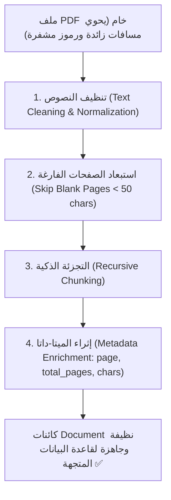

# 06 - حل المشكلات المعقدة في الـ PDF وتنظيف النصوص (Handling Common PDF Issues)

> **ملخص سريع:** المحاضرة الرابعة عشرة من الكورس (المحاضرة السادسة في قسم Ingestion). تنتقل بنا من مجرد قراءة الـ PDF العادية إلى **المستوى المتقدم والمعياري في الإنتاج**: التعامل مع عيوب وتحديات ملفات الـ PDF الشائعة (المسافات الزائدة، الأحرف المشفرة والـ Ligatures، الصفحات الفارغة)، وبناء كلاس بايثون منظم وقابل لإعادة الاستخدام يُدعى **`SmartPDFProcessor`** يدمج بين التنظيف الذكي والتجزئة وإثراء البيانات الوصفية (**Metadata Enrichment**).

---

## 1. أشهر المشكلات والتحديات في ملفات الـ PDF (Real-World PDF Challenges)

في الواقع العملي، نادراً ما تأتي ملفات الـ PDF بنصوص نظيفة:
1. **المسافات والأسطر الفارغة المتعددة (Excessive Whitespaces & Newlines):** وجود علامات `\n\n\n` ومسافات متفرقة ناتجة عن التنسيق البصري للـ PDF.
2. **الأحرف المدمجة والمشفرة (Ligatures):** دمج حروف مثل (`fi`, `fl`, `ffi`) في رمز طباعي واحد قد لا يقرأه النموذج بشكل سليم.
3. **الصفحات الفارغة أو قليلة المحتوى (Blank & Cover Pages):** صفحات تحتوي فقط على ترقيم أو علامات مائية لا تفيد نظام الـ RAG ويجب استبعادها لتوفير التكاليف ومساحة التخزين.
4. **فقدان السياق في الجداول والترويسات (Headers/Footers & Tables):** تكرار اسم المستند في كل صفحة مما يشتت محرك البحث.



---

## 2. دالة تنظيف النصوص (`clean_text`)

تقوم الدالة بتنظيف النص الخام عبر:
* توحيد المسافات والأسطر المتباعدة عبر `text.split()` و إعادة دمجها `" ".join()`.
* استبدال الرموز المشفرة والـ Ligatures الشائعة (`fi` ➔ `fi`, `fl` ➔ `fl`).

```python
def clean_text(text: str) -> str:
    # 1. استبدال الـ Ligatures الشائعة
    text = text.replace("fi", "fi").replace("fl", "fl")
    # 2. إزالة المسافات المتعددة والأسطر الفارغة المكررة
    text = " ".join(text.split())
    return text.strip()
```

---

## 3. المعمارية المعيارية: كلاس `SmartPDFProcessor`

بدلاً من كتابة كود مبعثر، يتم تجميع كل عمليات المعالجة داخل كلاس modular احترافي:

### المهام التي يقوم بها الكلاس:
1. **التهيئة (`__init__`):** استقبال `chunk_size` و `chunk_overlap` وإعداد `RecursiveCharacterTextSplitter`.
2. **التحميل:** قراءة ملف الـ PDF صفحة بصفحة عبر `PyPDFLoader`.
3. **التنظيف الذكي:** تطبيق `_clean_text` على كل صفحة.
4. **الفلترة:** تخطي أي صفحة يقل نصها النظيف عن 50 حرفاً (`len < 50`) كصفحة فارغة.
5. **إثراء الميتا-داتا (Metadata Enrichment):**
   * حفظ رقم الصفحة الحالي (`page_number`).
   * إجمالي عدد الصفحات (`total_pages`).
   * اسم استراتيجية التجزئة (`chunk_method: "smart_recursive"`).
   * عدد أحرف القطعة (`char_count`).
   * دمج الميتا-داتا الأصلية للملف (`**page.metadata`).

---

## 4. الكود الهيكلي لكلاس `SmartPDFProcessor`

```python
from typing import List
from langchain_community.document_loaders import PyPDFLoader
from langchain_text_splitters import RecursiveCharacterTextSplitter
from langchain_core.documents import Document

class SmartPDFProcessor:
    def __init__(self, chunk_size: int = 1000, chunk_overlap: int = 100):
        self.chunk_size = chunk_size
        self.chunk_overlap = chunk_overlap
        self.text_splitter = RecursiveCharacterTextSplitter(
            chunk_size=chunk_size,
            chunk_overlap=chunk_overlap,
            separators=["\n\n", "\n", " ", ""]
        )

    def _clean_text(self, text: str) -> str:
        text = text.replace("fi", "fi").replace("fl", "fl")
        return " ".join(text.split()).strip()

    def process_pdf(self, pdf_path: str) -> List[Document]:
        loader = PyPDFLoader(pdf_path)
        pages = loader.load()
        processed_chunks: List[Document] = []
        total_pages = len(pages)

        for page_num, page in enumerate(pages, 1):
            clean_content = self._clean_text(page.page_content)
            
            # استبعاد الصفحات شبه الفارغة
            if len(clean_content) < 50:
                continue

            # تجزئة الصفحة مع إضافة الميتا-داتا المثرية
            metadata = {
                **page.metadata,
                "page_number": page_num,
                "total_pages": total_pages,
                "chunk_method": "smart_recursive",
                "char_count": len(clean_content)
            }
            
            chunks = self.text_splitter.create_documents(
                texts=[clean_content],
                metadatas=[metadata]
            )
            processed_chunks.extend(chunks)

        return processed_chunks
```

---

## 5. لماذا يعتبر إثراء الميتا-داتا سراً من أسرار نجاح RAG؟

عند حفظ هذه القطع داخل قاعدة البيانات المتجهة، لن يقتصر بحثك على المعنى الدلالي فقط، بل يمكنك:
* تصفية النتائج للبحث فقط في الربع الأول أو صفحات معينة.
* توثيق رقم الصفحة الدقيقة وإجمالي الصفحات في رد المساعد الذكي.
* تتبع عدد الأحرف وجودة الاسترجاع في مرحلة الـ Evaluation.

---

## 6. الدليل المعماري وكود الإنتاج المتقدم (Production Blueprint & Code)

لمزيد من التعمق الهندسي وفهم كيفية التعامل مع ملفات الـ PDF في بيئات الإنتاج المعقدة (Enterprise RAG):
* 📖 **[دليل التحديات المعمارية الـ 13 ومستويات النضج الثلاثة](file:///d:/Code/AI/rag-mastery/01-ingestion/06-pdf-advanced-issues/PDF_PRODUCTION_CHALLENGES.md)**: ملف معماري شامل يغطي الجداول، النصوص العربية، الترويسات المتكررة، ومعادلات LaTeX.
* 🐍 **[الكود الإنتاجي الشامل (`production_pdf_pipeline.py`)](file:///d:/Code/AI/rag-mastery/01-ingestion/06-pdf-advanced-issues/production_pdf_pipeline.py)**: خط أنابيب متكامل يدعم إزالة الترويسات المتكررة آلياً، فك وصلات الحروف المقطوعة (De-hyphenation)، معالجة النصوص العربية، وبصمة الهاش (SHA-256) لمنع تكرار القطع.

---

## 7. نظرة تمهيدية للمحاضرة القادمة (Next Lecture)

في المحاضرة القادمة (**`07-word-documents`**):
* سننتقل لمستندات مايكروسوفت وورد (**DOCX**)، وكيفية قراءتها واستخراج فقراتها باستخدام أدوات مخصصة مثل `Docx2txtLoader`.

