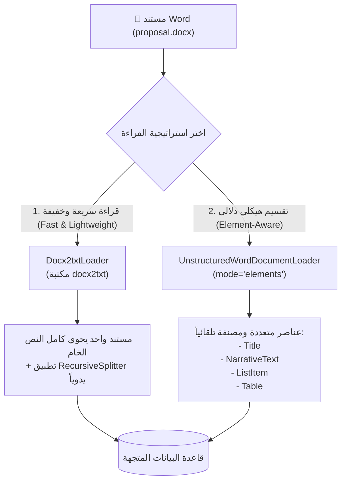

# 07 - قراءة وتحليل مستندات وورد (Word Documents Ingestion & Parsing)

> **ملخص سريع:** المحاضرة الخامسة عشرة من الكورس (المحاضرة السابعة في قسم Ingestion). تركّز على استخراج البيانات من مستندات مايكروسوفت وورد (**DOCX**) الشائعة جداً في الشركات والجهات الحكومية (مثل عروض المشاريع، السياسات الداخلية، العقود، والأدلة الإجرائية). تستعرض المحاضرة طريقتين أساسيتين: **`Docx2txtLoader`** السريع، و **`UnstructuredWordDocumentLoader`** القادر على تفكيك المستند إلى عناصره البنائية الدلالية (`mode="elements"`).

---

## 🧠 1. لماذا تعتبر ملفات Word (.docx) مميزة في RAG؟

ملفات الـ Word تختلف جوهرياً عن ملفات الـ PDF:
* **بنية ملف الـ DOCX:** هو في الحقيقة أرشيف مضغوط (ZIP) يحوي ملفات XML مهيكلة (`Office Open XML`).
* **ميزة الـ DOCX:** لا يعاني من مشكلة "ترتيب القراءة" البصرية كما في الـ PDF؛ فالنصوص والجداول والفقرات مخزنة داخلياً بتسلسل وترتيب هيكلي واضح (`Paragraphs`, `Runs`, `Tables`, `Headings`).



---

## 🛠️ 2. الحزم والمكتبات المطلوبة (Prerequisites)

```bash
pip install python-docx docx2txt "unstructured[docx]"
```

* **`python-docx`**: للتعامل البرمجي المباشر مع ملفات Word، قراءة الفقرات، والجداول.
* **`docx2txt`**: أداة سريعة جداً وخفيفة من بايثون النقي لاستخراج النصوص والصور بدون الحاجة لبيئات تشغيل معقدة.
* **`unstructured`**: إطار عمل متقدم لاستخراج المحتوى الدلالي وتصنيف العناصر.

---

## 💻 3. الطريقة الأولى: القراءة البسيطة عبر `Docx2txtLoader` (Method 1)

هذه الطريقة هي الخيار الأمثل والافتراضي إذا كان المستند عبارة عن نصوص وتقارير تقليدية وتريد سرعة فائقة في المعالجة بأقل استهلاك للموارد.

### كود التنفيذ:
```python
from langchain_community.document_loaders import Docx2txtLoader

file_path = "data/docx/proposal.docx"

try:
    loader = Docx2txtLoader(file_path)
    docs = loader.load()

    print(f"[+] Loaded documents count: {len(docs)}")
    print(f"[+] First 200 characters preview:\n{docs[0].page_content[:200]}")
    print(f"[+] Metadata: {docs[0].metadata}")
except Exception as e:
    print(f"[-] Error loading document: {e}")
```

### الخصائص والملاحظات:
1. **عدد المستندات الناتجة:** مستند واحد (`len = 1`) يضم كامل محتوى الملف كنص حر.
2. **الميتا-داتا:** تحتوي على مسار الملف المصدر (`{"source": "data/docx/proposal.docx"}`).
3. **التجزئة اللاحقة:** يتطلب تمرير الناتج على `RecursiveCharacterTextSplitter` لتقطيعه إلى قطع صغيرة (Chunks) مناسبة للـ Embedding.

---

## 🏗️ 4. الطريقة الثانية: التفكيك الهيكلي عبر `UnstructuredWordDocumentLoader` (Method 2)

عند استخدام خاصية `mode="elements"`، لا يقوم الـ Loader بقراءة الملف ككتلة نصية صماء، بل يقوم بنمذجة المستند كعناصر دلالية مستقلة.

### كود التنفيذ:
```python
from langchain_community.document_loaders import UnstructuredWordDocumentLoader

file_path = "data/docx/proposal.docx"

try:
    loader = UnstructuredWordDocumentLoader(file_path, mode="elements")
    docs = loader.load()

    print(f"[+] Loaded structured elements count: {len(docs)}")
    
    # استعراض أول 5 عناصر وتصنيفاتها
    for idx, doc in enumerate(docs[:5], 1):
        category = doc.metadata.get("category", "Unknown")
        print(f"--- Element #{idx} [{category}] ---")
        print(f"Content: {doc.page_content}")
        print(f"Metadata: {doc.metadata}\n")
except Exception as e:
    print(f"[-] Error or dependency issue: {e}")
```

### أنواع العناصر المستخرجة (`category` في Metadata):
* **`Title`**: العناوين الرئيسية والفرعية (مثل عنوان المشروع وأسماء الفصول).
* **`NarrativeText`**: الفقرات السردية التوضيحية العادية.
* **`ListItem`**: النقاط التعدادية والقوائم (`Bullet Points`).
* **`Table`**: الجداول مع الحفاظ على ترابط بياناتها.

---

## 📊 5. مقارنة معمارية بين الطريقتين (Architectural Comparison)

| وجه المقارنة | `Docx2txtLoader` | `UnstructuredWordDocumentLoader` |
| :--- | :--- | :--- |
| **السرعة وخفة الحركة** | فائقة السرعة (بضعة أجزاء من الثانية) ⚡ | أبطأ نسبياً (~30-35 ثانية لتحليل الهيكل) ⏳ |
| **الاعتماديات (Dependencies)** | بايثون نقي خفيف (`docx2txt`) | متطلبات برمجية أكبر وحزم NLP (`unstructured`) |
| **المخرجات (Output)** | مستند واحد مجمع (`Single Bulk Document`) | مصفوفة عناصر مجزأة تلقائياً (`List of Elements`) |
| **الميتا-داتا الناتجة** | بسيطة (`source` فقط) | ثرية جداً (`category`, `filename`, `file_directory`, `languages`) |
| **الحاجة لـ Text Splitter** | **ضرورية جداً** لتقطيع النص الكبير | اختيارية (العناصر مجزأة دلالياً مسبقاً) |
| **أفضل حالة استخدام** | تقارير نصية بسيطة، خطوط معالجة سريعة | مستندات معقدة ذات عناوين متعددة وجداول تحتاج لتصنيف |

---

## 💡 6. نصيحة للمهندسين في الـ Production (Enterprise Best Practice)

في بيئات العمل الحقيقية، يمكنك أيضاً استخدام مكتبة `python-docx` مباشرة لكتابة دالة مخصصة تستخرج:
1. العناوين (`Headings`) مع ربطها بالفقرات التابعة لها (`Heading Inheritance`).
2. الجداول وتحويلها إلى صيغة **Markdown Tables** مباشرة، مما يوفر أداءً فائقاً وسرعة عالية دون الحاجة للانتظار الطويل لحزم الـ NLP الثقيلة.

---

## 🔮 7. نظرة تمهيدية للمحاضرة القادمة (Next Lecture)

في الدرس القادم (**`08-csv-excel`**):
* سننتقل للتعامل مع البيانات الجدولية والمالية: قراءة ملفات **CSV** و **Excel** باستخدام `CSVLoader` و `UnstructuredExcelLoader` واستراتيجيات تمثيل الصفوف كـ Chunks للـ LLM.
