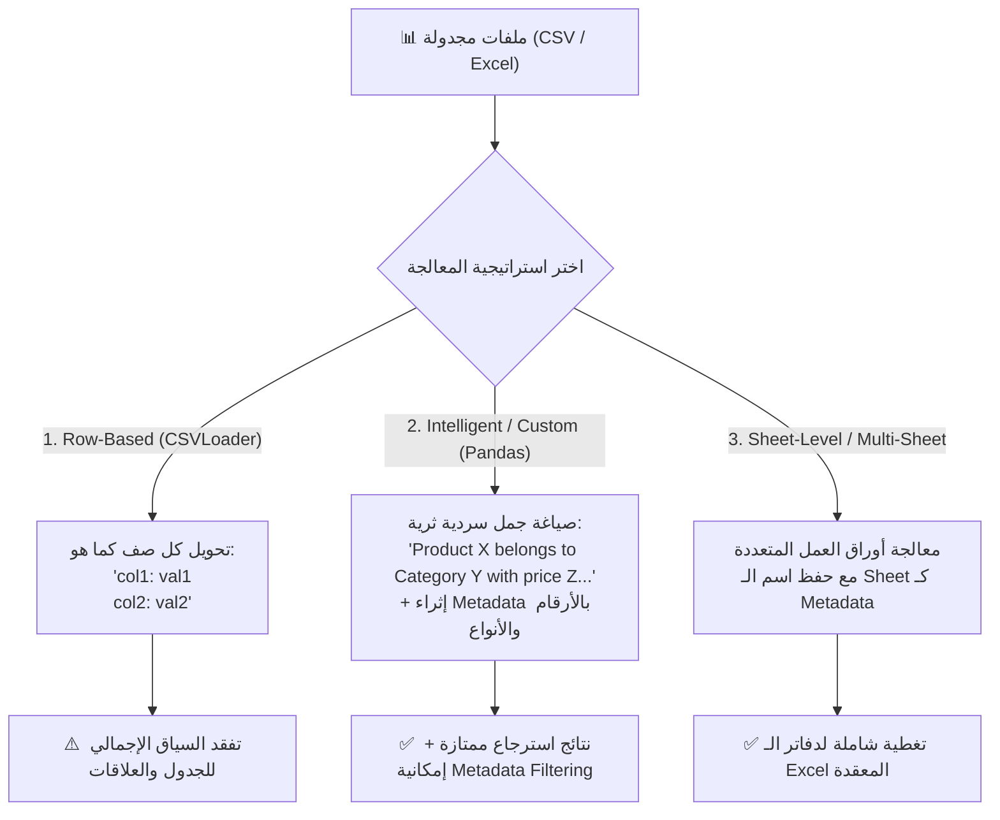

# 08 - معالجة ملفات الجداول CSV و Excel (CSV & Excel Tabular Data Ingestion)

> **ملخص سريع:** المحاضرة السادسة عشرة من الكورس (المحاضرة الثامنة في قسم Ingestion). تنتقل بنا من البيانات غير المهيكلة (النصوص والـ PDF والـ Word) إلى **البيانات المهيكلة والجدولية (Structured Tabular Data)** مثل ملفات **CSV** ومستندات **Excel (.xlsx)**. تشرح المحاضرة كيفية تحويل الصفوف والجداول إلى كائنات `Document` في LangChain، مع مقارنة معمارية حاسمة بين القراءة التلقائية بالصفوف (**Row-Based**) والقراءة الذكية المخصصة (**Intelligent/Custom Processing**) باستخدام Pandas لإثراء البيانات الوصفية وتمكين الفلترة الدقيقة.

---

## 🧠 1. معضلة البيانات الجدولية في RAG (The Tabular Data Dilemma)

نماذج التضمين المتجهي (`Embedding Models`) مصممة أصلاً لفهم **السياق اللغوي المتصل (Semantic Narrative Context)**، بينما الجداول تمثل بيانات رقمية وشبكية ثنائية الأبعاد (صفوف وأعمدة):



---

## 🛠️ 2. المتطلبات البرمجية والحزم الأساسية (Prerequisites)

تتطلب معالجة ملفات الجداول الحزم التالية:

```bash
pip install pandas openpyxl "unstructured[csv,xlsx]"
```

* **`pandas`**: الأداة القياسية الأقوى لتحميل وتعديل وفلترة البيانات الجدولية في بايثون.
* **`openpyxl`**: المحرك البرمجي المسؤول عن قراءة وكتابة ملفات مايكروسوفت إكسيل الحديثة (`.xlsx`).
* **`langchain_community`**: توفر `CSVLoader` و `UnstructuredCSVLoader` و `UnstructuredExcelLoader`.

---

## 💻 3. الطريقة الأولى: القراءة التلقائية للصفوف عبر `CSVLoader` (Method 1: Row-Based)

تقوم أداة `CSVLoader` بقراءة كل صف من صفوف الـ CSV وتحويله مباشرة إلى كائن `Document` مستقل، بحيث يكون اسم العمود هو المفتاح وقيمة الخلية هي القيمة.

### كود التنفيذ:
```python
from langchain_community.document_loaders import CSVLoader

csv_path = "data/products.csv"

# إعداد اللودر مع تحديد الترميز ومحددات الأعمدة
loader = CSVLoader(
    file_path=csv_path,
    encoding="utf-8",
    csv_args={
        "delimiter": ",",
        "quotechar": '"'
    }
)

docs = loader.load()

print(f"[+] Total Rows Loaded: {len(docs)}")
print(f"[+] First Row Content:\n{docs[0].page_content}")
print(f"[+] Metadata: {docs[0].metadata}")
```

### شكل المستند الناتج:
```text
product: MacBook Pro 16
category: Laptops
price: 2499
description: High-performance laptop with M3 Max chip and 36GB unified memory.

Metadata: {'source': 'data/products.csv', 'row': 0}
```

* **المزايا:** سريعة جداً، كود بسيط من سطرين، وتضيف رقم الصف `row` تلقائياً في الميتا-داتا.
* **العيوب:** تفتقر لمعلومات إحصائية عن كامل الجدول، وتعامل كل صف بمعزل تام عن باقي الصفوف.

---

## 🚀 4. الطريقة الثانية: المعالجة الذكية عبر Pandas (Method 2: Intelligent Custom Processing)

في بيئات العمل الإنتاجية، لا نترك النص للتحويل الآلي الجاف، بل نقوم بـ **"السرد الدلالي للصف (Semantic Row Serialization)"** ونستخرج الحقول الرقمية والتصنيفية إلى الميتا-داتا للاستفادة منها في الـ **Vector DB Metadata Filtering** (مثل: ابحث فقط في المنتجات التي سعرها أقل من \$1000).

### كود التنفيذ:
```python
import pandas as pd
from typing import List
from langchain_core.documents import Document

def process_csv_intelligently(file_path: str) -> List[Document]:
    df = pd.read_csv(file_path)
    documents = []
    
    for idx, row in df.iterrows():
        # 1. صياغة سياق سردي دلالي يفهمه نموذج التضمين بدقة
        content = (
            f"Product: {row['product']}\n"
            f"Category: {row['category']}\n"
            f"Price: ${row['price']}\n"
            f"Overview: {row['description']}"
        )
        
        # 2. إثراء الميتا-داتا بحقول قابلة للتصفية البرمجية (Filtering)
        metadata = {
            "source": file_path,
            "row_index": int(idx),
            "product_name": str(row["product"]),
            "category": str(row["category"]),
            "price": float(row["price"])
        }
        
        documents.append(Document(page_content=content, metadata=metadata))
        
    return documents

custom_docs = process_csv_intelligently("data/products.csv")
print(f"[+] Processed {len(custom_docs)} documents with rich metadata.")
```

---

## 📑 5. معالجة مستندات Excel متعددة الأوراق (Multi-Sheet Excel Processing)

ملفات الـ Excel غالباً ما تحتوي على عدة أوراق عمل (`Sheets`) مثل (`products`, `summary`, `transactions`). الطريقة المثلى هي قراءة كل ورقة عمل بشكل منفصل وتضمين اسم الورقة في الميتا-داتا:

```python
import pandas as pd
from langchain_core.documents import Document

def process_multisheet_excel(excel_path: str) -> List[Document]:
    excel_file = pd.ExcelFile(excel_path)
    all_docs = []
    
    for sheet_name in excel_file.sheet_names:
        df = pd.read_excel(excel_file, sheet_name=sheet_name)
        
        for idx, row in df.iterrows():
            # دمج الأعمدة كسطر مهيكل
            row_content = " | ".join([f"{col}: {val}" for col, val in row.items()])
            
            metadata = {
                "source": excel_path,
                "sheet_name": sheet_name,
                "row_index": int(idx)
            }
            all_docs.append(Document(page_content=row_content, metadata=metadata))
            
    return all_docs

excel_docs = process_multisheet_excel("data/inventory.xlsx")
print(f"[+] Extracted {len(excel_docs)} rows across all sheets.")
```

---

## ⚖️ 6. مقارنة الاستراتيجيات: متى تستخدم كل طريقة؟

| الميزة | `CSVLoader` البسيط | `Pandas` المخصص الذكي | `UnstructuredExcelLoader` |
| :--- | :--- | :--- | :--- |
| **السرعة** | فائقة (Native C/Python) ⚡ | سريعة جداً ⚡ | أبطأ نسبياً ⏳ |
| **تخصيص الميتا-داتا** | محدود (`row` و `source`) | **مرن وغير محدود** (أي عمود) 🎯 | قياسي حسب العناصر |
| **تعدد أوراق العمل (Sheets)** | غير متاح (CSV فقط) | **مدعوم بالكامل عبر `ExcelFile`** | مدعوم |
| **دقة استرجاع الـ LLM** | جيدة للاستعلامات المطابقة | **ممتازة جداً (Semantic Context)** | جيدة |
| **إمكانية التصفية (Filtering)** | ضعيفة | **قوية جداً عبر فهارس الـ Vector DB** | متوسطة |

---

## 💡 7. التوصية الهندسية لمشاريع الـ Enterprise RAG

1. **البيانات الكبيرة (ملايين الصفوف):** لا تقم بتحويل كل صف إلى Vector Embedding! الأفضل استخدام نمط **Text-to-SQL / Text-to-Pandas**؛ أي جعل الـ LLM يكتب استعلامات SQL أو استدعاءات Pandas للوصول للأرقام الدقيقة.
2. **البيانات الصغيرة والمتوسطة (كتالوجات المنتجات، الأسئلة الشائعة، الأدلة):** تحويل كل صف إلى كائن `Document` دلالي مع إثراء الميتا-داتا بالأرقام والتصنيفات هو الخيار الأمثل والأنسب للبحث الدلالي الهجين (`Hybrid Search`).

---

## 🔮 8. نظرة تمهيدية للمحاضرة القادمة (Next Lecture)

في الدرس القادم (**`09-json-processing`**):
* سننتقل للتعامل مع البيانات شبه المهيكلة الأكثر انتشاراً في الـ APIs والويب: قراءة وتحليل ملفات **JSON** المتداخلة باستخدام `JSONLoader` ومسارات `jq_schema`.
