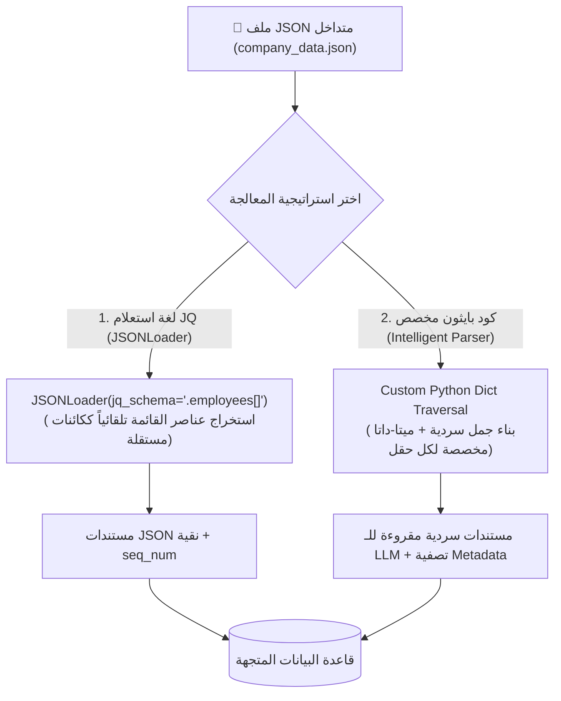

# 09 - قراءة وتحليل بيانات JSON شبه المهيكلة (JSON Data Ingestion & JQ Schema)

> **ملخص سريع:** المحاضرة السابعة عشرة من الكورس (المحاضرة التاسعة في قسم Ingestion). تركّز على استيراد وتحليل بيانات **JSON** شبه المهيكلة والمتداخلة (**Nested Semi-Structured Data**) التي تُعد لغة التخاطب القياسية في واجهات برمجة التطبيقات (**APIs**)، وسجلات الويب (**Event Logs**)، وقواعد بيانات NoSQL (مثل MongoDB). تستعرض المحاضرة طريقتين أساسيتين: استخدام **`JSONLoader`** مع لغة الاستعلامات القوية **`jq`**، والمعالجة البرمجية الذكية المخصصة عبر بايثون لتحويل الكائنات المعقدة إلى نصوص سردية دلالية مدعمة بميتا-داتا غنية.

---

## 🧠 1. تحدي بيانات الـ JSON في الـ RAG (The JSON Challenge in RAG)

على عكس النصوص السردية العادية، تأتي بيانات الـ JSON في هيئة كائنات متداخلة وقوائم (`Arrays of Objects`) ومفاتيح برمجية جافة (`key-value pairs`):
* إذا تم تمرير الـ JSON كما هو للنموذج المتجهي، فإن الأقواس المعقوفة `{}` والفواصل والمفاتيح المكررة تشتت دقة الـ Cosine Similarity.
* **الحل:** استخراج الكيانات المحددة وتسطيحها دلالياً (**Semantic Entity Flattening**) بحيث يمثل كل كيان (مثل: موظف، حدث، سجل طلب) كائن `Document` مستقل يحوي سياقاً لغوياً واضحاً وميتا-داتا قابلة للفلترة.



---

## 🛠️ 2. المتطلبات البرمجية والحزم الأساسية (Prerequisites)

```bash
pip install jq
```

* **`jq`**: لغة ومحرك برمجي فائق السرعة مخصص لاستعلام واختيار وتحويل بيانات الـ JSON المعقدة.
* **`langchain_community`**: توفر `JSONLoader` الذي يعتمد على مكتبة `jq` داخلياً.

---

## 💻 3. الطريقة الأولى: استخراج الكائنات عبر `JSONLoader` و `jq_schema` (Method 1)

تتيح لغة `jq` تحديد المسار الدقيق للكائنات المراد استخراجها داخل ملف الـ JSON المتداخل دون كتابة حلقات تكرار يدوية:

### أمثلة على صياغة `jq_schema`:
* `.` : استخراج كامل ملف الـ JSON ككتلة واحدة.
* `.employees[]` : التكرار على كل عنصر داخل قائمة `employees` وتحويل كل موظف إلى `Document` مستقل.
* `.employees[].name` : استخراج أسماء الموظفين فقط.

### كود التنفيذ:
```python
from langchain_community.document_loaders import JSONLoader

json_path = "data/json/company_data.json"

# استخراج كل موظف ككائن Document مستقل
loader = JSONLoader(
    file_path=json_path,
    jq_schema=".employees[]",
    text_content=False  # الاحتفاظ بكامل بنية الكائن الداخلي
)

docs = loader.load()

print(f"[+] Total Documents Loaded: {len(docs)}")
print(f"[+] Document #1 Content:\n{docs[0].page_content}")
print(f"[+] Document #1 Metadata:\n{docs[0].metadata}")
```

### شكل المستند الناتج:
```json
{"id": 1, "name": "Sarah Chen", "role": "Lead AI Engineer", "skills": ["Python", "PyTorch", "LangChain", "RAG Architecture"], "projects": [{"name": "RAG Knowledge Base", "status": "In Progress"}]}
```
* **الميتا-داتا التلقائية:** `{'source': '.../company_data.json', 'seq_num': 1}`

---

## 🚀 4. الطريقة الثانية: المعالجة البرمجية الدلالية المخصصة (Custom Semantic Parser)

في أنظمة الـ RAG الحقيقية، لا نترك الـ JSON الخام كـ String، بل نصيغ منه **جملة طبيعية (Natural Language Representation)** لكي يفهم نموذج التضمين المعنى والعلاقات، ونضع المعرفات والخصائص في الـ `metadata`:

### كود التنفيذ:
```python
import json
from pathlib import Path
from typing import List
from langchain_core.documents import Document

def parse_company_json_intelligently(file_path: str) -> List[Document]:
    with open(file_path, "r", encoding="utf-8") as f:
        data = json.load(f)
        
    company = data.get("company_name", "Unknown Company")
    employees = data.get("employees", [])
    documents = []
    
    for emp in employees:
        emp_id = emp.get("id")
        name = emp.get("name")
        role = emp.get("role")
        skills = ", ".join(emp.get("skills", []))
        
        # صياغة المشاريع وحالتها
        projects_info = []
        for p in emp.get("projects", []):
            projects_info.append(f"{p['name']} ({p['status']})")
        projects_str = "; ".join(projects_info)
        
        # 1. صياغة النص السردي المتكامل للـ LLM
        content = (
            f"Employee: {name} (ID: {emp_id})\n"
            f"Company: {company}\n"
            f"Role: {role}\n"
            f"Key Technical Skills: {skills}\n"
            f"Active & Completed Projects: {projects_str}"
        )
        
        # 2. إثراء الميتا-داتا بحقول جاهزة للفلترة البرمجية
        metadata = {
            "source": Path(file_path).name,
            "employee_id": emp_id,
            "name": name,
            "role": role,
            "company": company,
            "skills_count": len(emp.get("skills", []))
        }
        
        documents.append(Document(page_content=content, metadata=metadata))
        
    return documents

custom_docs = parse_company_json_intelligently("data/json/company_data.json")
print(f"[+] Created {len(custom_docs)} semantically enriched documents.")
```

---

## 🎯 5. حل تطبيق المحاضرة: معالجة سجلات الأحداث (`events.json`)

طرح المحاضر تمريناً عملياً لقراءة ملف سجل الأحداث `events.json` وتضمين الطابع الزمني (`timestamp`) ونوع الحدث (`event`) وهوية المستخدم (`user_id`) في الميتا-داتا:

```python
import json
from typing import List
from langchain_core.documents import Document

def parse_event_logs(file_path: str) -> List[Document]:
    with open(file_path, "r", encoding="utf-8") as f:
        events = json.load(f)
        
    documents = []
    for idx, ev in enumerate(events, 1):
        # صياغة محتوى وصفي للحدث
        content = (
            f"Audit Log Event: {ev['event']}\n"
            f"User ID: {ev['user_id']}\n"
            f"Target Page: {ev['page']}\n"
            f"Status: {ev['status']}\n"
            f"Timestamp: {ev['timestamp']}"
        )
        
        # إثراء الميتا-داتا بالخصائص الزمنية وهوية المستخدم
        metadata = {
            "source": "events.json",
            "event_type": ev["event"],
            "user_id": ev["user_id"],
            "page": ev["page"],
            "timestamp": ev["timestamp"],
            "status": ev["status"]
        }
        
        documents.append(Document(page_content=content, metadata=metadata))
        
    return documents
```

---

## 📊 6. مقارنة بين استراتيجيات معالجة الـ JSON

| وجه المقارنة | `JSONLoader` مع `jq_schema` | المعالجة الدلالية المخصصة (Custom Python) |
| :--- | :--- | :--- |
| **سهولة الاستخدام** | سطر واحد مع استعلام jq | تتطلب كتابة كود بايثون بسيط |
| **جودة الـ Embedding** | متوسطة (نص JSON خام يحتوي على علامات ترقيم ومفاتيح) | **فائقة جداً (سرد لغوي طبيعي مترابط دلالياً)** |
| **التحكم في الـ Metadata** | محدود (`seq_num` ومسار الملف) | **مرونة مطلقة لإضافة أي حقل للفلترة لاحقاً** |
| **التعامل مع الكيانات المتداخلة** | ممتاز عبر مسارات jq | ممتاز ومرن جداً |
| **الاعتماديات الخارجية** | تتطلب مكتبة `jq` | لا تتطلب أي مكتبة خارجية (Standard `json`) |

---

## 🔮 7. نظرة تمهيدية للمحاضرة القادمة (Next Lecture)

في الدرس القادم (**`10-sql-databases`**):
* سنختتم قسم **Data Ingestion** بالتعامل مع قواعد البيانات العلائقية (**Relational SQL Databases**): الاتصال بقواعد البيانات واستخراج السجلات باستخدام `SQLDatabaseLoader` واستراتيجيات ربط الجداول مع الـ RAG.
