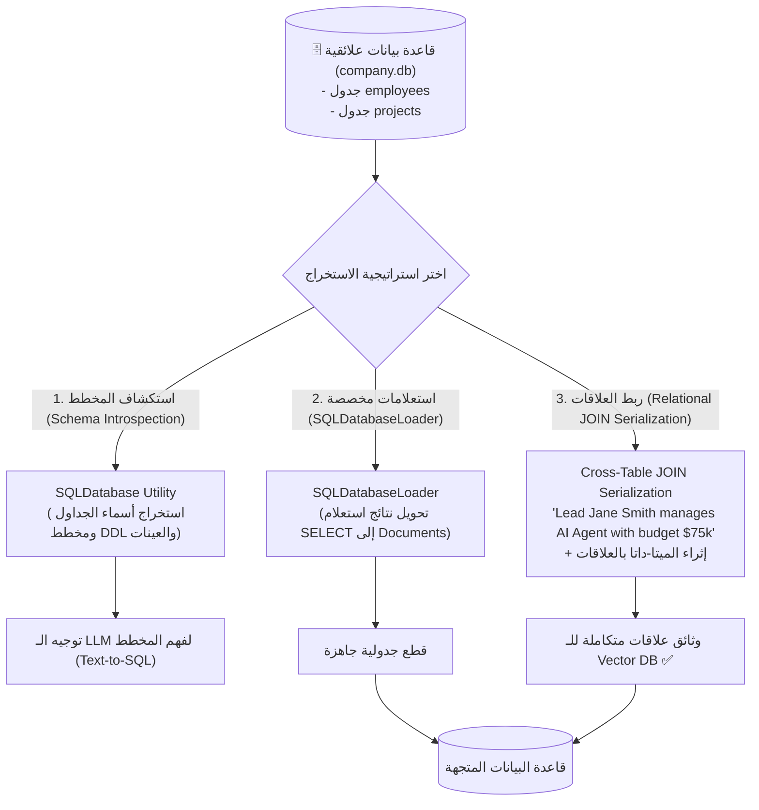

# 10 - ربط واستخراج البيانات من قواعد بيانات SQL (SQL Databases Ingestion & RAG)

> **ملخص سريع:** المحاضرة الثامنة عشرة من الكورس (المحاضرة العاشرة والأخيرة في قسم Ingestion). تركّز على استخراج البيانات من **قواعد البيانات العلائقية (Relational SQL Databases)** مثل SQLite و PostgreSQL و MySQL. تشرح المحاضرة كيفية سد الفجوة بين البيانات العلائقية المقسمة على جداول مترابطة (`Normalized Tables`) ونماذج الـ RAG التي تتطلب نصوصاً سياقية متكاملة، مستعرضةً أدوات LangChain الرسمية (`SQLDatabase` و `SQLDatabaseLoader`) واستراتيجيات الربط الدلالي بين الجداول (**Cross-Table Relational JOINs**).

---

## 🧠 1. معضلة قواعد بيانات SQL في الـ RAG (The Relational RAG Dilemma)

في الأنظمة التقليدية، تُخزن البيانات وفق قواعد التسوية (`Database Normalization`):
* جدول للموظفين (`employees`) وجدول منفصل للمشاريع (`projects`) مرتبط بمفتاح أجنبي (`lead_id ➔ id`).
* **المشكلة في الـ Vector DB:** قواعد البيانات المتجهة لا تستطيع تنفيذ عمليات `JOIN` برمجياً بين المتجهات! إذا قمت بتضمين كل صف بمعزل عن بقية الجداول، سيفقد النظام العلاقات الجوهرية.
* **الحل المعماري:** فك التسوية الدلالي (**Semantic Denormalization**) عبر استعلامات `JOIN` تجمع الكيانات المترابطة في وثيقة واحدة، أو دمج مخطط قاعدة البيانات (`DDL Schema`) لتمكين الوكلاء من فهم بنية البيانات.



---

## 🛠️ 2. المتطلبات البرمجية (Prerequisites)

```bash
pip install sqlalchemy
```

* **`sqlite3`**: مكتبة بايثون القياسية المدمجة لإدارة قواعد بيانات SQLite المحلية.
* **`sqlalchemy`**: المحرك القياسي الأقوى في بايثون للاتصال بجميع أنواع قواعد البيانات (Postgres, MySQL, Oracle, SQLite).
* **`langchain_community`**: توفر كلاسات `SQLDatabase` و `SQLDatabaseLoader`.

---

## 💻 3. الطريقة الأولى: استكشاف وفحص قاعدة البيانات عبر `SQLDatabase` (Method 1)

تتيح أداة `SQLDatabase` في LangChain فحص بنية قاعدة البيانات، واستخراج أسماء الجداول، وأوامر الـ DDL المنشئة لها، مع عينات من الصفوف تلقائياً:

### كود التنفيذ:
```python
from langchain_community.utilities import SQLDatabase

db_uri = "sqlite:///data/databases/company.db"
db = SQLDatabase.from_uri(db_uri)

# 1. استعراض الجداول المتاحة
print("Available Tables:", db.get_usable_table_names())
# مخرجات: ['employees', 'projects']

# 2. استعراض مخطط الجدول والعينات (DDL Schema + Top 3 Rows)
table_info = db.get_table_info(["employees"])
print(table_info)
```

### شكل المعلومات المستخرجة للـ LLM:
```sql
CREATE TABLE employees (
    id INTEGER, 
    name TEXT, 
    role TEXT, 
    department TEXT, 
    salary REAL, 
    PRIMARY KEY (id)
)

/*
3 rows from employees table:
id  name          role                 department    salary
1   John Doe      Senior Developer     Engineering   95000.0
2   Jane Smith    Lead Data Scientist  Data Science  115000.0
3   Mike Johnson  DevOps Architect     Infrastructure 105000.0
*/
```

---

## 🚀 4. الطريقة الثانية: استخراج البيانات عبر استعلامات `SQLDatabaseLoader` (Method 2)

عند الرغبة في تحويل نتائج استعلام SQL محدد إلى كائنات `Document` في خط أنابيب الـ RAG:

```python
from langchain_community.document_loaders import SQLDatabaseLoader

query = "SELECT name, role, department, salary FROM employees WHERE salary > 90000"

loader = SQLDatabaseLoader(
    query=query,
    db=db
)

docs = loader.load()

print(f"[+] Loaded {len(docs)} documents from SQL query.")
print(f"[+] First Record:\n{docs[0].page_content}")
```

---

## 🔗 5. الطريقة الثالثة: ربط العلاقات عبر الجداول (Relational JOIN Serialization)

في العالم الحقيقي، نادراً ما يجيب جدول منفصل عن استفسارات المستخدم. لذلك نقوم بربط الجداول عبر `JOIN` لإنشاء وثيقة دلالية متكاملة تصف العلاقة بين الموظف ومشاريعه:

### كود التنفيذ:
```python
import sqlite3
from typing import List
from langchain_core.documents import Document

def serialize_relational_data(db_path: str) -> List[Document]:
    conn = sqlite3.connect(db_path)
    cur = conn.cursor()
    
    # استعلام ربط الموظف بالمشروع الذي يقوده
    query = """
    SELECT 
        e.name AS lead_name,
        e.role AS lead_role,
        e.department,
        p.name AS project_name,
        p.status AS project_status,
        p.budget AS project_budget
    FROM employees e
    INNER JOIN projects p ON e.id = p.lead_id
    """
    cur.execute(query)
    rows = cur.fetchall()
    
    documents = []
    for row in rows:
        lead_name, role, dept, proj_name, status, budget = row
        
        # 1. صياغة جملة سردية متماسكة للـ Vector Search
        content = (
            f"Project: {proj_name}\n"
            f"Project Status: {status}\n"
            f"Allocated Budget: ${budget:,.2f}\n"
            f"Project Lead: {lead_name} ({role})\n"
            f"Responsible Department: {dept}"
        )
        
        # 2. إثراء الميتا-داتا لتمكين الفلترة البرمجية
        metadata = {
            "source": "company.db",
            "table_relation": "employees_x_projects",
            "project_name": proj_name,
            "project_status": status,
            "budget": budget,
            "lead_name": lead_name,
            "department": dept
        }
        
        documents.append(Document(page_content=content, metadata=metadata))
        
    conn.close()
    return documents

relational_docs = serialize_relational_data("data/databases/company.db")
print(f"[+] Generated {len(relational_docs)} relational documents.")
```

---

## ⚖️ 6. المقارنة المعمارية: Vector RAG مقابل Text-to-SQL

| المعيار | Vector RAG على بيانات SQL | وكلاء Text-to-SQL (SQL Agents) |
| :--- | :--- | :--- |
| **طبيعة المعالجة** | تحويل السجلات لـ Embeddings مقدماً | ترجمة سؤال المستخدم لحظياً إلى استعلام SQL |
| **العمليات الحسابية (SUM, AVG)** | ضعيفة جداً ولا يُعتمد عليها | **دقيقة ومثالية 100% بنظام قاعدة البيانات** |
| **البحث الدلالي والغامض** | **ممتاز جداً (Fuzzy & Semantic Search)** | ضعيف (يعتمد على المطابقة النصية LIKE) |
| **حجم البيانات وسرعة التحديث** | يتطلب إعادة فهرسة دورية | **يعمل مباشرة على البيانات الحية اللحظية** |
| **التوصية الهندسية** | استخدمه لكتالوجات المنتجات والشروحات | **استخدمه للتقارير المالية والتحليلات اللحظية** |

---

## 🎓 7. خاتمة مسار إدخال ومعالجة البيانات (Stage 01: Data Ingestion Summary)

بإتمام هذه المحاضرة، تكون قد بنيت فهماً هندسياً عملياً شاملاً لكافة مصادر البيانات في عالم الذكاء الاصطناعي:
1. **النصوص الخام (TXT)**: التجزئة واستراتيجيات التقطيع.
2. **المستندات المكتبية (PDF & Word)**: القراءة البسيطة، معالجة الجداول، الدليل المعماري، وخط الأنابيب الإنتاجي.
3. **البيانات المجدولة (CSV & Excel)**: القراءة بالصفوف، والسرد الدلالي الذكي.
4. **البيانات شبه المهيكلة (JSON)**: لغة `jq` وتسطيح الكائنات المتداخلة.
5. **قواعد البيانات العلائقية (SQL)**: فحص المخطط وربط العلاقات.

---

## 🔮 8. نظرة تمهيدية للمرحلة القادمة (Next Stage)

في المرحلة القادمة (**`02-indexing`**):
* سننتقل للقلب الرياضي لمحركات الـ RAG: **التضمينات الرياضية (Vector Embeddings)**، ونماذج التضمين مفتوحة المصدر والتجارية، وبناء فهارس المتجهات عالية السرعة (**FAISS & Vector Stores**).
