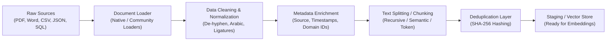

# 📘 الدليل الشامل لهندسة معالجة وإدخال البيانات (Stage 01: Complete Data Ingestion Guide)

> **وثيقة مرجعية شاملة (Comprehensive Reference Manual):**  
> توثيق هندسي ومعماري تفصيلي لكافة موضوعات وتقنيات **المرحلة الأولى (Data Ingestion & Parsing)** في أنظمة الـ RAG، مبني بالكامل على الأكواد، النماذج، والتجارب المعملية التي تم بناؤها في المشروع.

---

## 📑 فهرس المحتويات (Table of Contents)
1. [مقدمة ومعمارية خط إدخال البيانات (Ingestion Pipeline Architecture)](#-1-معمارية-خط-معالجة-البيانات-ingestion-pipeline-architecture)
2. [هيكلية البيانات المركزية في المشروع (Centralized Data Store)](#-2-هيكلية-البيانات-المركزية-centralized-data-store)
3. [الدرس 01: إعداد بيئة العمل والتحكم في الاعتماديات (Environment Setup & uv)](#-الدرس-01-إعداد-بيئة-العمل-والتحكم-في-الاعتماديات-01-environment-setup)
4. [الدرس 02: بنية كائن المستند وهندسة البيانات الوصفية (Document Structure & Metadata)](#-الدرس-02-بنية-كائن-المستند-وهندسة-البيانات-الوصفية-02-document-structure)
5. [الدرس 03: قراءة الملفات النصية واستراتيجيات الترميز (Text Loaders & Directory Ingestion)](#-الدرس-03-قراءة-الملفات-النصية-واستراتيجيات-الترميز-03-text-loaders)
6. [الدرس 04: تقنيات تجزئة وتقطيع النصوص (Text Splitting & Chunking Strategies)](#-الدرس-04-تقنيات-تجزئة-وتقطيع-النصوص-04-text-splitting)
7. [الدرس 05: أساسيات قراءة ومقارنة محملات PDF (PDF Parsing Foundations)](#-الدرس-05-أساسيات-قراءة-ومقارنة-محملات-pdf-05-pdf-parsing)
8. [الدرس 06: معالجة مشكلات PDF المعقدة والخط الإنتاجي (Advanced PDF Engineering & Pipeline)](#-الدرس-06-معالجة-مشكلات-pdf-المعقدة-والخط-الإنتاجي-06-pdf-advanced-issues)
9. [الدرس 07: قراءة وتحليل مستندات Word (Word DOCX Documents Parsing)](#-الدرس-07-قراءة-وتحليل-مستندات-word-07-word-documents)
10. [الدرس 08: استيعاب البيانات الجدولية CSV و Excel (Tabular Data Ingestion)](#-الدرس-08-استيعاب-البيانات-الجدولية-csv-و-excel-08-csv-excel)
11. [الدرس 09: معالجة بيانات JSON شبه المهيكلة (JSON & JQ Schemas)](#-الدرس-09-معالجة-بيانات-json-شبه-المهيكلة-09-json-processing)
12. [الدرس 10: ربط واستخراج قواعد البيانات العلائقية (Relational SQL Databases Ingestion)](#-الدرس-10-ربط-واستخراج-قواعد-البيانات-العلائقية-10-sql-databases)
13. [مصفوفة المقارنة الشاملة وقواعد الإنتاج (Production Best Practices & Matrix)](#-13-مصفوفة-المقارنة-الشاملة-وقواعد-الإنتاج)

---

## 🏛️ 1. معمارية خط معالجة البيانات (Ingestion Pipeline Architecture)

في أنظمة الـ RAG، ينطبق المبدأ الحاسم: **"Garbage In, Garbage Out"**. إذا دخلت البيانات إلى قاعدة المتجهات مشوهة، مقطوعة السياق، فاقدة للبيانات الوصفية، أو مليئة بالشوائب، فإن أفضل نماذج التضمين (Embedding Models) وأقوى نماذج الاستدلال (LLMs) ستفشل في استرجاع الإجابات الصحيحة.

خط الإدخال الذي قمنا بتطويره يمر عبر المراحل القياسية التالية:



---

## 📂 2. هيكلية البيانات المركزية (Centralized Data Store)

تم توحيد جميع مجموعات البيانات التجريبية والإنتاجية في مجلد مركزي موحد في جذر المشروع `data/` لضمان عدم تكرار الملفات، وتسهيل استهلاكها من كافة مراحل الـ Ingestion والمعمل العملي (Playground):

```text
rag-mastery/
├── data/
│   ├── txt/            # نصوص مقالات الذكاء الاصطناعي وهندسة البرمجيات
│   ├── pdf/            # أوراق بحثية sample_paper.pdf وتقارير مالية sample_financial_report.pdf
│   ├── docx/           # مقترحات مشاريع proposal.docx
│   ├── tabular/        # منتجات products.csv ومخزون inventory.xlsx
│   ├── json/           # هياكل متداخلة company_data.json وسجلات events.json
│   └── databases/      # قاعدة بيانات SQLite علائقية company.db
```

### كود الوصول الديناميكي المعتمد عبر الدروس:
```python
from pathlib import Path

# نمط التحقق التلقائي سواء تم تشغيل الكود من جذر المستودع أو من داخل مجلد الدرس
data_dir = Path("data") if Path("data").exists() else Path("../../data")
```

---

## 🛠️ الدرس 01: إعداد بيئة العمل والتحكم في الاعتماديات (01-environment-setup)
* **المسار:** [`01-ingestion/01-environment-setup/`](file:///d:/Code/AI/rag-mastery/01-ingestion/01-environment-setup/)
* **الملفات:** [README.md](file:///d:/Code/AI/rag-mastery/01-ingestion/01-environment-setup/README.md) | [01-environment-setup.ipynb](file:///d:/Code/AI/rag-mastery/01-ingestion/01-environment-setup/01-environment-setup.ipynb)

### 1. الهدف الهندسي (Goal)
بناء بيئة عمل احترافية، فائقة السرعة، وقابلة لإعادة الإنتاج (Reproducible) لتطوير تطبيقات الذكاء الاصطناعي التوليدي والـ RAG باستخدام أداة **`uv`** الحديثة من Astral بدلاً من أدوات `pip` و `virtualenv` التقليدية.

### 2. أهم المفاهيم التقنية
* **مدير الحزم `uv`:** مكتوب بلغة Rust، أسرع بـ 10 إلى 100 ضعف من `pip`.
* **ملف التثبيت القطعي (`uv.lock`):** يضمن تطابق نسخ المكتبات وحل التبعيات بدقة 100% بين أجهزة المطورين وخوادم الإنتاج.
* **إدارة الحزم المباشرة:** تعريف المتطلبات في `pyproject.toml` مع عزل البيئة الافتراضية داخل `.venv`.
* **ربط نواة Jupyter:** ربط البيئة الافتراضية بنواة `ipykernel` للعمل المباشر داخل دفاتر الملاحظات.

### 3. الأوامر الأساسية المطبقة:
```bash
# إنشاء بيئة العمل
uv init rag-mastery
# تثبيت الحزم الأساسية
uv add langchain langchain-community pypdf pymupdf pandas openpyxl
# تشغيل الأدوات عبر البيئة المنعزلة
uv run python -m ipykernel install --user --name rag-mastery --display-name "Python (RAG Mastery)"
```

---

## 📄 الدرس 02: بنية كائن المستند وهندسة البيانات الوصفية (02-document-structure)
* **المسار:** [`01-ingestion/02-document-structure/`](file:///d:/Code/AI/rag-mastery/01-ingestion/02-document-structure/)
* **الملفات:** [README.md](file:///d:/Code/AI/rag-mastery/01-ingestion/02-document-structure/README.md) | [02-document-structure.ipynb](file:///d:/Code/AI/rag-mastery/01-ingestion/02-document-structure/02-document-structure.ipynb)

### 1. الهدف الهندسي (Goal)
فهم البنية التحتية لتمثيل النصوص داخل LangChain، وهي كائن **`Document`**، وكيفية استغلال حقل البيانات الوصفية (**`metadata`**) كأداة هندسية لحل مشكلات التتبع، الاسترجاع المفلتر (Filtered Retrieval)، والتحكم في الصلاحيات.

### 2. التشريح البرمجي لكائن `Document`:
يتكون الكائن من حقلين رئيسيين فقط:
```python
from langchain_core.documents import Document

doc = Document(
    page_content="محتوى النص المراد تضمينه واسترجاعه...",
    metadata={
        "source": "knowledge_base.pdf",
        "doc_id": "doc_9918",
        "page": 4,
        "author": "Engineering Team",
        "department": "Security",
        "created_at": "2026-03-15T10:00:00Z"
    }
)
```

### 3. وظائف الميتا-داتا في أنظمة RAG الإنتاجية:
1. **فلترة قاعدة المتجهات (Vector DB Pre/Post-Filtering):** تقييد البحث بناءً على الشروط (مثل: `where={"department": "Security"}`).
2. **سلسلة التتبع والمصدرية (Provenance & Lineage):** تمكين الـ LLM من الاستشهاد بالمصدر الدقيق (اسم الملف، الصفحة، الفقرة).
3. **التحكم في الوصول (RBAC & Security):** حجب الوثائق الحساسة عن المستخدمين غير المصرح لهم قبل وصولها للنموذج.

---

## 🔤 الدرس 03: قراءة الملفات النصية واستراتيجيات الترميز (03-text-loaders)
* **المسار:** [`01-ingestion/03-text-loaders/`](file:///d:/Code/AI/rag-mastery/01-ingestion/03-text-loaders/)
* **الملفات:** [README.md](file:///d:/Code/AI/rag-mastery/01-ingestion/03-text-loaders/README.md) | [03-text-loaders.ipynb](file:///d:/Code/AI/rag-mastery/01-ingestion/03-text-loaders/03-text-loaders.ipynb)

### 1. الهدف الهندسي (Goal)
استيعاب الملفات النصية الخام (`.txt`, `.md`, `.log`) بشكل فردي عبر `TextLoader` أو دفعة واحدة عبر المجلدات باستخدام `DirectoryLoader`، مع معالجة مصائد الترميز اللغوي (Encoding Pitfalls).

### 2. التعامل مع مشكلات الترميز (Encoding Traps)
النصوص العربية وغيرها كثيراً ما تتعرض لانهيار الرموز (`UnicodeDecodeError`) عند استخدام ترميزات قديمة مثل `Windows-1256` أو نصوص تم تصديرها بدون `UTF-8`.
* **الحل المعتمد:** استخدام التحديد الصريح `encoding="utf-8"` أو تفعيل التحديد الذكي `autodetect_encoding=True` عبر مكتبة `chardet`.

### 3. القراءة المجمعة والمتوازية:
```python
from langchain_community.document_loaders import DirectoryLoader, TextLoader

loader = DirectoryLoader(
    path="data/txt",
    glob="**/*.txt",
    loader_cls=TextLoader,
    loader_kwargs={"encoding": "utf-8"},
    show_progress=True,
    use_multithreading=True,
    max_concurrency=4
)
docs = loader.load()
```

---

## ✂️ الدرس 04: تقنيات تجزئة وتقطيع النصوص (04-text-splitting)
* **المسار:** [`01-ingestion/04-text-splitting/`](file:///d:/Code/AI/rag-mastery/01-ingestion/04-text-splitting/)
* **الملفات:** [README.md](file:///d:/Code/AI/rag-mastery/01-ingestion/04-text-splitting/README.md) | [04-text-splitting.ipynb](file:///d:/Code/AI/rag-mastery/01-ingestion/04-text-splitting/04-text-splitting.ipynb)

### 1. الهدف الهندسي (Goal)
تقطيع المستندات الطويلة إلى أجزاء دلالية متوازنة (**Chunks**) تناسب نافذة سياق نماذج التضمين وتمنع فقدان المعاني عبر الحدود النصية.

### 2. المقارنة بين استراتيجيات التقطيع:

| الاستراتيجية | الفكرة البرمجية | متى تستخدم؟ |
| :--- | :--- | :--- |
| **`CharacterTextSplitter`** | التقطيع عند فاصل ثابت محدد (مثل `\n\n`) | نصوص مهيكلة بنظام فقرات منتظم بدقة |
| **`RecursiveCharacterTextSplitter`** | المحاولة الهرمية عند `["\n\n", "\n", " ", ""]` | **المعيار الذهبي (Gold Standard)** لجميع النصوص العامة |
| **`TokenTextSplitter`** | التقطيع بحساب التوكنز للنموذج (`cl100k_base` / tiktoken) | عند الرغبة في الالتزام الدقيق بحدود سياق الـ LLM |

### 3. معمارية التداخل المتدرج (`chunk_overlap`):
يعمل الـ `chunk_overlap` (عادة بين 10% إلى 20%) كنافذة منزلقة تمنع قطع الجمل المهمة عند الحواف، مما يحفظ المعنى المترابط بين الأجزاء المتعاقبة:

```python
from langchain_text_splitters import RecursiveCharacterTextSplitter

text_splitter = RecursiveCharacterTextSplitter(
    chunk_size=500,
    chunk_overlap=100,
    separators=["\n\n", "\n", " ", ""],
    length_function=len
)
chunks = text_splitter.split_documents(docs)
```

---

## 📑 الدرس 05: أساسيات قراءة ومقارنة محملات PDF (05-pdf-parsing)
* **المسار:** [`01-ingestion/05-pdf-parsing/`](file:///d:/Code/AI/rag-mastery/01-ingestion/05-pdf-parsing/)
* **الملفات:** [README.md](file:///d:/Code/AI/rag-mastery/01-ingestion/05-pdf-parsing/README.md) | [05-pdf-parsing.ipynb](file:///d:/Code/AI/rag-mastery/01-ingestion/05-pdf-parsing/05-pdf-parsing.ipynb)

### 1. الهدف الهندسي (Goal)
التعامل مع ملفات الـ PDF التي تمثل أكثر من 70% من وثائق الشركات، ومقارنة أشهر محملات الـ PDF في منظومة LangChain.

### 2. طبيعة ملفات الـ PDF الداخلية:
ملفات الـ PDF لا تفهم مصطلح "فقرة" أو "جدول"؛ بل هي عبارة عن أوامر رسم ثنائية وتوزيع إحداثيات للحروف (`PostScript drawing commands`). لذا، يختلف أداء المحملات بحسب طريقة إعادة تركيب الكلمات.

### 3. مصفوفة المفاضلة المعمارية:
* **`PyPDFLoader`:**
  * مكتوب بلغة بايثون نقية، سهل التثبيت، يقرأ الصفحة تلو الأخرى.
  * *العيوب:* بطيء مع الملفات الضخمة، ضعيف في الحفاظ على تنسيق الأعمدة والجداول.
* **`PyMuPDFLoader` (fitz):**
  * مبني على محرك C عالي الأداء (`MuPDF`).
  * *المزايا:* **أسرع بـ 15 إلى 25 ضعفاً** من `PyPDF`، دقة فائقة في استخراج البيانات الوصفية والإحداثيات، استهلاك ذاكرة منخفض جداً.

---

## 🛡️ الدرس 06: معالجة مشكلات PDF المعقدة والخط الإنتاجي (06-pdf-advanced-issues)
* **المسار:** [`01-ingestion/06-pdf-advanced-issues/`](file:///d:/Code/AI/rag-mastery/01-ingestion/06-pdf-advanced-issues/)
* **الملفات:** [README.md](file:///d:/Code/AI/rag-mastery/01-ingestion/06-pdf-advanced-issues/README.md) | [06-pdf-advanced-issues.ipynb](file:///d:/Code/AI/rag-mastery/01-ingestion/06-pdf-advanced-issues/06-pdf-advanced-issues.ipynb) | [production_pdf_pipeline.py](file:///d:/Code/AI/rag-mastery/01-ingestion/06-pdf-advanced-issues/production_pdf_pipeline.py)

### 1. الهدف الهندسي (Goal)
بناء خط معالجة إنتاجي متكامل (`SmartPDFProcessor` / `ProductionPipeline`) يعالج المشكلات الواقعية التي تدمر دقة أنظمة الـ RAG.

### 2. التحديات الـ 7 التي تم حلها برمجياً:
1. **الوصلات والشرطات المنكسرة (De-hyphenation):** دمج الكلمات المفصولة بين سطرين مثل (`infor- \n mation` $\to$ `information`).
2. **الحروف المدمجة (Ligatures):** فك الرموز المطبعية المدمجة مثل (`fi` $\to$ `fi`, `fl` $\to$ `fl`).
3. **معالجة النصوص العربية (Arabic Normalization):**
   * توحيد الهمزات والألفات (`أ, إ, آ` $\to$ `ا`).
   * إزالة التشكيل (الحركات) والمد (التطويل الكشيدة).
   * ضبط الياء المقصورة والتاء المربوطة للبحث.
4. **تصفية الترويسات والتذييلات المكررة (Header & Footer Stripping):** استبعاد أرقام الصفحات والعناوين المتكررة التي تلوث الـ Embeddings وتكرر النتائج.
5. **المحتوى المزدوج (Dual-Representation):**
   * حفظ `page_content` بالنص الأصلي المنظف لتقديمه للـ LLM في نافذة السياق.
   * توليد `search_text` مخفف داخل الميتا-داتا لاستخدامه في نماذج البحث المعجمي (BM25) والتضمين.
6. **إزالة التكرار بالبصمة الرقمية (SHA-256 Deduplication):** منع إدخال الـ Chunks المكررة إلى الـ Vector Store.
7. **إدارة الميتا-داتا المتقدمة:** حساب مؤشرات القراءة (Word Count, Reading Time, Content Hash).

---

## 📝 الدرس 07: قراءة وتحليل مستندات Word (07-word-documents)
* **المسار:** [`01-ingestion/07-word-documents/`](file:///d:/Code/AI/rag-mastery/01-ingestion/07-word-documents/)
* **الملفات:** [README.md](file:///d:/Code/AI/rag-mastery/01-ingestion/07-word-documents/README.md) | [07-word-documents.ipynb](file:///d:/Code/AI/rag-mastery/01-ingestion/07-word-documents/07-word-documents.ipynb)

### 1. الهدف الهندسي (Goal)
استيعاب مستندات Microsoft Word بصيغة `.docx` التي تعد المعيار للتقارير، المقترحات، والسياسات الداخلية في الشركات.

### 2. المقارنة بين المحملات:
* **`Docx2txtLoader`:**
  * سريع جداً ومكتبي، يستخرج النصوص والجداول بشكل نصوص مفصولة بمسافات. مناسب للمستندات النصية السريعة.
* **`UnstructuredWordDocumentLoader`:**
  * يحلل بنية الـ OpenXML بعمق.
  * يدعم وضع العناصر الدلالية (`mode="elements"`): يفكك المستند إلى كتل مصنفة في الميتا-داتا (`category: "Title"`, `"NarrativeText"`, `"ListItem"`, `"Table"`).

### 3. معالجة الجداول في Word:
تحويل جداول الـ Word إلى صيغة Markdown مجدولة داخل المستند لتمكين الـ LLM من فهم العلاقات الأفقية والعمودية بين الخلايا دون ارتباك.

---

## 📊 الدرس 08: استيعاب البيانات الجدولية CSV و Excel (08-csv-excel)
* **المسار:** [`01-ingestion/08-csv-excel/`](file:///d:/Code/AI/rag-mastery/01-ingestion/08-csv-excel/)
* **الملفات:** [README.md](file:///d:/Code/AI/rag-mastery/01-ingestion/08-csv-excel/README.md) | [08-csv-excel.ipynb](file:///d:/Code/AI/rag-mastery/01-ingestion/08-csv-excel/08-csv-excel.ipynb)

### 1. الهدف الهندسي (Goal)
تحويل البيانات المنظمة داخل ملفات الـ CSV و Excel إلى نصوص يفهمها نموذج التضمين، مع استخراج السمات الرقمية والتصنيفية إلى الميتا-داتا للفلترة.

### 2. المنهجية الأولى: القراءة السطحية (`CSVLoader`)
تقوم الأداة بقراءة كل صف وتحويله إلى صيغة `column: value`. هذه الطريقة سريعة لكنها تعامل البيانات بنصية جافة وتفتقر للسياق الإحصائي.

### 3. المنهجية الثانية: السرد الدلالي الذكي للصفوف (Semantic Row Serialization)
في البيئات الاحترافية، نقوم بصياغة الصف كجملة طبيعية متماسكة، واستخراج الأرقام والأسماء كحقول فلترة:

```python
import pandas as pd
from langchain_core.documents import Document

def serialize_product_row(row):
    content = (
        f"Product: {row['product']}\n"
        f"Category: {row['category']}\n"
        f"Price: ${row['price']}\n"
        f"Features: {row['description']}"
    )
    metadata = {
        "source": "data/tabular/products.csv",
        "product_name": str(row["product"]),
        "category": str(row["category"]),
        "price": float(row["price"])
    }
    return Document(page_content=content, metadata=metadata)
```

### 4. التعامل مع أوراق Excel المتعددة (Multi-Sheet Processing):
قراءة ملفات `.xlsx` عبر `pd.ExcelFile`، والتكرار على جميع أوراق العمل (`sheet_names`) مع توثيق `sheet_name` و `row_index` في الميتا-داتا لكل مستند مستخرج.

---

## 🌳 الدرس 09: معالجة بيانات JSON شبه المهيكلة (09-json-processing)
* **المسار:** [`01-ingestion/09-json-processing/`](file:///d:/Code/AI/rag-mastery/01-ingestion/09-json-processing/)
* **الملفات:** [README.md](file:///d:/Code/AI/rag-mastery/01-ingestion/09-json-processing/README.md) | [09-json-processing.ipynb](file:///d:/Code/AI/rag-mastery/01-ingestion/09-json-processing/09-json-processing.ipynb)

### 1. الهدف الهندسي (Goal)
تحليل ملفات الـ JSON المتداخلة المعقدة والناتجة من واجهات الـ REST APIs وسجلات التدقيق (Audit Logs) وتحويلها لمستندات بحثية دلالية.

### 2. استخدام `JSONLoader` واستعلامات `jq`:
تتيح لغة `jq` استهداف كائنات محددة داخل مصفوفات الـ JSON المتشعبة دون الحاجة لكتابة كود قراءة مخصص:
```python
from langchain_community.document_loaders import JSONLoader

loader = JSONLoader(
    file_path="data/json/company_data.json",
    jq_schema=".employees[]",
    text_content=False
)
docs = loader.load()
```

### 3. التطبيق العملي لسجلات الأحداث (`events.json`):
صياغة أحداث النظام (System Logs) كسرد إخباري متكامل مع تخزين `timestamp` و `user_id` و `event_type` في الميتا-داتا للبحث الزمني والتحليلي.

---

## 🗄️ الدرس 10: ربط واستخراج قواعد البيانات العلائقية (10-sql-databases)
* **المسار:** [`01-ingestion/10-sql-databases/`](file:///d:/Code/AI/rag-mastery/01-ingestion/10-sql-databases/)
* **الملفات:** [README.md](file:///d:/Code/AI/rag-mastery/01-ingestion/10-sql-databases/README.md) | [10-sql-databases.ipynb](file:///d:/Code/AI/rag-mastery/01-ingestion/10-sql-databases/10-sql-databases.ipynb)

### 1. الهدف الهندسي (Goal)
ردم الفجوة بين البيانات المقسمة حسب قواعد التطبيع العلائقي (**Normalized 3NF Tables**) في قواعد SQL، وبين طبيعة الـ RAG التي تحتاج إلى فقرات نصية متكاملة السياق.

### 2. معمارية الربط الدلالي بين الجداول (Cross-Table Relational JOINs)
قراءة جدول واحد بمعزل عن باقي الجداول (مثل قراءة جدول الموظفين دون جدول الأقسام أو المشاريع) ينتج مستندات غير مكتملة المعنى.  
الحل الهندسي يكمن في بناء استعلامات تجميعية عبر `JOIN` لإنتاج كيان سردي كامل:

```sql
SELECT 
    e.id AS employee_id,
    e.name AS employee_name,
    e.role,
    e.salary,
    d.name AS department_name,
    d.location AS department_location,
    p.name AS project_name,
    p.status AS project_status
FROM employees e
JOIN departments d ON e.department_id = d.id
LEFT JOIN projects p ON e.id = p.lead_employee_id
```

### 3. متى نستخدم Ingestion ومتى نستخدم Text-to-SQL؟
* **استخدم SQL Ingestion:** عندما تكون الأسئلة نوعية ودلالية (مثل: *"من الموظف المسؤول عن نظام التوصيات وما هي مهاراته؟"*).
* **استخدم Text-to-SQL Dynamic Agent:** عندما تكون الأسئلة حسابية وإحصائية دقيقة (مثل: *"ما هو متوسط رواتب قسم الهندسة في الربع الأخير؟"*).

---

## 📋 13. مصفوفة المقارنة الشاملة وقواعد الإنتاج

| نوع المصدر | الأداة الموصى بها في الإنتاج | التحدي الرئيسي | الحل الهندسي المطبق |
| :--- | :--- | :--- | :--- |
| **النصوص (.txt)** | `TextLoader` / `DirectoryLoader` | ترميزات الرموز القديمة | `autodetect_encoding=True` أو فرض `utf-8` |
| **مستندات PDF** | `PyMuPDFLoader` + `SmartPDFProcessor` | التذييلات، الوصلات، والعربية | De-hyphenation + Dual Representation |
| **مستندات Word** | `UnstructuredWordDocumentLoader` | الجداول والعناوين الهرمية | `mode="elements"` وتحويل الجداول لـ Markdown |
| **جداول CSV/Excel** | Pandas Custom Serializer | انعدام السياق في الصفوف الجافة | Semantic Row Serialization + Metadata Filters |
| **بيانات JSON** | `JSONLoader` (jq) + Custom Parser | الكائنات المتداخلة والمصفوفات | تسطيح الهيكل وتوليد نصوص سردية دلالية |
| **قواعد SQL** | `SQLDatabase` + Relational JOINs | تفكك الجداول بسبب الـ Normalization | تجميع الكيانات عبر الـ Foreign Keys في استعلام موحد |

---

## 🎯 الخلاصة الهندسية للمرحلة الأولى

بنهاية هذه المرحلة، أصبح المشروع يمتلك:
1. **خط إدخال مرن ومتعدد المصادر (Multi-Source Ingestion Pipeline)** قادر على استيعاب كافة أنواع البيانات الموجودة في المؤسسات.
2. **استراتيجية بيانات وصفية صارمة (Strict Metadata Strategy)** تضمن إمكانية الفلترة السريعة وتتبع أصل المستندات.
3. **طبقة تنظيف متقدمة (Advanced Normalization Layer)** تدعم اللغتين العربية والإنجليزية وتحمي من ضياع السياق.
4. **مستودع بيانات مركزي (`data/`)** موثق ومنظم يغذي كافة الدروس ومعمل التجارب (`playGround`).
