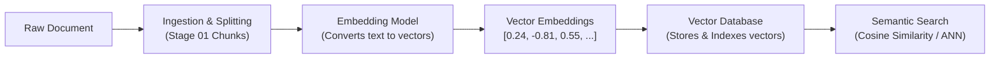

# 01 - مقدمة في التضمينات وقواعد بيانات المتجهات (Introduction to Embeddings & Vector Databases)

> **ملخص سريع:** الدرس الأول من مرحلة الفهرسة (`02-indexing`) والدرس رقم 19 في مسار الـ RAG. يشرح المفاهيم الجوهرية للتضمينات الشعاعية (**Vector Embeddings**)، ولماذا تفشل قواعد البيانات التقليدية في البحث الدلالي، ومفهوم فضاء الخصائص (**Feature Space**) عبر مثال أفلام مارفل، والأساس الرياضي لقياس التشابه باستخدام تشابه جيب التمام (**Cosine Similarity**).

---

## 🎯 1. أين نحن في معمارية الـ RAG؟ (The Big Picture)

في المرحلة الأولى (`01-ingestion`)، قمنا باستيراد البيانات من مصادر متعددة (PDF, DOCX, CSV, JSON, SQL)، ونظفناها، وقمنا بتقطيعها إلى أجزاء دلالية (**Chunks**).

السؤال الهندسي الحاسم الآن هو: **كيف يفهم الحاسوب ونموذج اللغة معنى هذه الـ Chunks؟**
الحواسيب ونماذج الذكاء الاصطناعي لا تفهم الكلمات كحروف وأوتار نصية (`strings`)، بل تفهم الأرقام والمتجهات الرياضية فقط. هنا يأتي دور **نماذج التضمين (Embedding Models)** لتحويل النصوص إلى فضاء رقمي متعدد الأبعاد.



---

## ⚖️ 2. مقارنة جوهرية: قواعد البيانات التقليدية مقابل قواعد بيانات المتجهات

| وجه المقارنة | قواعد البيانات التقليدية (Traditional DBs) | قواعد بيانات المتجهات (Vector Databases) |
| :--- | :--- | :--- |
| **أمثلة شهيرة** | PostgreSQL, MySQL, SQLite, MongoDB | Chroma, Pinecone, FAISS, Milvus, Qdrant |
| **نوع المطابقة** | **مطابقة حرفية تامة (Exact Matching)** | **مطابقة دلالية بالمعنى (Semantic Matching)** |
| **طريقة الاستعلام** | استعلام محدد `WHERE name = 'cat'` أو كلمات مفتاحية | متجه الاستعلام يطابق أقرب المتجهات في الفضاء الشعاعي |
| **المرادفات والمعاني** | تفشل تماماً ما لم يتم ذكر الكلمة الحرفية | **تتعرف تلقائياً على أن (Kitten) تشبه (Cat)** |
| **بنية الفهرسة** | B-Trees, Hash Indexes | فهارس التقريب (HNSW, IVF, Annoy, Flat) |
| **المقياس الرياضي** | المساواة والتطابق المنطقي (`=, LIKE, IN`) | المسافة الشعاعية (`Cosine, Euclidean, Dot Product`) |

### مثال عملي من المحاضرة:
لو احتوت قاعدة البيانات على الكلمات التالية: `["cat", "dog", "kitten", "puppy"]`
* **عند البحث عن `"cat"` في قاعدة تقليدية (SQL):**
  النتيجة الوحيدة المسترجعة هي: `cat` (فقط لأن الكلمة تطابقت حرفياً، بينما يتم تجاهل `kitten` تماماً).
* **عند البحث عن `"cat"` في قاعدة بيانات متجهات (Vector DB):**
  النتيجة المسترجعة تشمل: `cat` و `kitten` لأن متجهي الكلمتين متقاربان جداً في فضاء المعنى الدلالي.

---

## 🧬 3. ما هو التضمين الشعاعي؟ (What is an Embedding?)

التضمين الشعاعي (**Vector Embedding**) هو تمثيل رقمي كثيف (**Dense Vector**) للنص في فضاء متعدد الأبعاد ($\mathbb{R}^d$).
تُدرَّب نماذج التضمين العميقة (Deep Embedding Models) على مليارات النصوص لتتعلم العلاقات والسياقات، بحيث تُترجم الكلمات والجمل ذات المعاني المتشابهة إلى متجهات تقع على مسافات متقاربة جداً في ذلك الفضاء.

إذا أخذنا كلمة مثل `Apple`:
```text
Text: "Apple"  --->  Embedding Model  --->  [-0.024, 0.812, 0.341, ..., -0.198]
```
هذا المتجه لا يمثل الحروف، بل يمثل الخصائص الدلالية المشتركة (هل هو فاكهة؟ شركة تقنية؟ شيء يؤكل؟).

---

## 🎬 4. فضاء الخصائص: مثال أفلام مارفل (The Feature Representation Intuition)

لتخيل كيف تعمل الأبعاد داخل المتجه، افترض أننا صممنا فضاءً مبسطاً يتكون من 3 أبعاد/خصائص تمثل تصنيف الأفلام:
1. **الأكشن والإثارة (Action)**
2. **الكوميديا والضحك (Comedy)**
3. **الغموض والتشويق (Suspense)**

قام نموذج التضمين بتمثيل الأفلام الثلاثة التالية:

```python
# متجهات الخصائص (Feature Vectors)
iron_man        = [0.95, 0.20, 0.60]  # أكشن عالي جداً، كوميديا قليلة، غموض متوسط
hulk            = [0.96, 0.40, 0.70]  # أكشن عالي جداً، كوميديا متوسطة، غموض متوسط
sherlock_holmes = [0.60, 0.75, 0.90]  # أكشن متوسط، كوميديا جيدة، غموض وتشويق عالي جداً
```

### كيف يقرر نظام التوصية (أو البحث في RAG)؟
إذا شاهد مستخدم فيلم **Iron Man** على Netflix، أي فيلم سيقترحه النظام؟
بمقارنة المسافة بين المتجهات:
* متجه **Iron Man** و متجه **Hulk** متجاوران بشدة في بُعد الأكشن والغموض.
* بينما متجه **Sherlock Holmes** بعيد عنهما في فضاء المتجهات.
* النتيجة: يقترح النظام فيلم **Hulk** فوراً!

---

## 📐 5. الأساس الرياضي: تشابه جيب التمام (Cosine Similarity)

المقياس الأكثر استخداماً في أنظمة الـ RAG لحساب درجة التشابه بين متجهين $\mathbf{A}$ و $\mathbf{B}$ هو **Cosine Similarity**:

$$\text{Cosine Similarity}(\mathbf{A}, \mathbf{B}) = \cos(\theta) = \frac{\mathbf{A} \cdot \mathbf{B}}{\|\mathbf{A}\| \|\mathbf{B}\|} = \frac{\sum_{i=1}^n A_i B_i}{\sqrt{\sum_{i=1}^n A_i^2} \cdot \sqrt{\sum_{i=1}^n B_i^2}}$$

### خصائص هذا المقياس:
1. **الاستقلالية عن طول المتجه:** يقيس الزاوية $\theta$ بين المتجهين وليس طولهما، مما يجعله مثالياً لمقارنة نصوص ذات أطوال مختلفة.
2. **مجال النتيجة:** يتراوح بين `-1.0` (متعاكسان تماماً) إلى `+1.0` (متطابقان تماماً في الاتجاه).
3. عندما تكون المتجهات معيرة بطول الوحدة ($\|\mathbf{A}\| = 1$)، يتحول تشابه جيب التمام ببساطة إلى **الضرب النقطي (Dot Product)**:
   $$\text{Cosine Similarity}(\mathbf{A}, \mathbf{B}) = \mathbf{A} \cdot \mathbf{B}$$

---

## 📊 6. التصور الهندسي ثنائي الأبعاد (2D Geometric View)

لو اقتطعنا بُعدين فقط من المثال (Action على المحور الأفقي و Comedy على المحور الرأسي):

```text
Comedy
  ^
  |
0.8 |                  [Sherlock Holmes] (0.60, 0.75)
  |
0.4 |                            [Hulk] (0.96, 0.40)
0.2 |                            [Iron Man] (0.95, 0.20)
  |
  +----------------------------------------------------> Action
  0                 0.5                 1.0
```

لاحظ التقارب الشديد بين `Iron Man` و `Hulk` وتباعد `Sherlock Holmes`.

---

## 🚀 7. النماذج مفتوحة المصدر مقابل التجارية (Open Source vs Commercial APIs)

في الدروس القادمة سنطبق عملياً على كلا النوعين:
1. **النماذج مفتوحة المصدر (HuggingFace / Sentence-Transformers):**
   * تعمل محلياً على جهازك دون إرسال بياناتك للخارج (خصوصية تامة وبدون تكلفة API).
   * أمثلة: `all-MiniLM-L6-v2`, `BAAI/bge-large-en-v1.5`.
2. **النماذج التجارية السحابية (OpenAI Embeddings):**
   * نماذج عالية الدقة وسريعة عبر الـ API.
   * أمثلة: `text-embedding-3-small` (1536 أبعاد)، `text-embedding-3-large` (3072 أبعاد).

---

## 🧪 8. الكود العملي للتجربة
تم بناء الكود التفاعلي الكامل في الدفتر المرجعي المرفق:  
👉 **[`01-intro-to-embeddings.ipynb`](./01-intro-to-embeddings.ipynb)**
