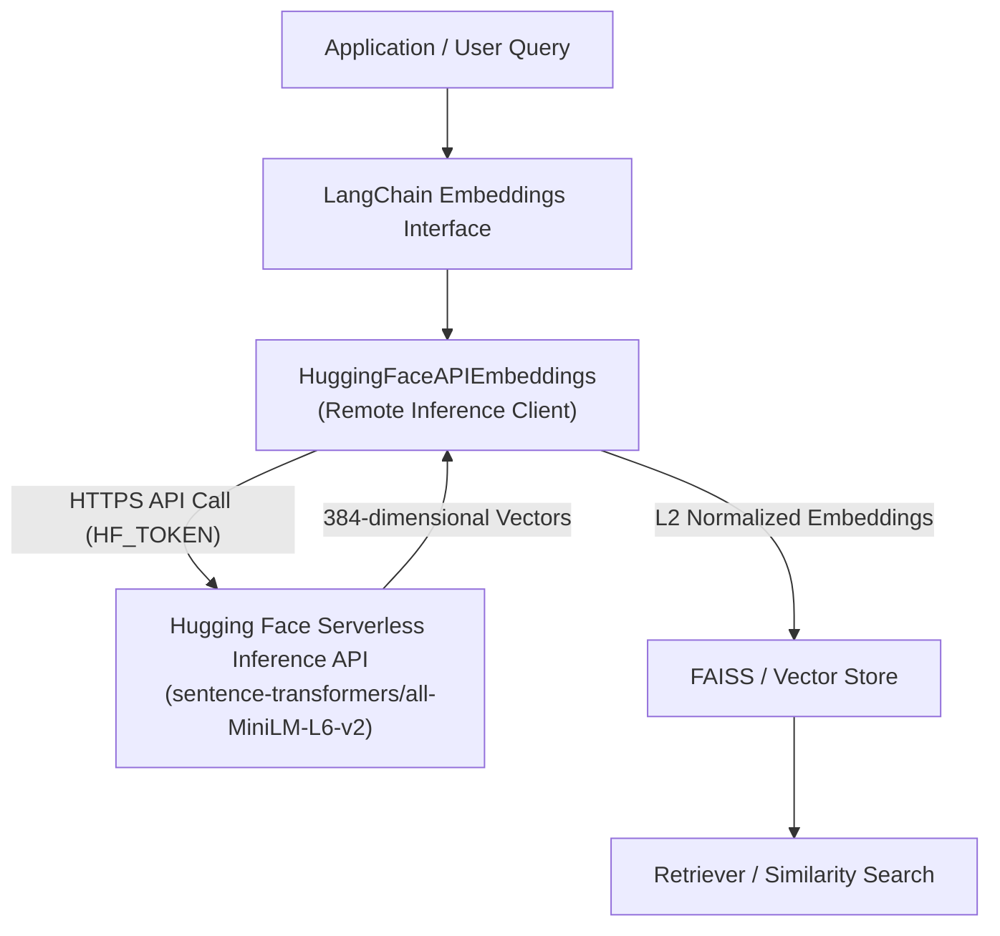

# 03 - نماذج التضمين السحابية عبر Hugging Face Inference API (Remote Embeddings)

> **ملخص سريع:** الدرس الثالث من مرحلة الفهرسة (`02-indexing`) والدرس رقم 21 في مسار الـ RAG. يغطي كيفية استخدام وتوليد التضمينات الشعاعية باستخدام منصة **Hugging Face** عبر واجهة الـ **Serverless Inference API** الرسمية، بتوافق كامل مع معايير LangChain و FAISS، وبدون استدعاء مكتبة PyTorch محلياً أو تنزيل ملفات أوزان ثقيلة على القرص، مما يوفر حلاً آمناً ومتوافقاً مع بيئات العمل المحمية (Windows Smart App Control).

---

## 🏛️ 1. المعمارية السحابية للتضمينات (Remote API Architecture)

في البيئات الاحترافية وأنظمة التشغيل الخاضعة لسياسات تحكم أمني صارمة (مثل Windows 11 Smart App Control / WDAC)، يتم حجب ملفات الـ DLL التنفيذية غير الموقعة التابعة لـ PyTorch محلياً (`torch_python.dll`).

لذلك، تم اعتماد معمارية التضمين السحابي الرسمي عبر خوادم Hugging Face دون المساس بخط الـ RAG:



### مزايا هذه المعمارية:
1. **خالية تماماً من PyTorch محلياً:** لا يتم استيراد `torch` أو تحميل أي ملفات ثنائية غير معتمدة على الجهاز.
2. **صفر استهلاك للمساحة:** لا حاجة لتنزيل أوزان النماذج محلياً (Zero local model storage).
3. **توافق كامل مع خط الـ RAG:** الفئة `HuggingFaceAPIEmbeddings` ترث مباشرة من `langchain_core.embeddings.Embeddings` وتعمل كبديل فوري مع FAISS و Chroma وجميع أدوات LangChain.
4. **تأمين المفاتيح:** قراءة التوكن من متغير البيئة `HF_TOKEN` وحجبه تماماً في السجلات والـ `repr`.

---

## 🧩 2. فئة `HuggingFaceAPIEmbeddings` والفرق بين `embed_query` و `embed_documents`

تم بناء الفئة في موديول مستقل: [`02-indexing/huggingface_api.py`](file:///d:/Code/AI/rag-mastery/02-indexing/huggingface_api.py).

```python
from huggingface_api import HuggingFaceAPIEmbeddings

embeddings = HuggingFaceAPIEmbeddings(
    model="sentence-transformers/all-MiniLM-L6-v2",
    normalize_embeddings=True,
    expected_dimension=384
)
```

### الفرق المعماري الجوهري:

| الدالة | الغرض واستخدامها في خط الـ RAG | نوع المدخل | نوع المخرج |
| :--- | :--- | :--- | :--- |
| **`embed_query(text)`** | تُستخدم عند **وقت البحث والاستعلام (Query Time)** لتضمين سؤال المستخدم. | نص مفرد (`str`) | متجه واحد 1D (`List[float]`) |
| **`embed_documents(texts)`** | تُستخدم عند **مرحلة الإدخال والفهرسة (Ingestion Time)** لتضمين مئات أو آلاف الـ Chunks دفعة واحدة. | قائمة نصوص (`List[str]`) | مصفوفة متجهات 2D (`List[List[float]]`) |

---

## 🔍 3. نموذج `all-MiniLM-L6-v2` بالتفصيل
* **الأبعاد (Dimensions):** **384 بُعداً**.
* **السرعة والحجم:** خفيف وسريع جداً، ومناسب تماماً للاستخدام العام والبحث الفوري (Real-Time).
* **معايرة المتجهات (L2 Normalization):** يتم معايرة طول المتجه ليكون $\|v\| = 1.0$، مما يتيح حساب تشابه جيب التمام عبر الضرب النقطي (`Dot Product`) فائق السرعة داخل فهارس المتجهات.

---

## 📊 4. مصفوفة مقارنة أشهر نماذج Hugging Face المتاحة عبر الـ API

| النموذج (Model Name) | الأبعاد (Dims) | الخصائص والسرعة | أفضل استخدام وحالة تطبيق |
| :--- | :---: | :--- | :--- |
| **`sentence-transformers/all-MiniLM-L6-v2`** | **384** | فائق السرعة، خفيف، أداء ممتاز ⚡ | التطبيقات الفورية (Real-Time) والاستخدام العام. |
| **`sentence-transformers/all-mpnet-base-v2`** | **768** | أعلى دقة، لكن أبطأ نسبياً 🎯 | عندما تكون دقة الاسترجاع أهم من زمن الاستجابة. |
| **`sentence-transformers/paraphrase-multilingual-MiniLM-L12-v2`** | **384** | يدعم أكثر من 50 لغة (منها العربية) 🌍 | أنظمة الـ RAG متعددة اللغات (Multilingual). |

---

## 🔬 5. التكامل مع قاعدة المتجهات FAISS وسلسلة الاسترجاع

تعمل الفئة بسلاسة تامة مع قاعدة FAISS ومسترجعات LangChain:

```python
from langchain_community.vectorstores import FAISS
from langchain_core.documents import Document
from huggingface_api import HuggingFaceAPIEmbeddings

# 1. تهيئة التضمينات السحابية
embeddings = HuggingFaceAPIEmbeddings()

# 2. إنشاء الفهرس وتضمين المستندات
documents = [
    Document(page_content="LangChain is a framework for developing LLM applications.", metadata={"topic": "ai"}),
    Document(page_content="Python is a versatile programming language for AI.", metadata={"topic": "tech"})
]
vectorstore = FAISS.from_documents(documents, embeddings)

# 3. الاسترجاع الدلالي
retriever = vectorstore.as_retriever(search_kwargs={"k": 1})
results = retriever.invoke("Which language is best for machine learning?")
print(results[0].page_content)
```

---

## 🧪 6. الدفتر التفاعلي
كافة الأكواد والتجارب المعملية متاحة في:  
👉 **[`03-huggingface-embeddings.ipynb`](./03-huggingface-embeddings.ipynb)**
