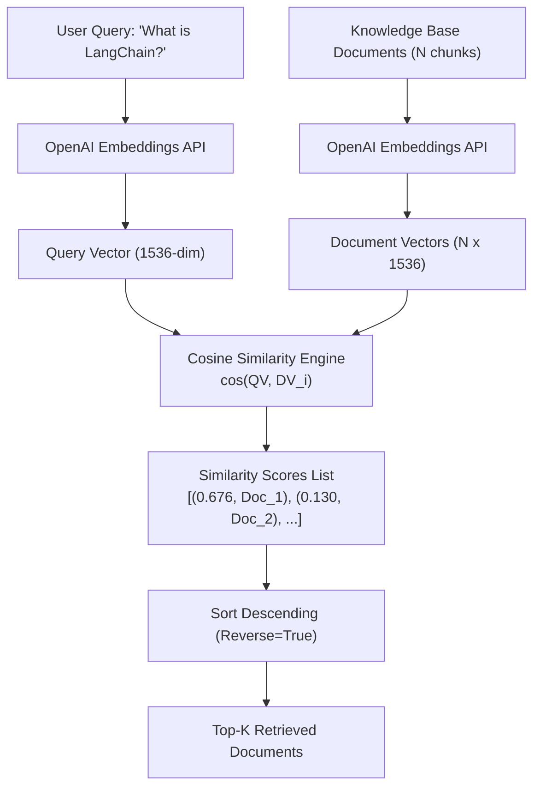

# الدرس 04: تضمينات OpenAI والبحث الدلالي (OpenAI Embeddings & Semantic Search)

مرحبًا بك في الدرس الرابع من مرحلة **الفهرسة والتضمينات الشعاعية (Vector Embeddings & Indexing)**.  
في هذا الدرس، سننتقل من التضمينات مفتوحة المصدر إلى التضمينات التجارية الرائدة عبر **OpenAI Embeddings API**، وسنقوم بتطبيق تشابه جيب التمام (Cosine Similarity) رياضياً وبرمجياً لبناء **محرك بحث دلالي متكامل (Semantic Search Engine)** من الصفر دون الاعتماد على مكتبات وسيطة معقدة.

---

## 📌 أهداف الدرس (Learning Objectives)

1. **التعرف على نماذج تضمين OpenAI**: الفروق الجوهرية بين عائلة النماذج الحديثة (`text-embedding-3-small` و `text-embedding-3-large`) والنموذج القديم (`ada-002`).
2. **صياغة وحساب تشابه جيب التمام (Cosine Similarity)**: فهم الصيغة الرياضية وتطبيقها عملياً باستخدام مكتبة `numpy`.
3. **المقارنة الزوجية بين الجمل (Pairwise Similarity Comparison)**: قياس التشابه بين كل جملة وأخرى لفهم تقارب المعاني داخل الفضاء الدلالي.
4. **بناء محرك بحث دلالي من الصفر (Building Semantic Search from Scratch)**: برمجة دالة `semantic_search` واسترجاع أفضل $k$ وثائق مطابقة لأي استعلام.
5. **التمهيد لقواعد بيانات المتجهات (Vector Databases)**: فهم الفارق بين البحث الخطي $O(N)$ والبحث التقريبي المفهرس $O(\log N)$.

---

## 🧠 النظريات والمفاهيم الأساسية

### 1. عائلة نماذج OpenAI Embeddings

توفر OpenAI نماذج تضمين فائقة الدقة تم تدريبها على كميات هائلة من النصوص متعددة اللغات:

| النموذج | الأبعاد الافتراضية (Dimensions) | دقة الأداء (MTEB Benchmark) | التكلفة لكل مليون توكن | الملاحظات والاستخدام |
| :--- | :---: | :---: | :---: | :--- |
| **`text-embedding-3-small`** | **1536** | 62.3% | **\$0.02** | **الخيار القياسي الموصى به**: رخيص جداً وسريع ومناسب لمعظم تطبيقات RAG. |
| **`text-embedding-3-large`** | **3072** | 64.6% | **\$0.13** | **الخيار الأقوى دقة**: للأنظمة المالية والقانونية التي تتطلب أدق الفروق الدلالية. |
| `text-embedding-ada-002` | 1536 | 61.0% | \$0.10 | الجيل السابق (Legacy)، تم استبداله بالجيل الثالث بالكامل. |

> [!TIP]
> **ميزة تقليص الأبعاد (Matryoshka Representation Learning - MRL)**:  
> تدعم نماذج الجيل الثالث (`text-embedding-3-*`) تقليص حجم المتجه برمجياً (مثلاً من 1536 إلى 512 بُعداً) عبر تمرير معامل `dimensions=512` دون فقدان كبير في الدقة، مما يوفر حتى 70% من مساحة تخزين قواعد بيانات المتجهات.

---

### 2. الرياضيات وراء تشابه جيب التمام (Cosine Similarity)

يقيس تشابه جيب التمام زاوية الانفراج $\theta$ بين متجهين في فضاء متعدد الأبعاد، بصرف النظر عن طول المتجه (Magnitude):

$$\text{Cosine Similarity}(\vec{u}, \vec{v}) = \cos(\theta) = \frac{\vec{u} \cdot \vec{v}}{\|\vec{u}\|_2 \times \|\vec{v}\|_2} = \frac{\sum_{i=1}^n u_i v_i}{\sqrt{\sum_{i=1}^n u_i^2} \times \sqrt{\sum_{i=1}^n v_i^2}}$$

* **القيم الناتجة**:
  - `+1.0`: المتجهان متطابقان تماماً في الاتجاه والمعنى الدلالي ($\theta = 0^\circ$).
  - `0.0`: المتجهان متعامدان، ولا توجد أي علاقة دلالية بينهما ($\theta = 90^\circ$).
  - `-1.0`: المتجهان متعاكسان تماماً في الاتجاه ($\theta = 180^\circ$).
* **لماذا نفضل Cosine Similarity على مسافة إقليدس (Euclidean Distance)؟**:
  لأن المسافة الإقليدية تتأثر بطول المستند (عدد الكلمات)، بينما يركز جيب التمام فقط على **الاتجاه الدلالي**، مما يمنع تفضيل المستندات القصيرة على الطويلة بدون مبرر.

---

### 3. معمارية محرك البحث الدلالي المباشر (Semantic Search Flow)



---

## 🛠️ التطبيق البرمجي خطوة بخطوة

### 1. استيراد المكتبات وتهيئة النموذج
```python
import os
import numpy as np
from dotenv import load_dotenv
from langchain_openai import OpenAIEmbeddings

load_dotenv()

# تهيئة النموذج الاقتصادي السريع
embeddings = OpenAIEmbeddings(model="text-embedding-3-small")
```

### 2. دالة حساب تشابه جيب التمام من الصفر
```python
def cosine_similarity(a: list[float] | np.ndarray, b: list[float] | np.ndarray) -> float:
    """حساب معامل تشابه جيب التمام بين متجهين باستخدام NumPy."""
    vec_a = np.array(a)
    vec_b = np.array(b)
    
    dot_product = np.dot(vec_a, vec_b)
    norm_a = np.linalg.norm(vec_a)
    norm_b = np.linalg.norm(vec_b)
    
    if norm_a == 0 or norm_b == 0:
        return 0.0
    
    return float(dot_product / (norm_a * norm_b))
```

### 3. المقارنة الزوجية الشاملة بين الجمل
```python
sentences = [
    "The cat sat on the mat.",
    "A feline rested on the rug.",
    "The dog played in the yard.",
    "I love programming in Python.",
    "Python is my favorite programming language."
]

# توليد متجهات الجمل دفعة واحدة
sentence_vectors = embeddings.embed_documents(sentences)

# حلقة تكرارية لمقارنة كل زوج فريد (i, j)
for i in range(len(sentences)):
    for j in range(i + 1, len(sentences)):
        score = cosine_similarity(sentence_vectors[i], sentence_vectors[j])
        print(f"'{sentences[i]}' VS '{sentences[j]}'")
        print(f"  --> Similarity Score: {score:.4f}\n")
```

### 4. دالة البحث الدلالي المتكاملة (`semantic_search`)
```python
def semantic_search(
    query: str,
    documents: list[str],
    embedding_model,
    top_k: int = 3
) -> list[tuple[float, str]]:
    """محرك بحث دلالي يسترجع أفضل k وثائق مطابقة للاستعلام."""
    # 1. تضمين الاستعلام والوثائق
    query_vector = embedding_model.embed_query(query)
    doc_vectors = embedding_model.embed_documents(documents)
    
    # 2. حساب درجات التشابه
    results = []
    for doc, doc_vec in zip(documents, doc_vectors):
        score = cosine_similarity(query_vector, doc_vec)
        results.append((score, doc))
    
    # 3. الترتيب التنازلي واختيار أفضل النتائج
    results.sort(key=lambda x: x[0], reverse=True)
    return results[:top_k]
```

---

## ⚡ من البحث اليدوي إلى قواعد بيانات المتجهات (Vector Databases)

في هذا الدرس قمنا بحساب التشابه بمقارنة استعلام المستخدم مع كل وثيقة على حدة عبر حلقة تكرارية (`for loop`).
* **في مجموعات البيانات الصغيرة (10 إلى 1,000 وثيقة)**: هذا البحث ممتاز ودقيق جداً وتكلفته الزمنية مقبولة $O(N)$.
* **في بيئات الإنتاج الكبيرة (100,000 إلى ملايين الوثائق)**:
  - مقارنة الاستعلام بمليون متجه تستغرق وقتاً طويلاً جداً (Latency غير مقبول).
  - هنا تبرز أهمية **فهارس المتجهات وقواعد البيانات (FAISS, Chroma, Qdrant, Pinecone)** التي تستخدم خوارزميات البحث التقريبي بأقرب الجيران (Approximate Nearest Neighbors - ANN مثل HNSW و IVF) لتنفيذ البحث في زمن لوغاريتمي فائق السرعة $O(\log N)$، وهو ما سنتوسع فيه عملياً في الدروس القادمة.
