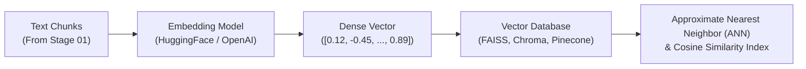

# 02 - الفهرسة والتضمينات الشعاعية (Vector Embeddings & Indexing)

المرحلة الثانية في مسار إتقان الـ RAG، وتركز على تحويل قطع النصوص المجزأة (**Chunks**) إلى متجهات رقمية كثيفة (**Dense Vectors**) تعبر عن المعنى الدلالي، وفهرستها في قواعد بيانات المتجهات (**Vector Databases**) لتمكين الاسترجاع الفائق السرعة والدقة.

---

## 🧭 خارطة موضوعات المرحلة (Curriculum)

| الرقم | المجلد الفرعي | عنوان الدرس (Topic) | الشرح (.md) | الدفتر المرجعي (.ipynb) | الحالة |
| :---: | :--- | :--- | :---: | :---: | :---: |
| 01 | **[01-intro-to-embeddings](./01-intro-to-embeddings/)** | مقدمة في التضمينات وقواعد بيانات المتجهات (Intro to Embeddings & Vector DBs) | [README](./01-intro-to-embeddings/README.md) | [Notebook](./01-intro-to-embeddings/01-intro-to-embeddings.ipynb) | [x] مكتمل |
| 02 | **[02-visualization-cosine-similarity](./02-visualization-cosine-similarity/)** | التصور الرياضي والبصري للمتجهات وتشابه جيب التمام | [README](./02-visualization-cosine-similarity/README.md) | [Notebook](./02-visualization-cosine-similarity/02-visualization-cosine-similarity.ipynb) | [x] مكتمل |
| 03 | **[03-huggingface-embeddings](./03-huggingface-embeddings/)** | التضمينات مفتوحة المصدر باستخدام نماذج HuggingFace | [README](./03-huggingface-embeddings/README.md) | [Notebook](./03-huggingface-embeddings/03-huggingface-embeddings.ipynb) | [x] مكتمل |
| 04 | **[04-openai-embeddings](./04-openai-embeddings/)** | تضمينات OpenAI والبحث الدلالي (OpenAI Embeddings & Semantic Search) | [README](./04-openai-embeddings/README.md) | [Notebook](./04-openai-embeddings/04-openai-embeddings.ipynb) | [x] مكتمل |
| 05 | **05-semantic-similarity-search** | فهارس المتجهات وقواعد البيانات (Vector Stores & Databases) | قيد العمل | قيد العمل | [ ] قادم |

---

## 🏛️ المعمارية العامة للمرحلة (Stage Architecture)

