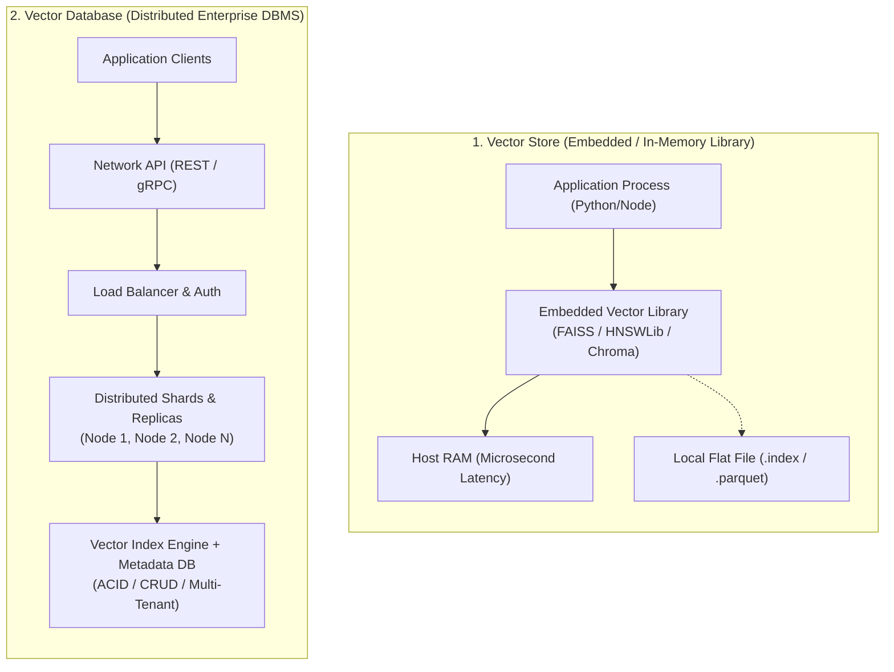

# الدرس 01: مخازن المتجهات مقابل قواعد بيانات المتجهات
### Vector Stores vs. Vector Databases: The Definitive Architectural Guide

مرحبًا بك في الدرس الأول من مرحلة **فهارس وقواعد بيانات المتجهات (Vector Stores & Vector Databases)**، وهو الدرس التأسيسي للقسم السابع (Section 7) في الكورس (المحاضرة 24).  
يخلط الكثير من مهندسي الذكاء الاصطناعي والمطورين المبتدئين بين مصطلحي **Vector Store** و **Vector Database** ويعتبرونهما شيئاً واحداً؛ ولكن من منظور هندسة النظم وتصميم معمارية الـ RAG، هناك **فروق جوهرية حاسمة** في المعمارية، والأداء، وقابلية التوسع (Scalability)، والتكلفة، وإدارة البيانات.

---

## 📌 أهداف الدرس (Learning Objectives)

1. **إزالة اللبس المفاهيمي**: فهم الفارق الدقيق بين "المكتبة البرمجية المدمجة" و"نظام إدارة قواعد البيانات المستقل".
2. **المقارنة المعمارية الشاملة**: دراسة الفروق الهندسية عبر 10 معايير (السرعة، الحجم، عمليات CRUD، التكلفة، إلخ).
3. **التعرف على أشهر التقنيات العالمية**: متى تستخدم FAISS أو ChromaDB محلياً، ومتى تنتقل إلى Pinecone أو Qdrant أو Milvus.
4. **مصفوفة اتخاذ القرار الهندسي (Decision Matrix)**: معايير اختيار الأداة الأنسب لمشروعك (من النماذج الأولية Prototypes حتى أنظمة الإنتاج Enterprise).

---

## 🏛️ المقارنة المعمارية (Architectural Breakdown)

---

## 📊 جدول المقارنة الشامل (Detailed Comparison Table)

| وجه المقارنة (Feature) | مخزن المتجهات (Vector Store) | قاعدة بيانات المتجهات (Vector Database) |
| :--- | :--- | :--- |
| **التعريف الطبيعي** | **مكتبة برمجية مدمجة** (Library / Tool) مخصصة لحساب التشابه وفهرسة المتجهات. | **نظام قواعد بيانات كامل ومتكامل** (Full-Fledged DBMS) مخصص لإدارة المتجهات على نطاق واسع. |
| **طريقة التشغيل** | داخل نفس مساحة ذاكرة التطبيق (**In-Memory Process**). | كـ **خادم مستقل أو خدمة سحابية** (Client-Server / Distributed Cloud). |
| **السرعة وزمن الاستجابة (Latency)** | **فائقة السرعة بالميكروثانية** ($\mu s$) لعدم وجود اتصالات شبكية. | **سريعة بالمللي ثانية** ($ms$) بسبب وقت نقل البيانات عبر الشبكة (Network Round-Trip). |
| **سعة التوسع (Scale)** | حتى **1 مليون متجه** (محدودة بحجم ذاكرة الجهاز المحلي RAM). | من **مئات الملايين إلى مليارات المتجهات** (توسع أفقي وعمودي غير محدود). |
| **عمليات البيانات (CRUD Support)** | **محدودة جداً**: مبنية على نمط "ابنِ الفهرس مرة واحدة وابحث فيه" (Build-once, Read-many). التعديل والحذف يتطلب إعادة بناء الفهرس غالباً. | **دعم كامل لعمليات CRUD الفورية**: إضافة، تعديل، حذف، وقراءة المتجهات وبياناتها الوصفية لحظياً ودون إيقاف النظام. |
| **التصفية بالبيانات الوصفية (Metadata Filtering)** | بسيطة وغالباً بعدية (Post-filtering)، مما قد يقلل دقة النتائج. | متقدمة جداً (Pre-filtering) مدعومة بفهارس B-Tree أو Inverted Indexes لتصفية البيانات قبل حساب المسافات. |
| **الاعتمادية وتكرار البيانات (High Availability)** | لا يوجد؛ إذا توقف البرنامج ضاعت البيانات غير المحفوظة في ملف. | نسخ متطابق (Replication)، تجزئة (Sharding)، نسخ احتياطي آلي، وضمان توفر $99.99\%$. |
| **أمان البيانات والصلاحيات (Security & RBAC)** | أمان الملفات على نظام التشغيل المحلي فقط. | تحكم دقيق في الصلاحيات (RBAC)، تشفير في النقل والتخزين، وعزل المستخدمين (Multi-Tenancy). |
| **وقت وتكلفة الإعداد (Setup & Cost)** | **مجاني تماماً**؛ يثبت في ثوانٍ عبر `pip install faiss-cpu`. | يتطلب اشتراكاً سحابياً مدفوعاً أو إدارة خوادم مخصصة (قد يستغرق ساعات لإعداده). |
| **أفضل حالات الاستخدام** | النماذج الأولية (PoC)، الأبحاث الأكاديمية، التطبيقات المكتبية (Desktop/Local)، والأنظمة التي تعالج أقل من مليون متجه. | تطبيقات الشركات (Enterprise)، بيئات الإنتاج الحية، الأنظمة متعددة المستخدمين، ومجموعات البيانات الضخمة المحدثة لحظياً. |

---

## 🛠️ أشهر التقنيات في كل فئة (Popular Technologies)

### أولاً: أشهر مخازن المتجهات (Vector Stores)
1. **FAISS (Facebook AI Similarity Search - Meta)**:
   - المكتبة القياسية الذهبية عالمياً والمكتوبة بلغة C++ مع واجهات بايثون.
   - تركز حصرياً على خوارزميات البحث السريع (Exact L2/IP, IVF-Flat, HNSW, PQ).
2. **ChromaDB (الوضع المدمج Embedded Mode)**:
   - أكثر أداة محبوبة وسهلة الاستخدام للمبتدئين في الـ RAG، تخزن البيانات محلياً في مجلدات مع محرك SQLite مدمج.
3. **ScaNN (Google Research)**:
   - مكتبة جوجل المتفوقة في ضغط المتجهات وتحقيق أعلى دقة استرجاع بأقل استهلاك للذاكرة.
4. **HNSWLib**:
   - تطبيق نقي وخفيف جداً لخوارزمية Hierarchical Navigable Small World Graph.

---

### ثانياً: أشهر قواعد بيانات المتجهات (Vector Databases)
1. **Pinecone**:
   - الخدمة السحابية المدارة (Fully Managed Serverless) الأكثر شهرة في بيئات الإنتاج؛ توفر سرعة عالية وإدارة خالية من الخوادم (Zero Infrastructure Overhead).
2. **Qdrant**:
   - قاعدة بيانات فائقة السرعة مكتوبة بلغة **Rust**، تدعم التصفية المتقدمة بالبيانات الوصفية ومتاحة كمصدر مفتوح أو سحابية.
3. **Milvus**:
   - أقوى قاعدة بيانات مفتوحة المصدر للشركات الكبرى التي تحتاج لمعالجة مليارات المتجهات عبر بنية موزعة (Kubernetes Native).
4. **Weaviate**:
   - قاعدة بيانات سحابية وهجينة، تتميز بدعمها الداخلي لنماذج الـ Embeddings والبحث الهجين (Hybrid Search).
5. **DataStax Astra DB**:
   - قاعدة بيانات متجهات سحابية مبنية على معمارية Apache Cassandra العالمية، تضمن قابلية توسع هائلة.
6. **Pgvector (PostgreSQL Extension)**:
   - إضافة ممتازة تحول قاعدة بيانات Postgres التقليدية إلى قاعدة بيانات متجهات هجينة تجمع البيانات العلائقية والمتجهات في مكان واحد.

---

## 🧭 مصفوفة اتخاذ القرار الهندسي (Engineering Decision Rule)

> [!IMPORTANT]
> **القاعدة الذهبية المتبعة في كبرى الشركات:**  
> **"ابدأ بمخزن متجهات محلي (Vector Store مثل FAISS أو Chroma) لسرعة التطوير والتعلم والتجربة؛ وعندما تحتاج إلى ميزات الإنتاج، والاعتمادية، والتحديثات اللحظية، وتخطي حاجز المليون متجه، انتقل إلى قاعدة بيانات متجهات سحابية أو موزعة (Vector Database)."**

### اختر Vector Store (مثل FAISS أو Chroma) إذا كان:
* حجم بياناتك أقل من **1,000,000 مقطع**.
* التطبيق يعمل محلياً أو داخل حاوية فردية (Single Container/Script).
* الميزانية محدودة وتريد تقليل التكاليف إلى الصفر.
* البيانات ثابتة ولا تتغير أو تحدث لحظياً على مدار الساعة.

### اختر Vector Database (مثل Pinecone أو Qdrant أو Milvus) إذا كان:
* لديك مستندات ضخمة تتجاوز ملايين المتجهات وتتوسع باستمرار.
* تحتاج إلى تحديث وحذف مقاطع فردية لحظياً (Real-Time CRUD).
* التطبيق يخدم آلاف المستخدمين في نفس الوقت ويتطلب توفراً $24/7$.
* تحتاج إلى تصفية صارمة بالبيانات الوصفية لكل مستخدم على حدة (Multi-Tenant Authorization).
