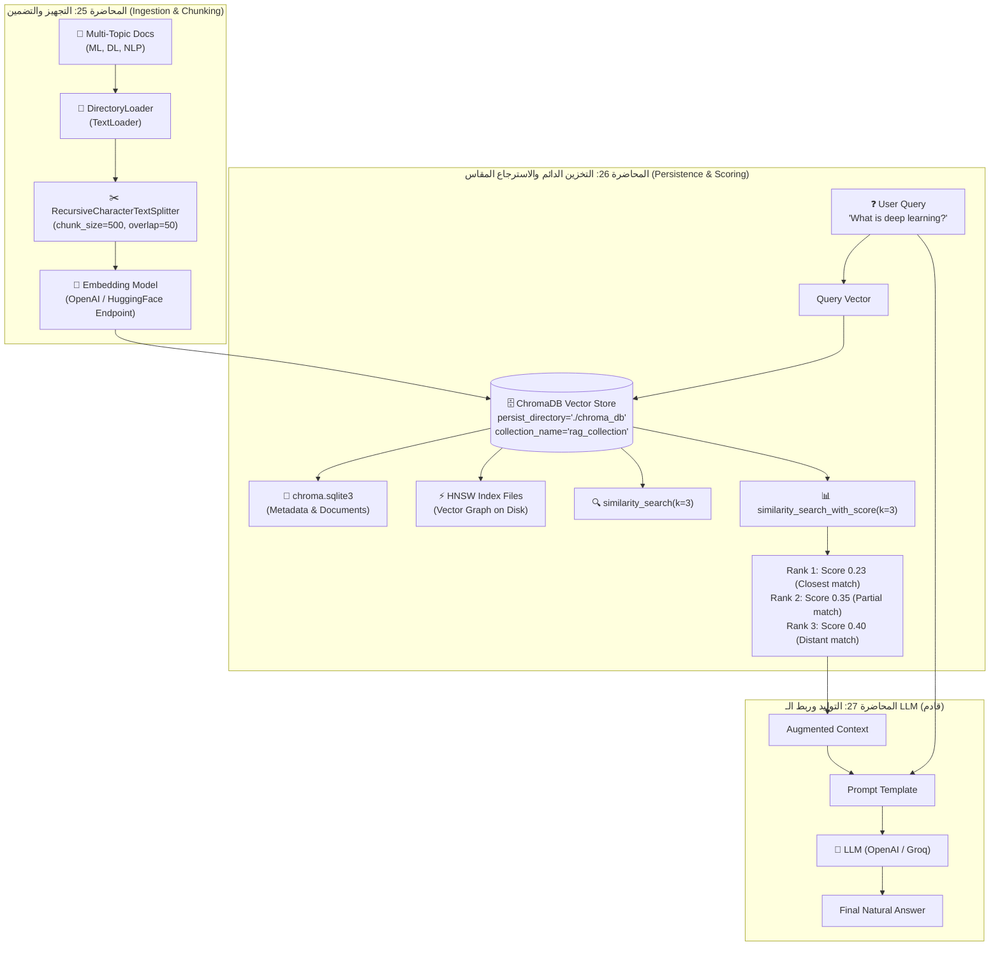

# الدرس 02: بناء نظام RAG تقليدي باستخدام ChromaDB — الأجزاء 1 و 2
### Building Traditional RAG with ChromaDB: Ingestion, Persistence & Scored Retrieval

مرحبًا بك في الدرس الثاني من مرحلة **فهارس وقواعد بيانات المتجهات (Vector Stores & Vector Databases)**، والمخصص للمحاضرتين **25 و 26** في الكورس.  
هذا الدليل يغطي النصفين الأول والثاني من ثلاثية نظام الـ Traditional RAG باستخدام قاعدة بيانات **ChromaDB**:
- **الجزء الأول (المحاضرة 25)**: تجهيز وتفريغ المستندات، التجزئة المتداخلة (Recursive Chunking)، ونماذج التضمين.
- **الجزء الثاني (المحاضرة 26)**: حفظ المتجهات الدائم على القرص (`Persistence`)، استعلامات البحث الدلالي المتعددة، وفهم وتفسير درجات المسافة الإقليدية ($L_2$) مقابل تشابه جيب التمام.

---

## 📌 أهداف الدرس (Learning Objectives)

1. **التخزين الدائم (Persistence)**: فهم كيفية عمل `persist_directory` في ChromaDB وكيف تحتفظ بالبيانات عبر قاعدة بيانات `SQLite` المدمجة وفهارس `HNSW`.
2. **إدارة المجموعات (Collection Management)**: تنظيم الفهارس عبر `collection_name` داخل مساحة تخزين المتجهات.
3. **البحث الدلالي (Semantic Similarity Search)**: تنفيذ استعلامات البحث بـ $k$ محدد واسترجاع المستندات مع بياناتها الوصفية (`Metadata`).
4. **البحث المتقدم بالدرجات (`similarity_search_with_score`)**: قياس المسافة بين المتجهات رياضياً.
5. **الرياضيات وراء درجات المسافة (Score Interpretation)**: إزالة اللبس حول مقياس المسافة الإقليدية $L_2$ (حيث الرقم الأصغر يعني تشابهاً أعلى) ومقارنته بجيب التمام.

---

## 🏛️ المعمارية الهندسية لمسار RAG (Pipeline Architecture)



---

## 📐 الرياضيات وراء درجات التشابه في ChromaDB: $L_2$ vs Cosine

من أكبر مصادر اللبس لدى مهندسي الذكاء الاصطناعي هي قيمة الـ `score` الناتجة من دالة `similarity_search_with_score`:

### 1. المسافة الإقليدية الافتراضية ($L_2$ Distance):
تعتمد ChromaDB افتراضياً مقياس المسافة التربيعية الإقليدية (Squared Euclidean Distance):
$$d(\vec{u}, \vec{v}) = \sum_{i=1}^{d} (u_i - v_i)^2$$

* **القيمة $0.0$**: تعني أن المتجهين متطابقان تماماً ($\vec{u} = \vec{v}$).
* **كلما قلت المسافة (Lower Score) $\rightarrow$ كلما زاد التشابه الدلالي (Higher Similarity)**.
* لذلك، الرتبة الأولى (Rank 1) تكون دائماً صاحبة **أصغر درجة مسافة**.

### 2. تشابه جيب التمام (Cosine Similarity):
يحسب زاوية الفرق بين المتجهين بصرف النظر عن طولهما:
$$\text{Cosine}(\vec{u}, \vec{v}) = \frac{\vec{u} \cdot \vec{v}}{\|\vec{u}\| \|\vec{v}\|}$$
* يتراوح بين $-1.0$ (معنى متناقض تماماً) و $+1.0$ (معنى متطابق).
* **كلما زادت القيمة (Higher Score) $\rightarrow$ كلما زاد التشابه**.

### 3. العلاقة الرياضية عند تطبيع المتجهات (Normalized Embeddings):
إذا كانت متجهات التضمين موحدة الطول ($\|\vec{u}\| = \|\vec{v}\| = 1$) مثل متجهات OpenAI و HuggingFace:
$$d_{L_2}^2 = 2 - 2 \cdot \text{Cosine}(\vec{u}, \vec{v})$$
ومنها يمكن تحويل مسافة $L_2$ إلى معامل تشابه (Relevance Score):
$$\text{Relevance} = 1 - \frac{d_{L_2}^2}{2}$$

---

## 💾 التخزين الدائم (Persistence) مقابل التخزين في الذاكرة (In-Memory)

| المعيار | التخزين المؤقت (In-Memory) | التخزين الدائم على القرص (Persistent) |
| :--- | :--- | :--- |
| **طريقة الإعلان** | `Chroma(collection_name="...")` | `Chroma(persist_directory="./chroma_db", ...)` |
| **سرعة الإعداد** | فائقة بالميكروثانية | سريعة جداً مع حفظ على القرص |
| **بقاء البيانات** | تزول بمجرد إغلاق جلسة Python | تبقى محفوظة دائماً في ملفات `chroma.sqlite3` |
| **الاستخدام العملي** | اختبارات سريعة / Unit Tests | تطبيقات حقيقية، خوادم FastAPI، روبوتات المحادثة |

---

## 💻 أهم الشيفرات البرمجية المطبقة في الدرس

### 1. حفظ المتجهات في مسار دائم:
```python
from langchain_chroma import Chroma

persist_directory = "./chroma_db"
collection_name = "rag_collection"

vectorstore = Chroma.from_documents(
    documents=chunks,
    embedding=embeddings,
    persist_directory=persist_directory,
    collection_name=collection_name
)
print(f"Persisted {len(chunks)} chunks to {persist_directory}")
```

### 2. استدعاء الفهرس الموجود مسبقاً دون إعادة تضمينه:
```python
# إعادة فتح الفهرس من القرص مباشرة
reloaded_db = Chroma(
    persist_directory=persist_directory,
    embedding_function=embeddings,
    collection_name=collection_name
)
```

### 3. البحث المقاس بالدرجات:
```python
query = "What is deep learning?"
results_with_scores = vectorstore.similarity_search_with_score(query, k=3)

for rank, (doc, score) in enumerate(results_with_scores, start=1):
    print(f"Rank #{rank} [L2 Distance: {score:.4f}]:")
    print(f"  Source: {doc.metadata.get('source')}")
    print(f"  Content: {doc.page_content[:100]}...")
```

---

## 🎯 ملخص الدرس والخطوة التالية (Part 3):
- قمنا بنجاح ببناء الفهرس الدائم على القرص الصلب.
- اختبرنا دقة الاسترجاع الدلالي وأثبتنا أن $L_2$ Distance الأصغر تعبر عن المحتوى الأقرب لسؤال المستخدم.

في **المحاضرة 27 (Part 3)**:
سنقوم بربط هذا الفهرس بمحرك استرجاع (`Retriever`) ونموذج لغوي كبير (`LLM`) عبر سلاسل لانج تشين (`LCEL`) وقوالب التوجيه (`Prompt Templates`) لإكمال مسار الـ RAG التوليدي من البداية حتى صياغة الجواب النهائي!
