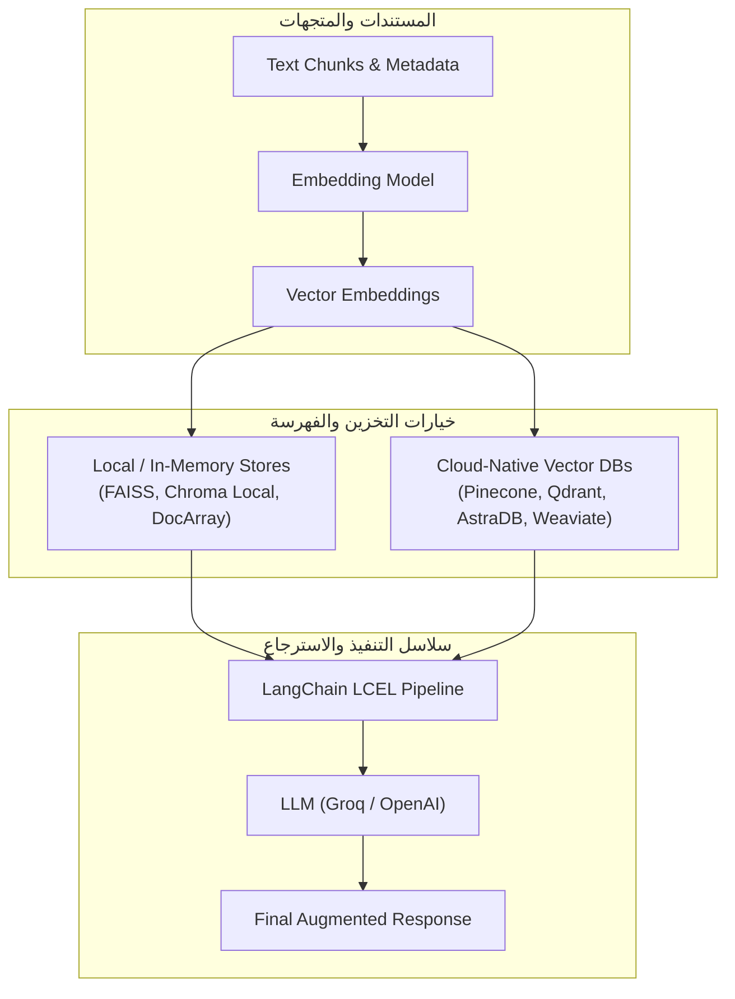

# 03 - فهارس وقواعد بيانات المتجهات (Vector Stores & Vector Databases)

المرحلة الثالثة في مسار إتقان الـ RAG، وتغطي بالكامل **القسم السابع من الكورس (Section 7: Vector Stores And Vector Databases - المحاضرات 24 إلى 36)**.

تتناول هذه المرحلة الانتقال من مجرد إنشاء المتجهات (Embeddings) إلى كيفية حفظها، وفهرستها، وإجراء عمليات البحث والاسترجاع الدلالي السريع عليها باستخدام أدوات التخزين الموضعية وقواعد البيانات السحابية العملاقة.

---

## 🧭 خارطة موضوعات المرحلة (Curriculum)

| الرقم | المجلد الفرعي | عنوان الدرس (Topic) | المحاضرة المقابلة | الشرح (.md) | الدفتر المرجعي (.ipynb) | الحالة |
| :---: | :--- | :--- | :---: | :---: | :---: | :---: |
| 01 | **[01-vector-stores-vs-vector-databases](./01-vector-stores-vs-vector-databases/)** | مقارنة فهارس المتجهات وقواعد بيانات المتجهات | Lecture 24 | [README](./01-vector-stores-vs-vector-databases/README.md) | [Notebook](./01-vector-stores-vs-vector-databases/01-vector-stores-vs-vector-databases.ipynb) | [x] مكتمل |
| 02 | **02-traditional-rag-chromadb** | بناء نظام RAG تقليدي باستخدام ChromaDB (أجزاء 1، 2، 3) | Lectures 25-27 | قيد العمل | قيد العمل | [ ] قادم |
| 03 | **03-rag-pipeline-lcel** | بناء خط أنابيب RAG متكامل باستخدام لغة تعبير لانج تشين (LCEL) | Lecture 28 | قيد العمل | قيد العمل | [ ] قادم |
| 04 | **04-updating-vector-store** | إضافة وتحديث مستندات جديدة داخل فهرس متجهات موجود | Lecture 29 | قيد العمل | قيد العمل | [ ] قادم |
| 05 | **05-conversational-memory-rag** | تقنيات RAG المتقدمة: إضافة ذاكرة المحادثة وسياق الحوار | Lecture 30 | قيد العمل | قيد العمل | [ ] قادم |
| 06 | **06-groq-llm-integration** | ربط واستخدام نماذج اللغات فائقة السرعة مع Groq API | Lecture 31 | قيد العمل | قيد العمل | [ ] قادم |
| 07 | **07-rag-faiss** | بناء نظام RAG محلي باستخدام مكتبة FAISS من فيسبوك (أجزاء 1 و 2) | Lectures 32-33 | قيد العمل | قيد العمل | [ ] قادم |
| 08 | **08-in-memory-vector-store** | التخزين والفهرسة السريعة في الذاكرة الحية (InMemory Vector Store) | Lecture 34 | قيد العمل | قيد العمل | [ ] قادم |
| 09 | **09-astradb-vector-database** | العمل مع قواعد البيانات السحابية المدارة DataStax AstraDB | Lecture 35 | قيد العمل | قيد العمل | [ ] قادم |
| 10 | **10-pinecone-vector-database** | تخزين واسترجاع المتجهات على النطاق المؤسسي باستخدام Pinecone | Lecture 36 | قيد العمل | قيد العمل | [ ] قادم |

---

## 🏛️ المعمارية العامة للمرحلة (Stage Architecture)

