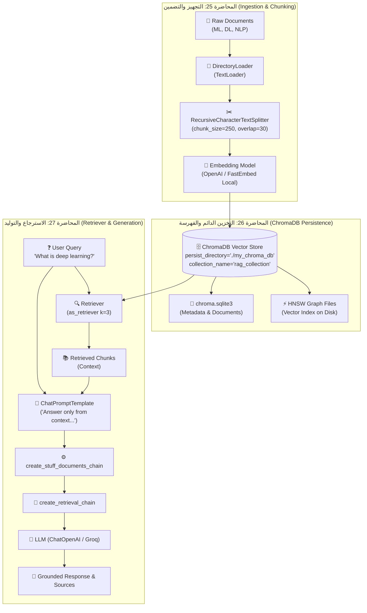

# الدرس 02: بناء نظام RAG تقليدي متكامل باستخدام ChromaDB (الأجزاء 1، 2، 3)
### Building Complete Traditional RAG Pipeline with ChromaDB, Retrievers & LLM

مرحبًا بك في الدرس الثاني من مرحلة **فهارس وقواعد بيانات المتجهات (Vector Stores & Vector Databases)**، والمخصص للمحاضرات **25 و 26 و 27** في الكورس.  
هذا الدليل يغطي الثلاثية الكاملة لبناء نظام الـ Traditional RAG خطوة بخطوة باستخدام قاعدة بيانات **ChromaDB** ومكتبة **LangChain**:
- **الجزء الأول (المحاضرة 25)**: تجهيز وتفريغ المستندات، التجزئة المتداخلة (Recursive Chunking)، ونماذج التضمين.
- **الجزء الثاني (المحاضرة 26)**: حفظ المتجهات الدائم على القرص (`persist_directory`)، استعلامات البحث الدلالي، ومقاييس المسافة الإقليدية ($L_2$).
- **الجزء الثالث (المحاضرة 27)**: تحويل الفهرس إلى `Retriever`، تصميم قوالب التوجيه (`ChatPromptTemplate`)، وتجميع السلسلة بـ `create_retrieval_chain` لتوليد الإجابات المعتمدة على السياق.

---

## 📌 أهداف الدرس (Learning Objectives)

1. **التخزين الدائم (Persistence)**: فهم كيفية عمل `persist_directory` في ChromaDB وحفظ البيانات محلياً عبر قاعدة بيانات `SQLite` المدمجة وفهارس `HNSW`.
2. **إدارة المجموعات (Collections)**: تنظيم واستدعاء الفهارس عبر `collection_name`.
3. **البحث الدلالي بالدرجات (`similarity_search_with_score`)**: قياس المسافة الإقليدية ($L_2$) وفهم أن القيمة الأقل تعني تشابهاً أعلى.
4. **تحويل الفهرس إلى مسترجع (`as_retriever`)**: ضبط معايير الاسترجاع مثل $k$ لتحديد عدد القطع الأكثر صلة.
5. **تهيئة نموذج التوليد (LLM)**: استدعاء نماذج الدردشة (`ChatOpenAI` أو `ChatGroq`) مع درجات حرارة منخفضة لتقليل الهلوسة.
6. **سلاسل المستندات والسحب (`create_stuff_documents_chain` & `create_retrieval_chain`)**: ربط المسترجع بالقالب والنموذج اللغوي للحصول على إجابة نهائية مدعومة بالمصادر.

---

## 🏛️ المعمارية الهندسية لمسار RAG الكامل (Pipeline Architecture)



---

## 📐 الرياضيات وراء درجات التشابه في ChromaDB: $L_2$ vs Cosine

تعتمد ChromaDB افتراضياً مقياس المسافة التربيعية الإقليدية (Squared Euclidean Distance):
$$d(\vec{u}, \vec{v}) = \sum_{i=1}^{d} (u_i - v_i)^2$$

* **القيمة $0.0$**: تعني أن المتجهين متطابقان تماماً ($\vec{u} = \vec{v}$).
* **كلما قلت المسافة (Lower Score) $\rightarrow$ كلما زاد التشابه الدلالي (Higher Similarity)**.
* عند استخدام متجهات مطبعة الطول (Normalized Embeddings)، ترتبط مسافة $L_2$ بـ Cosine Similarity بالمعادلة:
$$\text{Relevance} = 1 - \frac{d_{L_2}^2}{2}$$

---

## 💻 أهم الشيفرات البرمجية لتشغيل الـ Pipeline

### 1. حفظ وتخزين المتجهات في ChromaDB:
```python
from langchain_chroma import Chroma

vectorstore = Chroma.from_documents(
    documents=chunks,
    embedding=embeddings,
    persist_directory="./my_chroma_db",
    collection_name="rag_collection"
)
```

### 2. تحويل الفهرس إلى مسترجع (Retriever):
```python
retriever = vectorstore.as_retriever(search_kwargs={"k": 3})
```

### 3. إعداد القالب وسلسلة المستندات (Stuff Documents Chain):
```python
from langchain_core.prompts import ChatPromptTemplate
from langchain_classic.chains.combine_documents.stuff import create_stuff_documents_chain

system_prompt = (
    "You are an assistant for question-answering tasks. "
    "Use the following pieces of retrieved context to answer the question. "
    "If you don't know the answer, say that you don't know. "
    "Use three sentences maximum and keep the answer concise.\n\n"
    "Context:\n{context}"
)

prompt = ChatPromptTemplate.from_messages([
    ("system", system_prompt),
    ("human", "{input}")
])

document_chain = create_stuff_documents_chain(llm, prompt)
```

### 4. بناء السلسلة الكاملة وتشغيل الاستعلام (Retrieval Chain):
```python
from langchain_classic.chains.retrieval import create_retrieval_chain

rag_chain = create_retrieval_chain(retriever, document_chain)

response = rag_chain.invoke({"input": "What is deep learning?"})

print("💬 الإجابة:", response["answer"])
print("📚 المصادر:", [doc.metadata["source"] for doc in response["context"]])
```

---

## 🎯 ملخص مسار ChromaDB والخطوة التالية:
- اكتمل مسار RAG التقليدي بالكامل: تحميل $\rightarrow$ تجزئة $\rightarrow$ تضمين $\rightarrow$ حفظ وفهرسة $\rightarrow$ استرجاع $\rightarrow$ توليد مؤكد السياق.
- الدفتر العملي متاح ومنظم في:
  - [`02-traditional-rag-chromadb.ipynb`](./02-traditional-rag-chromadb.ipynb)
  - نسخة الـ Playground: [`playground/03-vector-stores-and-databases/02-traditional-rag-chromadb.ipynb`](../../../playground/03-vector-stores-and-databases/02-traditional-rag-chromadb.ipynb)

**المحاضرة التالية (28)**:
سنقوم ببناء نفس المسار المتكامل باستخدام **لغة تعبير لانج تشين الحديثة (`LCEL`)** باستخدام مشغلي الربط السريع (`|` Pipe Operator) لمرونة وتحكم أعمق في كل خطوة.
